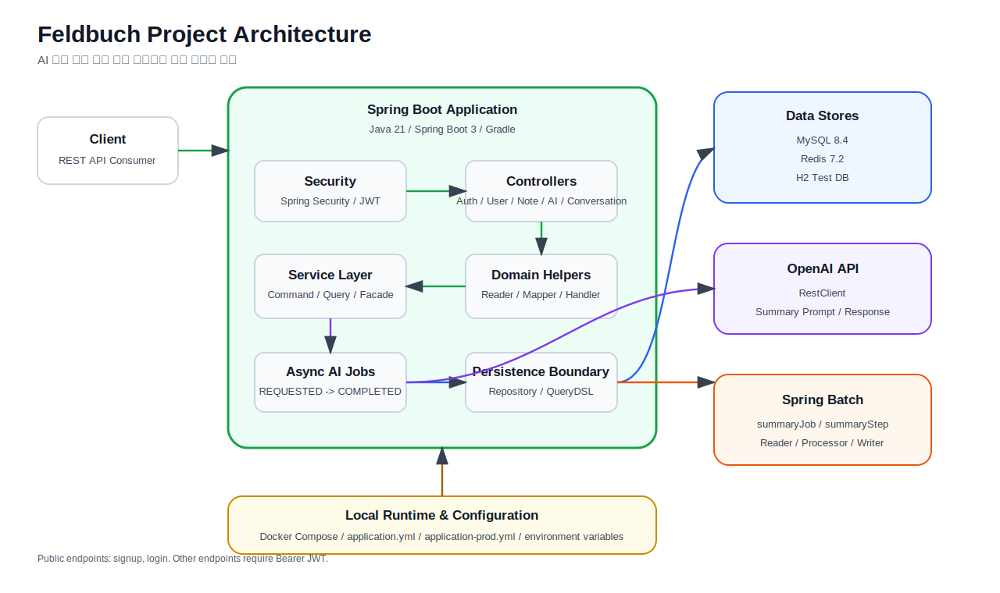
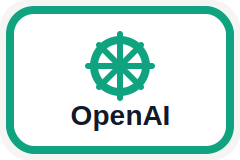
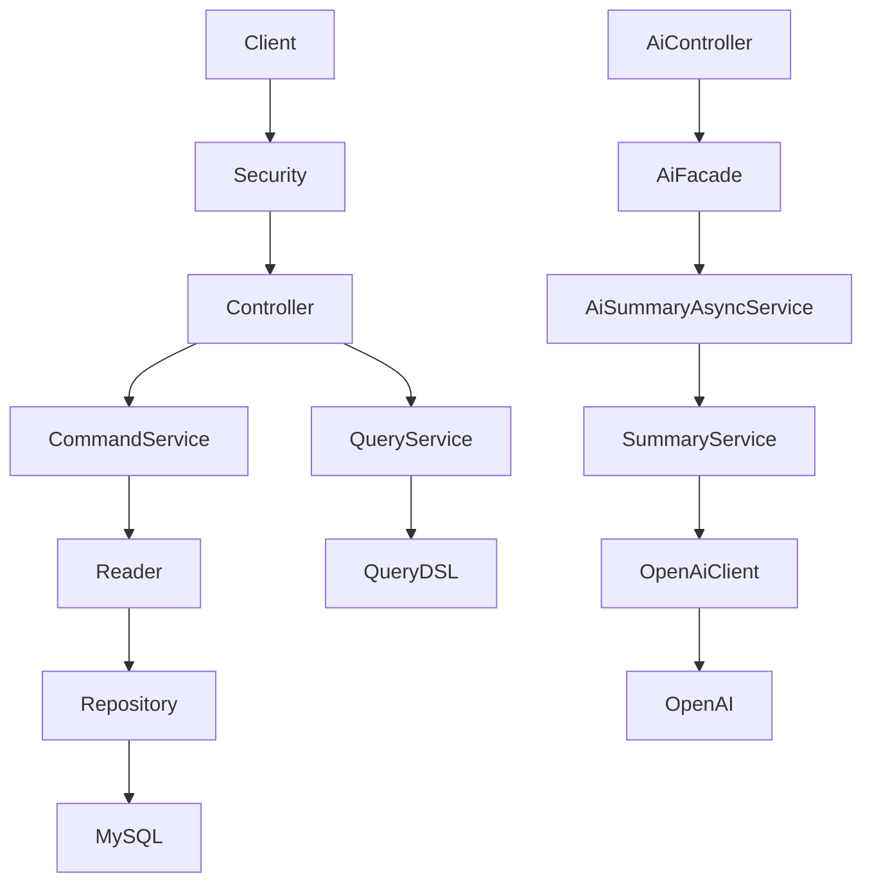

# Feldbuch

> AI 기반 개발 지식 관리 플랫폼

Feldbuch는 개발자가 학습하며 얻은 지식, 트러블슈팅, 코드, 환경 설정을 기록하고 검색할 수 있는 개발 노트 서비스입니다.

단순 CRUD를 넘어, AI가 개발 노트를 이해해 요약, 태깅, 추천, 코드 리뷰까지 수행하는 개발 지식 관리 플랫폼을 목표로 합니다.

## Overview



## Tech Stack

| Java                                                         | Spring Boot                                                               | Docker                                                           | MySQL                                                          | Gradle                                                           | OpenAI                                                           |
|--------------------------------------------------------------|---------------------------------------------------------------------------|------------------------------------------------------------------|----------------------------------------------------------------|------------------------------------------------------------------|------------------------------------------------------------------|
|  |  |  |  |  |  |

| Spring Security | JWT | Spring Data JPA | QueryDSL | H2 Test DB | RestClient |
| --- | --- | --- | --- | --- | --- |
| 인증/인가 | 토큰 인증 | ORM | 동적 검색 | 테스트 DB | OpenAI API 호출 |

## Features

- JWT 기반 회원가입과 로그인
- Spring Security 기반 인증/인가
- 개발 노트 생성, 조회, 수정, 삭제
- QueryDSL 기반 검색
- 페이지네이션
- Pin 기능
- 학습 상태 관리
- OpenAI 기반 AI 요약
- 비동기 AI 처리

## Architecture



## Project Structure

```text
src/main/java
└── io.github.kaltz.feldbuch
    ├── ai
    ├── auth
    ├── common
    ├── config
    ├── note
    └── user
```

## Design Points

- Reader Pattern
- CQRS, Command / Query Separation
- Facade Pattern
- Mapper Pattern
- Async Processing
- OpenAI Client Layer
- `.env` 기반 외부 API Key 관리

## Roadmap

- AI 태그 생성
- 제목 추천
- 코드 리뷰
- 학습 퀴즈 생성
- 학습 로드맵 추천
- Docker Compose 정리
- 테스트 커버리지 확장
- Monitoring

## Documentation

프로젝트의 상세 설계, 개발 기록, 이미지 자료는 `docs/`에서 관리합니다.

- [FELDBUCH_DEVELOPMENT_DOCUMENTATION.md](docs/FELDBUCH_DEVELOPMENT_DOCUMENTATION.md)
- [API.md](docs/API.md)

## Philosophy

> 개발자의 학습 기록을 저장하고, AI가 그 기록을 이해하여 더 나은 학습을 돕는 지식 관리 플랫폼.

Feldbuch는 기능 구현뿐 아니라 리팩토링, 테스트, 아키텍처, 유지보수성을 함께 고민하며 발전시키는 장기 프로젝트입니다.
