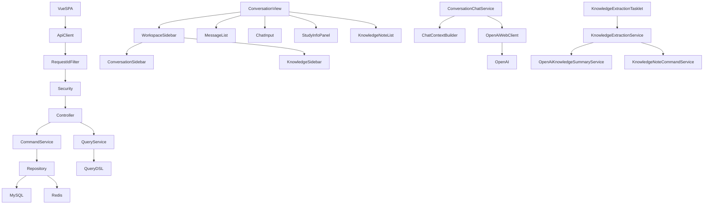

# Feldbuch

> AI 기반 개발 지식 관리 플랫폼

Feldbuch는 개발자가 학습하며 얻은 지식, 트러블슈팅, 코드, 환경 설정을 대화와 노트로 기록하고, AI가 이를 요약해 재사용 가능한 지식으로 정리하는 개발 학습 서비스입니다.

## Main Screen


현재 메인 화면은 `frontend/`의 Vue 3 + Vite SPA입니다. 왼쪽 `WorkspaceSidebar`에서 대화와 지식 폴더 탭을 전환하고, 대화 모드에서는 AI 채팅과 학습 정보 패널을, 지식 모드에서는 선택한 Knowledge 폴더의 추출 노트 목록을 보여줍니다.

## Current Scope

- JWT 기반 회원가입, 로그인, 클라이언트 로그아웃
- Spring Security 인증/인가와 Vite 개발 서버 CORS 허용
- 개발 노트 CRUD, QueryDSL 검색, 페이지네이션, Pin, 학습 상태 관리
- AI 요약 Job 생성, 비동기 처리, 상태 조회
- Conversation 생성, 목록/상세 조회, 제목 수정, 삭제
- Conversation Message 저장과 대화 컨텍스트 기반 AI 채팅
- OpenAI WebClient 기반 SSE 스트리밍 응답
- 첫 사용자 메시지 기반 Conversation 제목 자동 생성
- 완료된 Conversation 기반 Knowledge 추출 대상 관리
- Knowledge 폴더 트리와 AI 추출 KnowledgeNote 저장
- Knowledge 추출 Batch Job/Step/Tasklet과 실패 재시도 상태 관리
- Vue Router Guard, Axios Interceptor, Fetch 기반 SSE 클라이언트
- Markdown 렌더링, DOMPurify sanitize, highlight.js 코드 강조, 코드 복사 UX
- 대화/지식 탭을 가진 Workspace Sidebar와 Knowledge 노트 목록 조회 화면
- 요청별 UUID `requestId`와 `X-Request-Id` 응답 헤더

## Tech Stack

| Area | Stack |
| --- | --- |
| Backend | Java 21, Spring Boot 3.5, Spring Security, Spring Data JPA, QueryDSL, Spring Batch, WebFlux WebClient |
| Database / Infra | MySQL, H2 Test DB, Redis, Docker Compose |
| AI | OpenAI Chat Completion, SSE Streaming, structured summary parsing |
| Frontend | Vue 3, Vite, Vue Router, Axios, Fetch SSE, marked, highlight.js, DOMPurify |
| View Legacy | Thymeleaf, static CSS/JS comparison screens |
| Test | JUnit 5, MockMvc, Spring Security Test, Spring Batch Test |

## Runtime Configuration

- 기본 활성 프로필은 `local`입니다.
- 공통 설정은 `src/main/resources/application.yml`에서 관리합니다.
- 로컬/운영 환경별 DB, JWT, OpenAI Key는 `application-local.yml`, `application-prod.yml`에서 분리합니다.
- OpenAI 기본 모델은 `openai.model` 값으로 선택하며 현재 기본값은 `gpt-4.1-nano`입니다.
- 로컬 인프라는 `docker/docker-compose.yml`의 MySQL, Redis 구성을 기준으로 실행합니다.
- Spring Batch 자동 실행은 `spring.batch.job.enabled=false`로 막습니다.
- Knowledge 추출 배치는 로컬 프로필에서 `feldbuch.batch.knowledge-extraction.run=true`일 때 `ApplicationRunner`가 애플리케이션 시작 직후 1회 실행합니다.

## Frontend Direction

- 앞으로의 사용자 화면은 `frontend/`의 Vue 3 + Vite SPA를 중심으로 진행합니다.
- Spring Boot 내부 Thymeleaf 로그인/대화 화면은 비교용 기준 구현으로 유지합니다.
- Vue Router는 `/login`, `/conversations` 라우트를 관리하고, 인증이 필요한 화면은 Router Guard로 보호합니다.
- `ConversationView`는 화면 조립 지점입니다.
- `WorkspaceSidebar`는 대화/지식 탭 전환을 담당합니다.
- 대화 모드에서는 `ConversationSidebar`, `MessageList`, `ChatInput`, `StudyInfoPanel`을 조합합니다.
- 지식 모드에서는 `KnowledgeSidebar`, `KnowledgeTreeNode`, `KnowledgeNoteList`를 조합해 Knowledge 폴더 선택과 노트 목록 조회를 처리합니다.
- 전역 스타일은 `frontend/src/assets/main.css`에서 다크 터미널 톤 색상 토큰, 레이아웃 폭, 기본 인터랙션 스타일을 정의합니다.

## Communication

- 클라이언트와 백엔드는 JSON 기반 REST API로 통신합니다.
- 공통 응답은 `ApiResponse<T>` 형식이며, 실제 데이터는 `data` 필드에 담습니다.
- 로그인은 `POST /api/auth/login`으로 수행하고, 응답의 `accessToken`을 `localStorage`에 보관합니다.
- Axios Request Interceptor가 `Authorization: Bearer <accessToken>` 헤더를 자동으로 추가합니다.
- Axios Response Interceptor는 `401 Unauthorized` 응답을 받으면 클라이언트 로그아웃을 수행하고 `/login`으로 이동합니다.
- Vue 메인 대화 화면은 `POST /api/conversations/{conversationId}/chat/stream` SSE 스트리밍을 사용해 AI 응답 토큰을 실시간으로 표시합니다.
- SSE 응답은 `ApiResponse<T>`로 감싸지 않고 `StreamResponse` 이벤트(`TOKEN`, `COMPLETE`, `ERROR`)를 순차 전송합니다.
- Knowledge 화면은 `GET /api/knowledge/tree`, `GET /api/knowledge/{knowledgeId}/notes`, `GET /api/knowledge/notes/{noteId}`를 사용합니다.
- 서버는 모든 요청에 UUID 기반 `requestId`를 생성하고 `X-Request-Id` 응답 헤더로 내려줍니다.

## Architecture Summary


```mermaid
flowchart TD
    VueSPA --> ApiClient
    ApiClient --> RequestIdFilter
    RequestIdFilter --> Security
    Security --> Controller
    Controller --> CommandService
    Controller --> QueryService
    CommandService --> Repository
    QueryService --> QueryDSL
    Repository --> MySQL
    Repository --> Redis

    ConversationView --> WorkspaceSidebar
    WorkspaceSidebar --> ConversationSidebar
    WorkspaceSidebar --> KnowledgeSidebar
    ConversationView --> MessageList
    ConversationView --> ChatInput
    ConversationView --> StudyInfoPanel
    ConversationView --> KnowledgeNoteList

    ConversationChatService --> ChatContextBuilder
    ConversationChatService --> OpenAiWebClient
    OpenAiWebClient --> OpenAI

    KnowledgeExtractionTasklet --> KnowledgeExtractionService
    KnowledgeExtractionService --> OpenAiKnowledgeSummaryService
    KnowledgeExtractionService --> KnowledgeNoteCommandService
```

## Project Structure

```text
src/main/java/io.github.kaltz.feldbuch
├── ai               # OpenAI 연동, 요약, 채팅, AI Job
├── auth             # 로그인, JWT 인증
├── batch            # Spring Batch 요약/Knowledge 추출 파이프라인
├── common           # 공통 응답, 예외, requestId 로깅
├── config           # Security, Redis, OpenAI, Batch 설정
├── conversation     # 대화, 메시지, 대화형 AI
├── knowledge        # 지식 폴더, AI 추출 학습 노트
├── note             # 개발 노트 CRUD/Search
├── redis            # Redis 유틸리티
└── user             # 회원, 사용자 조회

frontend/src
├── api              # Axios API client와 도메인별 API 함수
├── assets           # Vue 전역 스타일과 디자인 토큰
├── components       # Conversation, Chat, Knowledge, Layout 컴포넌트
├── router           # Vue Router와 인증 Guard
├── utils            # 인증/Markdown 렌더링 유틸리티
└── views            # LoginView, ConversationView
```

## Documentation

상세 설계, 개발 흐름, 다이어그램은 `docs/`에서 관리합니다.

- [FELDBUCH_DEVELOPMENT_DOCUMENTATION.md](docs/FELDBUCH_DEVELOPMENT_DOCUMENTATION.md)
- [API.md](docs/API.md)

## Roadmap

- Knowledge 노트 상세 화면 연결
- Vue 화면 상태 관리 구조 정리
- Vue 삭제 확인 UX 개선
- Knowledge 추출 Batch 정기 스케줄러 연결
- AI 태그 생성, 코드 리뷰, 학습 퀴즈 생성, 학습 로드맵 추천
- Docker Compose 운영 구성 정리
- 테스트 커버리지와 모니터링 확장
