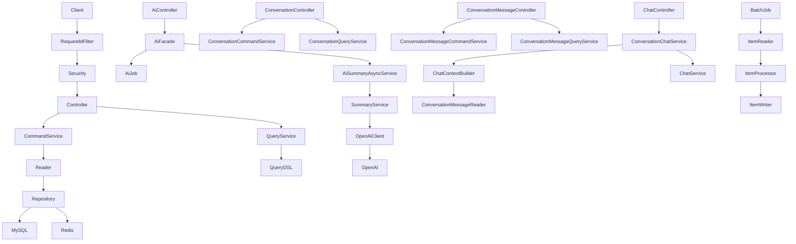
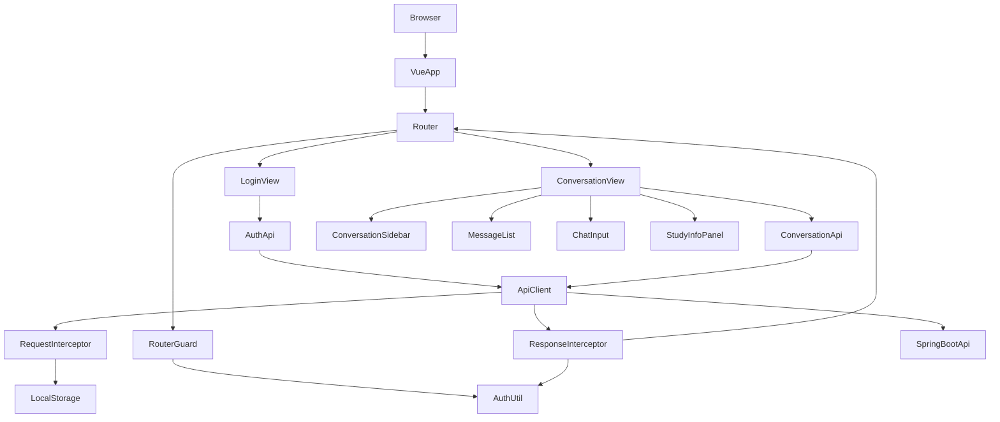

# Feldbuch

> AI 기반 개발 지식 관리 플랫폼

Feldbuch는 개발자가 학습하며 얻은 지식, 트러블슈팅, 코드, 환경 설정을 기록하고 검색할 수 있는 개발 노트 서비스입니다.

단순 CRUD를 넘어, AI가 개발 노트를 이해해 요약, 태깅, 추천, 코드 리뷰까지 수행하는 개발 지식 관리 플랫폼을 목표로 합니다.

## Overview


## Tech Stack

| Java                                                         | Spring Boot                                                               | Docker                                                           | MySQL                                                          | Gradle                                                           | OpenAI                                                           |
|--------------------------------------------------------------|---------------------------------------------------------------------------|------------------------------------------------------------------|----------------------------------------------------------------|------------------------------------------------------------------|------------------------------------------------------------------|
|  |  |  |  |  |  |

| Spring Security | JWT | Spring Data JPA | QueryDSL | Redis | Spring Batch | H2 Test DB | RestClient |
| --- | --- | --- | --- | --- | --- | --- | --- |
| 인증/인가 | 토큰 인증 | ORM | 동적 검색 | 캐시/임시 저장소 | 요약 배치 파이프라인 | 테스트 DB | OpenAI API 호출 |

| Vue.js                                                       | Vite | Vue Router | Axios | marked | DOMPurify | Thymeleaf |
|--------------------------------------------------------------| --- | --- | --- | --- | --- | --- |
|  | 프론트엔드 개발/빌드 | 클라이언트 라우팅 | HTTP client / interceptor | Markdown 렌더링 | HTML sanitize | 비교용 서버 렌더링 화면 |

## Runtime Configuration

- 기본 활성 프로필은 `local`입니다.
- 공통 설정은 `src/main/resources/application.yml`에서 관리합니다.
- 로컬/운영 환경별 DB, JWT, OpenAI Key는 `application-local.yml`, `application-prod.yml`에서 분리합니다.
- OpenAI 기본 모델은 `openai.model` 값으로 선택하며 현재 기본값은 `gpt-4.1-nano`입니다.
- 로컬 인프라는 `docker/docker-compose.yml`의 MySQL, Redis 구성을 기준으로 실행합니다.

## Frontend Direction

- 현재 Spring Boot 내부에는 Thymeleaf 기반 로그인/대화 화면이 남아 있습니다.
- Thymeleaf 화면은 Vue.js 화면과 비교하기 위한 기준 구현으로 유지합니다.
- 앞으로의 프론트엔드 작업은 `frontend/`의 Vue 3 + Vite 프로젝트를 중심으로 진행합니다.
- Vue 화면은 Spring Boot API 서버와 분리된 SPA로 구성하고, 백엔드와는 REST API로 통신합니다.
- Vue Router로 `/login`, `/conversations` 라우트를 구성하고, 인증이 필요한 화면은 Router Guard로 보호합니다.

## Communication

- 클라이언트와 백엔드는 JSON 기반 REST API로 통신합니다.
- 로그인은 `POST /api/auth/login`으로 수행하고, 응답의 `accessToken`을 클라이언트 저장소에 보관합니다.
- Vue 프론트엔드는 Axios 기반 `apiClient`를 사용합니다.
- Axios Request Interceptor가 `localStorage`의 `accessToken`을 읽어 `Authorization: Bearer <accessToken>` 헤더를 자동으로 추가합니다.
- Axios Response Interceptor는 `401 Unauthorized` 응답을 받으면 클라이언트 로그아웃을 수행하고 `/login`으로 이동합니다.
- 로그아웃은 stateless JWT 구조에 맞춰 서버 세션을 폐기하지 않고, 클라이언트의 `accessToken`과 `userId`를 제거합니다.
- 공통 응답은 `ApiResponse<T>` 형식이며, 실제 데이터는 `data` 필드에 담습니다.
- 대화형 AI 요청은 `POST /api/conversations/{conversationId}/chat`으로 전송합니다.
- 대화 상세 조회는 `GET /api/conversations/{conversationId}`로 수행하며, 대화 메타데이터와 메시지 목록을 함께 받습니다.
- 새 대화 생성은 `POST /api/conversations`, 대화 삭제는 `DELETE /api/conversations/{conversationId}`로 처리합니다.
- 대화 제목 수정은 `PATCH /api/conversations/{conversationId}`로 처리합니다.
- 메시지 전송 후에는 선택한 대화를 다시 조회해 사용자 메시지, AI 응답, 자동 생성 제목을 최신화합니다.
- AI 요약은 요청 즉시 `jobId`를 반환하고, 클라이언트는 `GET /api/ai/jobs/{jobId}`로 처리 상태를 조회합니다.
- 서버는 모든 요청에 UUID 기반 `requestId`를 생성하고 `X-Request-Id` 응답 헤더로 내려줍니다.
- 백엔드는 Vite 개발 서버(`http://localhost:5173`)에서 오는 요청을 CORS로 허용합니다.
- 기존 Thymeleaf 정적 JS는 `fetch`와 `localStorage` 기반 비교용 구현으로 남겨둡니다.

## Features

- JWT 기반 회원가입과 로그인
- 클라이언트 로그아웃
- Spring Security 기반 인증/인가
- 개발 노트 생성, 조회, 수정, 삭제
- QueryDSL 기반 검색
- 페이지네이션
- Pin 기능
- 학습 상태 관리
- OpenAI 기반 AI 요약
- 비동기 AI 처리
- AI Job 생성 및 상태 조회
- Conversation 생성, 목록 조회, 단건 조회
- Conversation 제목 수정
- Conversation 삭제
- Conversation Message 저장 및 조회
- Conversation 컨텍스트 기반 AI 채팅
- 첫 사용자 메시지 기반 Conversation 제목 자동 생성
- Thymeleaf 기반 로그인/대화 화면
- Vue 3 + Vite 로그인/대화 화면 전환
- Axios API client, Request/Response Interceptor
- Vue Router Guard 기반 인증 라우팅
- Conversation Sidebar, Message List, Study Info Panel 기반 대화 화면
- 새 대화 생성/제목 수정/삭제 UI와 중복 요청 방지 상태
- AI 응답 Markdown 렌더링 및 DOMPurify sanitize 처리
- 메시지 전송 중 로딩 표시와 자동 스크롤
- Request ID 기반 요청 추적과 `X-Request-Id` 응답 헤더
- Redis, Spring Batch 기반 확장 구성

## Architecture


```mermaid
flowchart TD
    Client --> RequestIdFilter
    RequestIdFilter --> Security
    Security --> Controller

    Controller --> CommandService
    Controller --> QueryService

    CommandService --> Reader
    QueryService --> QueryDSL

    Reader --> Repository
    Repository --> MySQL
    Repository --> Redis

    AiController --> AiFacade
    AiFacade --> AiJob
    AiFacade --> AiSummaryAsyncService
    AiSummaryAsyncService --> SummaryService
    SummaryService --> OpenAiClient
    OpenAiClient --> OpenAI

    ConversationController --> ConversationCommandService
    ConversationController --> ConversationQueryService
    ConversationMessageController --> ConversationMessageCommandService
    ConversationMessageController --> ConversationMessageQueryService
    ChatController --> ConversationChatService
    ConversationChatService --> ChatContextBuilder
    ChatContextBuilder --> ConversationMessageReader
    ConversationChatService --> ChatService

    BatchJob --> ItemReader
    ItemReader --> ItemProcessor
    ItemProcessor --> ItemWriter
```

## Client Architecture



```mermaid
flowchart TD
    Browser --> VueApp
    VueApp --> Router
    Router --> LoginView
    Router --> ConversationView

    Router --> RouterGuard
    RouterGuard --> AuthUtil

    LoginView --> AuthApi
    ConversationView --> ConversationApi
    ConversationView --> ConversationSidebar
    ConversationView --> MessageList
    ConversationView --> ChatInput
    ConversationView --> StudyInfoPanel

    AuthApi --> ApiClient
    ConversationApi --> ApiClient
    ApiClient --> RequestInterceptor
    ApiClient --> ResponseInterceptor
    RequestInterceptor --> LocalStorage
    ResponseInterceptor --> AuthUtil
    ResponseInterceptor --> Router

    ApiClient --> SpringBootApi
```

Vue 클라이언트는 `ConversationView`를 화면 조립 지점으로 사용합니다. 대화 목록과 생성/제목 수정/삭제는 `ConversationSidebar`, 메시지는 `MessageList`, 입력과 전송 중 비활성화는 `ChatInput`, 학습 메타 정보는 `StudyInfoPanel`이 담당합니다. 백엔드 통신은 `authApi`와 `conversationApi`가 Axios `apiClient`를 통해 수행합니다.

## Project Structure

```text
src/main/java
└── io.github.kaltz.feldbuch
    ├── ai
    ├── auth
    ├── batch
    ├── common
    ├── config
    ├── conversation
    ├── home
    ├── note
    ├── redis
    └── user

frontend
└── src
    ├── api
    ├── components
    ├── router
    ├── utils
    └── views
```

## Design Points

- Reader Pattern
- CQRS, Command / Query Separation
- Facade Pattern
- Mapper Pattern
- Async Processing
- AI Job State Tracking
- Spring Batch Job Configuration
- OpenAI Client Layer
- Chat Context Builder
- Conversation Message Persistence
- Thymeleaf View Layer 유지 및 Vue SPA 전환
- Axios 기반 프론트엔드/백엔드 통신
- Request/Response Interceptor
- Router Guard 기반 인증 화면 보호
- Stateless JWT Logout
- Component-based Client Architecture
- Markdown Rendering and Sanitizing
- Request ID 기반 요청 추적
- Profile 기반 외부 설정 관리

## Roadmap

- Vue 화면 상태 관리 구조 정리
- Vue 삭제 확인 UX 개선
- AI 태그 생성
- 코드 리뷰
- 학습 퀴즈 생성
- 학습 로드맵 추천
- Docker Compose 정리
- 테스트 커버리지 확장
- Monitoring

## Documentation

프로젝트의 상세 설계, 개발 기록, 이미지 자료는 `docs/`에서 관리합니다.

- [FELDBUCH_DEVELOPMENT_DOCUMENTATION.md](docs/FELDBUCH_DEVELOPMENT_DOCUMENTATION.md)
- [API.md](docs/API.md)

## Philosophy

> 개발자의 학습 기록을 저장하고, AI가 그 기록을 이해하여 더 나은 학습을 돕는 지식 관리 플랫폼.

Feldbuch는 기능 구현뿐 아니라 리팩토링, 테스트, 아키텍처, 유지보수성을 함께 고민하며 발전시키는 장기 프로젝트입니다.
