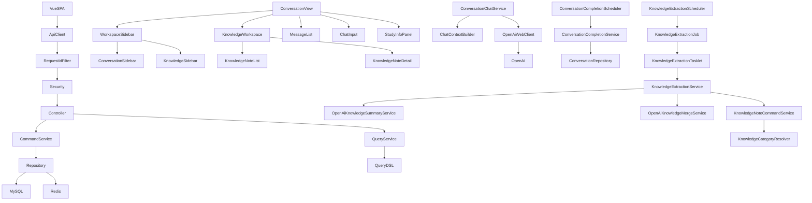

# Feldbuch

> AI 기반 개발 지식 관리 플랫폼

Feldbuch는 개발자가 AI와 나눈 학습 대화를 저장하고, 완료된 대화를 AI가 재사용 가능한 Knowledge 노트로 정리하는 개발 학습 서비스입니다.

## Screens


현재 메인 화면은 `frontend/`의 Vue 3 + Vite SPA입니다. 왼쪽 `WorkspaceSidebar`에서 대화와 지식 폴더 탭을 전환하고, 대화 모드에서는 AI 채팅과 학습 정보 패널을, 지식 모드에서는 Knowledge 폴더의 추출 노트 목록과 상세 요약을 보여줍니다.

## Current Scope

- JWT 기반 회원가입, 로그인, 클라이언트 로그아웃
- Spring Security 인증/인가와 Vite 개발 서버 CORS 허용
- Conversation 생성, 목록/상세 조회, 제목 수정, 삭제
- Conversation Message 저장과 대화 컨텍스트 기반 AI 채팅
- OpenAI WebClient 기반 SSE 스트리밍 응답
- 첫 사용자 메시지 기반 Conversation 제목 자동 생성
- 메시지 저장 시 Conversation 활동 시각 갱신과 완료 대화 재활성화
- 30분 기본 비활성 시간 이후 ACTIVE Conversation 자동 완료
- 완료된 Conversation 기반 Knowledge 추출 대상 관리
- 마지막 추출 메시지 ID 기반 증분 Knowledge 추출 체크포인트
- `KnowledgeCategory` 고정 카테고리 기반 Knowledge 폴더 생성
- Knowledge 폴더 트리와 AI 추출 KnowledgeNote 저장
- KnowledgeNote `INCREMENTAL`/`CONSOLIDATED` 타입 분리
- 기존 통합 KnowledgeNote 자동 병합과 Conversation별 통합 노트 조회
- Knowledge 추출 Batch Job/Step/Tasklet, 스케줄러, 실패 재시도 상태 관리
- Vue Router Guard, Axios Interceptor, Fetch 기반 SSE 클라이언트
- Markdown 렌더링, DOMPurify sanitize, highlight.js 코드 강조, 코드 복사 UX
- 대화/지식 탭을 가진 Workspace Sidebar와 Knowledge 노트 워크스페이스
- Knowledge 폴더 검색, 노트 검색, 검색어 하이라이트
- Knowledge 노트 상세 조회, 요약과 키워드 표시
- 선택한 사이드바 모드, 대화, Knowledge 폴더, Knowledge 노트 localStorage 복원
- 요청별 UUID `requestId`와 `X-Request-Id` 응답 헤더
- Google OAuth2 client 설정 키 추가, 실제 인증 플로우 연결은 미구현

## Tech Stack

| Area | Stack |
| --- | --- |
| Backend | Java 21, Spring Boot 3.5, Spring Security, Spring Data JPA, QueryDSL, Spring Batch, WebFlux WebClient |
| Database / Infra | MySQL, H2 Test DB, Redis, Docker Compose |
| AI | OpenAI Chat Completion, SSE Streaming, structured Knowledge summary/merge parsing |
| Auth Config | JWT, Google OAuth2 client properties |
| Frontend | Vue 3, Vite, Vue Router, Axios, Fetch SSE, marked, highlight.js, DOMPurify |
| View Legacy | Thymeleaf, static CSS/JS comparison screens |
| Test | JUnit 5, MockMvc, Spring Security Test, Spring Batch Test |

## Runtime Configuration

- 기본 활성 프로필은 `local`입니다.
- 공통 설정은 `src/main/resources/application.yml`에서 관리합니다.
- 로컬/운영 환경별 DB, JWT, OpenAI Key는 `application-local.yml`, `application-prod.yml`에서 분리합니다.
- OpenAI 기본 모델은 `openai.model` 값으로 선택하며 현재 기본값은 `gpt-4.1-nano`입니다.
- Google OAuth2 client 값은 `GOOGLE_CLIENT_ID`, `GOOGLE_CLIENT_SECRET` 환경 변수로 주입합니다.
- 현재 로그인 API와 Vue 로그인 화면은 JWT 폼 로그인을 사용하며, OAuth2 로그인 플로우는 아직 연결하지 않았습니다.
- 로컬 인프라는 `docker/docker-compose.yml`의 MySQL, Redis 구성을 기준으로 실행합니다.
- Spring Batch 자동 실행은 `spring.batch.job.enabled=false`로 막습니다.
- Knowledge 추출 스케줄러는 `batch.knowledge-extraction.fixed-delay` 값으로 실행 간격을 조정하며 기본값은 60초입니다.
- Conversation 자동 완료 스케줄러는 `conversation.auto-completion.fixed-delay` 기본 60초마다 실행되고, `conversation.auto-completion.inactivity-timeout` 기본 30분을 기준으로 비활성 ACTIVE 대화를 COMPLETED로 전환합니다.

## Frontend Direction

- 앞으로의 사용자 화면은 `frontend/`의 Vue 3 + Vite SPA를 중심으로 진행합니다.
- Spring Boot 내부 Thymeleaf 로그인/대화 화면은 비교용 기준 구현으로 유지합니다.
- Vue Router는 `/login`, `/conversations` 라우트를 관리하고, 인증이 필요한 화면은 Router Guard로 보호합니다.
- `ConversationView`는 화면 조립 지점입니다.
- `WorkspaceSidebar`는 대화/지식 탭 전환과 사이드바 공통 레이아웃을 담당합니다.
- 대화 모드에서는 `ConversationSidebar`, `MessageList`, `ChatInput`, `StudyInfoPanel`을 조합합니다.
- 지식 모드에서는 `KnowledgeSidebar`, `KnowledgeTreeNode`, `KnowledgeWorkspace`, `KnowledgeNoteList`, `KnowledgeNoteDetail`을 조합합니다.
- Knowledge 화면은 폴더 검색, 노트 검색, 검색어 하이라이트, breadcrumb, 노트 상세/키워드 표시를 제공합니다.
- 선택한 사이드바 모드와 마지막 선택 대화/Knowledge/KnowledgeNote는 `frontend/src/constants/storageKeys.js` 기준으로 `localStorage`에 저장합니다.
- 전역 스타일은 `frontend/src/assets/main.css`에서 다크 터미널 톤 색상 토큰, 레이아웃 폭, 기본 인터랙션 스타일을 정의합니다.

## Communication

- 클라이언트와 백엔드는 JSON 기반 REST API로 통신합니다.
- 공통 응답은 `ApiResponse<T>` 형식이며, 실제 데이터는 `data` 필드에 담습니다.
- 로그인은 `POST /api/auth/login`으로 수행하고, 응답의 `accessToken`을 `localStorage`에 보관합니다.
- Axios Request Interceptor가 `Authorization: Bearer <accessToken>` 헤더를 자동으로 추가합니다.
- Axios Response Interceptor는 `401 Unauthorized` 응답을 받으면 클라이언트 로그아웃을 수행하고 `/login`으로 이동합니다.
- Vue 메인 대화 화면은 `POST /api/conversations/{conversationId}/chat/stream` SSE 스트리밍을 사용해 AI 응답 토큰을 실시간으로 표시합니다.
- SSE 응답은 `ApiResponse<T>`로 감싸지 않고 `StreamResponse` 이벤트(`TOKEN`, `COMPLETE`, `ERROR`)를 순차 전송합니다.
- Knowledge 화면은 `GET /api/knowledge/tree`, `GET /api/knowledge/{knowledgeId}/notes`, `GET /api/knowledge/notes/{noteId}`를 사용합니다.
- Conversation별 통합 Knowledge 노트는 `GET /api/knowledge/conversations/{conversationId}/consolidated-note`로 조회합니다.
- 서버는 모든 요청에 UUID 기반 `requestId`를 생성하고 `X-Request-Id` 응답 헤더로 내려줍니다.

## Architecture Summary


```mermaid
flowchart TD
    VueSPA --> ApiClient
    ApiClient --> RequestIdFilter
    RequestIdFilter --> Security
    Security --> Controller
    Controller --> CommandService
    Controller --> QueryService
    CommandService --> Repository
    QueryService --> QueryDSL
    Repository --> MySQL
    Repository --> Redis

    ConversationView --> WorkspaceSidebar
    WorkspaceSidebar --> ConversationSidebar
    WorkspaceSidebar --> KnowledgeSidebar
    ConversationView --> KnowledgeWorkspace
    ConversationView --> MessageList
    ConversationView --> ChatInput
    ConversationView --> StudyInfoPanel
    KnowledgeWorkspace --> KnowledgeNoteList
    KnowledgeWorkspace --> KnowledgeNoteDetail

    ConversationChatService --> ChatContextBuilder
    ConversationChatService --> OpenAiWebClient
    OpenAiWebClient --> OpenAI

    ConversationCompletionScheduler --> ConversationCompletionService
    ConversationCompletionService --> ConversationRepository
    KnowledgeExtractionScheduler --> KnowledgeExtractionJob
    KnowledgeExtractionJob --> KnowledgeExtractionTasklet
    KnowledgeExtractionTasklet --> KnowledgeExtractionService
    KnowledgeExtractionService --> OpenAiKnowledgeSummaryService
    KnowledgeExtractionService --> OpenAiKnowledgeMergeService
    KnowledgeExtractionService --> KnowledgeNoteCommandService
    KnowledgeNoteCommandService --> KnowledgeCategoryResolver
```

## Project Structure

```text
src/main/java/io.github.kaltz.feldbuch
├── ai               # OpenAI 연동, 대화 응답, Knowledge 요약/병합
├── auth             # 로그인, JWT 인증, OAuth2 설정
├── batch            # Knowledge 추출 Batch 파이프라인과 스케줄러
├── common           # 공통 응답, 예외, requestId 로깅
├── config           # Security, Redis, OpenAI, Batch 설정
├── conversation     # 대화, 메시지, 대화형 AI, 비활성 대화 자동 완료
├── knowledge        # 지식 폴더, 카테고리, 추출/통합 학습 노트
├── redis            # Redis 유틸리티
└── user             # 회원, 사용자 조회

frontend/src
├── api              # Axios API client와 도메인별 API 함수
├── assets           # Vue 전역 스타일과 디자인 토큰
├── components       # Chat, Common, Knowledge, Sidebar 컴포넌트
├── constants        # localStorage key 등 클라이언트 상수
├── router           # Vue Router와 인증 Guard
├── utils            # 인증/Markdown 렌더링 유틸리티
└── views            # LoginView, ConversationView
```

## Documentation

상세 설계, 개발 흐름, 다이어그램은 `docs/`에서 관리합니다.

- [FELDBUCH_DEVELOPMENT_DOCUMENTATION.md](docs/FELDBUCH_DEVELOPMENT_DOCUMENTATION.md)
- [API.md](docs/API.md)

## Roadmap

- OAuth2 로그인 플로우 연결
- Knowledge 노트 원본 Conversation 이동 링크
- Vue 화면 상태 관리 구조 정리
- Vue 삭제 확인 UX 개선
- Postman Knowledge 요청 파일 보강
- AI 태그 생성, 코드 리뷰, 학습 퀴즈 생성, 학습 로드맵 추천
- Docker Compose 운영 구성 정리
- 테스트 커버리지와 모니터링 확장

## 삭제 로그

- Note 도메인 API/서비스/엔티티/프론트 문서 항목 제거
- AI Job 기반 노트 요약 API와 Summary Batch 문서 항목 제거
- `KnowledgePathResolver`, AI 폴더 선택 구조 문서 항목을 `KnowledgeCategoryResolver` 기반 구조로 대체
- 개발용 `JwtTestRunner` 문서 노출 대상에서 제외
