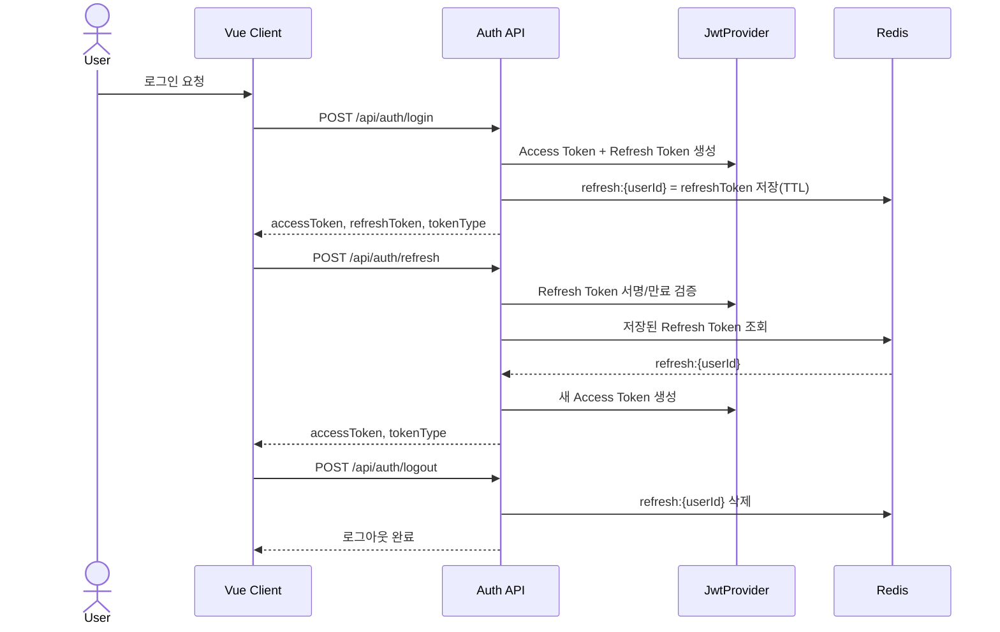

# Feldbuch

> AI 기반 개발 지식 관리 플랫폼

Feldbuch는 개발자가 AI와 나눈 학습 대화를 저장하고, 완료된 대화를 AI가 재사용 가능한 Knowledge 노트로 정리하는 개발 학습 서비스입니다.

## Screens


현재 사용자 화면은 `frontend/`의 Vue 3 + Vite SPA입니다. 로그인 화면은 터미널 콘셉트의 이메일/비밀번호 인증과 Google OAuth2 로그인을 제공하고, 회원가입 화면은 nickname/email/password 입력 기반 계정 생성을 제공합니다. 메인 화면은 왼쪽 `WorkspaceSidebar`에서 대화와 지식 폴더 탭을 전환하고, 하단 사용자 프로필 패널에서 로그인 사용자, 인증 Provider, 설정/로그아웃 진입점을 보여줍니다. 대화 모드에서는 AI 채팅과 학습 정보 패널을, 지식 모드에서는 Knowledge 폴더의 추출 노트 목록과 상세 요약을 보여줍니다.

## Current Scope

- JWT 기반 회원가입, 이메일/비밀번호 로그인, Google OAuth2 로그인, Refresh Token 재발급, 서버 로그아웃
- Vue 터미널 스타일 로그인/회원가입 화면과 상호 이동 링크
- Spring Security 인증/인가와 Vite 개발 서버 CORS 허용
- 현재 로그인 사용자 조회 API와 Provider/Role 기반 사용자 프로필 패널
- Conversation 생성, 목록/상세 조회, 제목 수정, 삭제
- Conversation Message 저장과 대화 컨텍스트 기반 AI 채팅
- OpenAI WebClient 기반 SSE 스트리밍 응답
- 첫 사용자 메시지 기반 Conversation 제목 자동 생성
- 메시지 저장 시 Conversation 활동 시각 갱신과 완료 대화 재활성화
- 30분 기본 비활성 시간 이후 ACTIVE Conversation 자동 완료
- 완료된 Conversation 기반 Knowledge 추출 대상 관리
- 마지막 추출 메시지 ID 기반 증분 Knowledge 추출 체크포인트
- `KnowledgeCategory` 고정 카테고리 기반 Knowledge 폴더 생성
- Knowledge 폴더 트리와 AI 추출 KnowledgeNote 저장
- KnowledgeNote `INCREMENTAL`/`CONSOLIDATED` 타입 분리
- 기존 통합 KnowledgeNote 자동 병합과 Conversation별 통합 노트 조회
- Knowledge 추출 Batch Job/Step/Tasklet, 스케줄러, 실패 재시도 상태 관리
- 운영 확인용 Knowledge 추출 Batch 수동 실행 API
- Vue Router Guard, Axios Interceptor, Fetch 기반 SSE 클라이언트
- Markdown 렌더링, DOMPurify sanitize, highlight.js 코드 강조, 코드 복사 UX
- 대화/지식 탭을 가진 Workspace Sidebar와 Knowledge 노트 워크스페이스
- 사용자 프로필 패널, 설정 모달, OAuth2 성공 처리 화면
- Knowledge 폴더 검색, 노트 검색, 검색어 하이라이트
- Knowledge 노트 상세 조회, 요약과 키워드 표시
- 선택한 사이드바 모드, 대화, Knowledge 폴더, Knowledge 노트 localStorage 복원
- 요청별 UUID `requestId`와 `X-Request-Id` 응답 헤더
- Google OAuth2 로그인 시작, Google OIDC 사용자 연동, JWT 발급 후 Vue OAuth2 성공 화면 리다이렉트
- Redis 기반 Refresh Token 저장, 검증, 삭제

## Tech Stack

| Area | Stack |
| --- | --- |
| Backend | Java 21, Spring Boot 3.5, Spring Security, Spring Data JPA, QueryDSL, Spring Batch, WebFlux WebClient |
| Database / Infra | MySQL, H2 Test DB, Redis, Docker Compose |
| AI | OpenAI Chat Completion, SSE Streaming, structured Knowledge summary/merge parsing |
| Auth Config | JWT Access/Refresh Token, Spring Security OAuth2 Client, Google OIDC |
| Frontend | Vue 3, Vite, Vue Router, Axios, Fetch SSE, marked, highlight.js, DOMPurify |
| Deployment | GitHub Actions, GHCR, Docker, Nginx, AWS Lightsail, AWS RDS MySQL |
| View Legacy | Thymeleaf, static CSS/JS comparison screens |
| Test | JUnit 5, MockMvc, Spring Security Test, Spring Batch Test |

## Runtime Configuration

- 기본 활성 프로필은 `local`입니다.
- 공통 설정은 `src/main/resources/application.yml`에서 관리합니다.
- 로컬/운영 환경별 DB, JWT, OpenAI Key는 `application-local.yml`, `application-prod.yml`에서 분리합니다.
- OpenAI 기본 모델은 `openai.model` 값으로 선택하며 현재 기본값은 `gpt-4.1-nano`입니다.
- OpenAI 일반 요청용 `RestClient`는 connect timeout 10초, read timeout 120초로 설정합니다.
- Google OAuth2 client 값은 `GOOGLE_CLIENT_ID`, `GOOGLE_CLIENT_SECRET` 환경 변수로 주입합니다.
- JWT 만료 시간은 `jwt.access-token-expiration`, `jwt.refresh-token-expiration` 값으로 분리합니다.
- Vue 로그인 화면은 JWT 폼 로그인과 Google OAuth2 로그인 진입점을 함께 제공합니다.
- Google OAuth2 성공 시 서버가 JWT를 발급하고 `app.frontend-url` 기준 `/oauth2/success`로 리다이렉트하며, Vue 성공 화면이 토큰과 사용자 ID를 저장한 뒤 `/conversations`로 이동합니다.
- Refresh Token은 Redis에 `refresh:{userId}` 키로 저장하고 Refresh Token 만료 시간과 같은 TTL을 적용합니다.
- 로컬 인프라는 `docker/docker-compose.yml`의 MySQL, Redis 구성을 기준으로 실행합니다.
- Spring Batch 자동 실행은 `spring.batch.job.enabled=false`로 막습니다.
- 운영 프로필은 Spring Batch 메타 테이블을 `spring.batch.jdbc.initialize-schema=always`로 초기화합니다.
- Knowledge 추출 스케줄러는 `batch.knowledge-extraction.fixed-delay` 값으로 실행 간격을 조정하며 기본값은 30분(`1800000` ms)입니다.
- Conversation 자동 완료 스케줄러는 `conversation.auto-completion.fixed-delay` 기본 60초마다 실행되고, `conversation.auto-completion.inactivity-timeout` 기본 30분을 기준으로 비활성 ACTIVE 대화를 COMPLETED로 전환합니다.

## Deployment

현재 운영 배포는 로컬에서 직접 서버 빌드를 수행하지 않고, GitHub Actions가 Docker 이미지를 빌드해 GitHub Container Registry에 저장한 뒤 AWS Lightsail에 SSH로 접속해 이미지를 pull하고 컨테이너를 재시작하는 구조입니다.


외부 요청은 Lightsail Static IP의 80 포트로 들어와 `feldbuch-frontend` Nginx가 처리합니다. Vue SPA 라우트는 `try_files $uri $uri/ /index.html`로 전달하고, `/api/*` 요청은 Docker Network 내부의 `feldbuch-app:8080`으로 프록시합니다. SSE 스트리밍을 위해 Nginx API 프록시에 `proxy_buffering off`를 적용합니다.


운영 설정은 `application-prod.yml`에서 환경 변수로 주입합니다. 실제 운영 값은 Git에 올리지 않는 Lightsail의 `.env.prod`에서 관리합니다. Redis는 Lightsail 내부 Docker 컨테이너로 실행하고 외부 포트는 공개하지 않습니다. MySQL은 AWS RDS로 분리했으며, Lightsail VPC Peering과 RDS Security Group을 통해 Lightsail 인스턴스에서만 3306 접근을 허용합니다.

`cicd.yml`은 `main` push 시 Backend/Frontend 이미지를 빌드해 `latest`와 commit SHA 태그로 GHCR에 push하고, Lightsail에서 `feldbuch-app`, `feldbuch-frontend`를 재기동합니다. 배포 중 `/actuator/health`와 frontend root 응답을 확인하며 실패하면 직전 이미지 ID로 롤백합니다. `deploy.yml`은 필요할 때 수동으로 동일 이미지를 Lightsail에 재배포하는 workflow입니다.

## Operations

- Spring Boot 운영 로그는 `logging.file.name=/var/log/feldbuch/app.log`로 기록하고, backend 컨테이너는 해당 경로를 host volume으로 마운트합니다.
- CloudWatch Agent가 `/var/log/feldbuch/app.log`를 `/feldbuch/backend` 로그 그룹으로 수집하도록 구성했습니다.
- `ERROR` 로그는 CloudWatch Metric Filter를 통해 `Feldbuch/Application` namespace의 `BackendErrorCount` 지표로 변환합니다.
- `feldbuch-backend-error` CloudWatch Alarm은 5분 기간에 `BackendErrorCount >= 1`이면 ALARM 상태로 전환하고, SNS topic `feldbuch-alerts`로 이메일 알림을 전송합니다.
- 2026-08-11 테스트에서 `ERROR Feldbuch CloudWatch alarm test` 로그가 `BackendErrorCount = 1.0`으로 집계되어 `OK -> ALARM` 전환과 SNS 이메일 수신까지 검증했습니다.
- 메모리 80% 경보와 Swap 60% 경보를 함께 구성해 작은 Lightsail 인스턴스의 리소스 압박을 관찰합니다.
- Lightsail 컨테이너 내부에서 OpenAI Chat Completion SSE 요청이 `200 OK`와 `[DONE]`까지 정상 수신되는 것을 확인했고, 앱에서도 짧은 OpenAI 스트리밍 응답을 검증했습니다.
- 긴 OpenAI 스트리밍 응답은 작은 Lightsail 메모리와 swap 사용량에 영향을 받을 수 있어 `free -h`, `docker stats --no-stream`, CloudWatch 경보를 함께 보며 확인합니다.

## Frontend Direction

- 앞으로의 사용자 화면은 `frontend/`의 Vue 3 + Vite SPA를 중심으로 진행합니다.
- Spring Boot 내부 Thymeleaf 로그인/대화 화면은 비교용 기준 구현으로 유지합니다.
- Vue Router는 `/login`, `/signup`, `/oauth2/success`, `/conversations` 라우트를 관리하고, 인증이 필요한 화면은 Router Guard로 보호합니다.
- `LoginView`는 이메일/비밀번호 로그인, Google 로그인, 회원가입 이동 링크를 제공합니다.
- `SignUpView`는 nickname, email, password를 입력받아 `POST /api/users/signup` 호출 후 `/login`으로 이동합니다.
- `ConversationView`는 화면 조립 지점입니다.
- `WorkspaceSidebar`는 대화/지식 탭 전환, 사이드바 공통 레이아웃, footer 슬롯 기반 사용자 프로필 영역을 담당합니다.
- 대화 모드에서는 `ConversationSidebar`, `MessageList`, `ChatInput`, `StudyInfoPanel`을 조합합니다.
- 지식 모드에서는 `KnowledgeSidebar`, `KnowledgeTreeNode`, `KnowledgeWorkspace`, `KnowledgeNoteList`, `KnowledgeNoteDetail`을 조합합니다.
- `UserProfilePanel`은 현재 사용자 이름/이메일/Provider/Role/세션 정보를 표시하고 설정/로그아웃 동작을 제공합니다.
- `SettingsModal`은 계정, 인증, 화면 설정 정보를 터미널 스타일 패널로 표시합니다.
- 첫 사용자 메시지로 생성되는 대화 제목은 전송 직후 짧게 재조회해 사이드바 제목을 빠르게 갱신합니다.
- Knowledge 화면은 폴더 검색, 노트 검색, 검색어 하이라이트, breadcrumb, 노트 상세/키워드 표시를 제공합니다.
- 선택한 사이드바 모드와 마지막 선택 대화/Knowledge/KnowledgeNote는 `frontend/src/constants/storageKeys.js` 기준으로 `localStorage`에 저장합니다.
- 전역 스타일은 `frontend/src/assets/main.css`에서 다크 터미널 톤 색상 토큰, 레이아웃 폭, 기본 인터랙션 스타일을 정의합니다.

## Communication

- 클라이언트와 백엔드는 JSON 기반 REST API로 통신합니다.
- 공통 응답은 `ApiResponse<T>` 형식이며, 실제 데이터는 `data` 필드에 담습니다.
- 회원가입은 `POST /api/users/signup`으로 수행하며, `email`, `password`, `nickname`을 전송합니다.
- 로그인은 `POST /api/auth/login`으로 수행하고, 응답의 `accessToken`, `refreshToken`, `tokenType`을 클라이언트 인증 상태에 사용합니다.
- Access Token 만료 시 인증 헤더 없이 `POST /api/auth/refresh`로 Refresh Token을 전송해 새 Access Token을 발급받습니다.
- 로그아웃은 `POST /api/auth/logout`으로 수행하며, 서버는 Redis에 저장된 현재 사용자의 Refresh Token을 삭제합니다.
- 현재 사용자 정보는 `GET /api/auth/me`로 조회하며, 응답의 `email`, `nickname`, `role`, `provider`를 사용자 프로필 패널에 사용합니다.
- Google OAuth2 로그인은 `GET /oauth2/authorization/google`에서 시작하고, 성공 후 서버가 `/oauth2/success` Vue 라우트로 JWT와 사용자 ID를 전달합니다.
- Axios Request Interceptor가 `Authorization: Bearer <accessToken>` 헤더를 자동으로 추가합니다.
- Axios Response Interceptor는 `401 Unauthorized` 응답을 받으면 클라이언트 로그아웃을 수행하고 `/login`으로 이동합니다.
- Vue 메인 대화 화면은 `POST /api/conversations/{conversationId}/chat/stream` SSE 스트리밍을 사용해 AI 응답 토큰을 실시간으로 표시합니다.
- SSE 응답은 `ApiResponse<T>`로 감싸지 않고 `StreamResponse` 이벤트(`TOKEN`, `COMPLETE`, `ERROR`)를 순차 전송합니다.
- Knowledge 화면은 `GET /api/knowledge/tree`, `GET /api/knowledge/{knowledgeId}/notes`, `GET /api/knowledge/notes/{noteId}`를 사용합니다.
- Conversation별 통합 Knowledge 노트는 `GET /api/knowledge/conversations/{conversationId}/consolidated-note`로 조회합니다.
- 서버는 모든 요청에 UUID 기반 `requestId`를 생성하고 `X-Request-Id` 응답 헤더로 내려줍니다.

### Refresh Token Flow


```mermaid
sequenceDiagram
    actor User
    participant Client as Vue Client
    participant Auth as Auth API
    participant Jwt as JwtProvider
    participant Redis as Redis

    User->>Client: 로그인 요청
    Client->>Auth: POST /api/auth/login
    Auth->>Jwt: Access Token + Refresh Token 생성
    Auth->>Redis: refresh:{userId} = refreshToken 저장(TTL)
    Auth-->>Client: accessToken, refreshToken, tokenType

    Client->>Auth: POST /api/auth/refresh
    Auth->>Jwt: Refresh Token 서명/만료 검증
    Auth->>Redis: 저장된 Refresh Token 조회
    Redis-->>Auth: refresh:{userId}
    Auth->>Jwt: 새 Access Token 생성
    Auth-->>Client: accessToken, tokenType

    Client->>Auth: POST /api/auth/logout
    Auth->>Redis: refresh:{userId} 삭제
    Auth-->>Client: 로그아웃 완료
```

## Architecture Summary


## Project Structure

```text
src/main/java/io.github.kaltz.feldbuch
├── ai               # OpenAI 연동, 대화 응답, Knowledge 요약/병합
├── auth             # 로그인, JWT Access/Refresh Token, Google OAuth2/OIDC 인증
├── batch            # Knowledge 추출 Batch 파이프라인, 스케줄러, 관리용 수동 실행 API
├── common           # 공통 응답, 예외, requestId 로깅
├── config           # Security, Redis, OpenAI, Batch 설정
├── conversation     # 대화, 메시지, 대화형 AI, 비활성 대화 자동 완료
├── knowledge        # 지식 폴더, 카테고리, 추출/통합 학습 노트
├── redis            # Redis 유틸리티
└── user             # 회원, 사용자 조회

frontend/src
├── api              # Axios API client와 도메인별 API 함수
├── assets           # Vue 전역 스타일과 디자인 토큰
├── components       # Chat, Common, Knowledge, Sidebar 컴포넌트
├── constants        # localStorage key 등 클라이언트 상수
├── router           # Vue Router와 인증 Guard
├── utils            # 인증/Markdown 렌더링 유틸리티
└── views            # LoginView, SignUpView, OAuth2SuccessView, ConversationView
```

## Documentation

상세 설계, 개발 흐름, 다이어그램은 `docs/`에서 관리합니다.

- [FELDBUCH_DEVELOPMENT_DOCUMENTATION.md](docs/FELDBUCH_DEVELOPMENT_DOCUMENTATION.md)
- [API.md](docs/API.md)

## Roadmap

- 도메인과 HTTPS 적용
- backend 애플리케이션 가용성/헬스체크 경보 추가
- Lightsail 인스턴스 리소스 증설 또는 컨테이너 메모리 튜닝 검토
- Knowledge 노트 원본 Conversation 이동 링크
- Vue 화면 상태 관리 구조 정리
- Vue 삭제 확인 UX 개선
- Postman Knowledge 요청 파일 보강
- AI 태그 생성, 코드 리뷰, 학습 퀴즈 생성, 학습 로드맵 추천
- 테스트 커버리지 확장

## 삭제 로그

- Note 도메인 API/서비스/엔티티/프론트 문서 항목 제거
- AI Job 기반 노트 요약 API와 Summary Batch 문서 항목 제거
- `KnowledgePathResolver`, AI 폴더 선택 구조 문서 항목을 `KnowledgeCategoryResolver` 기반 구조로 대체
- 개발용 `JwtTestRunner` 문서 노출 대상에서 제외
