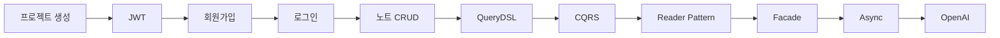
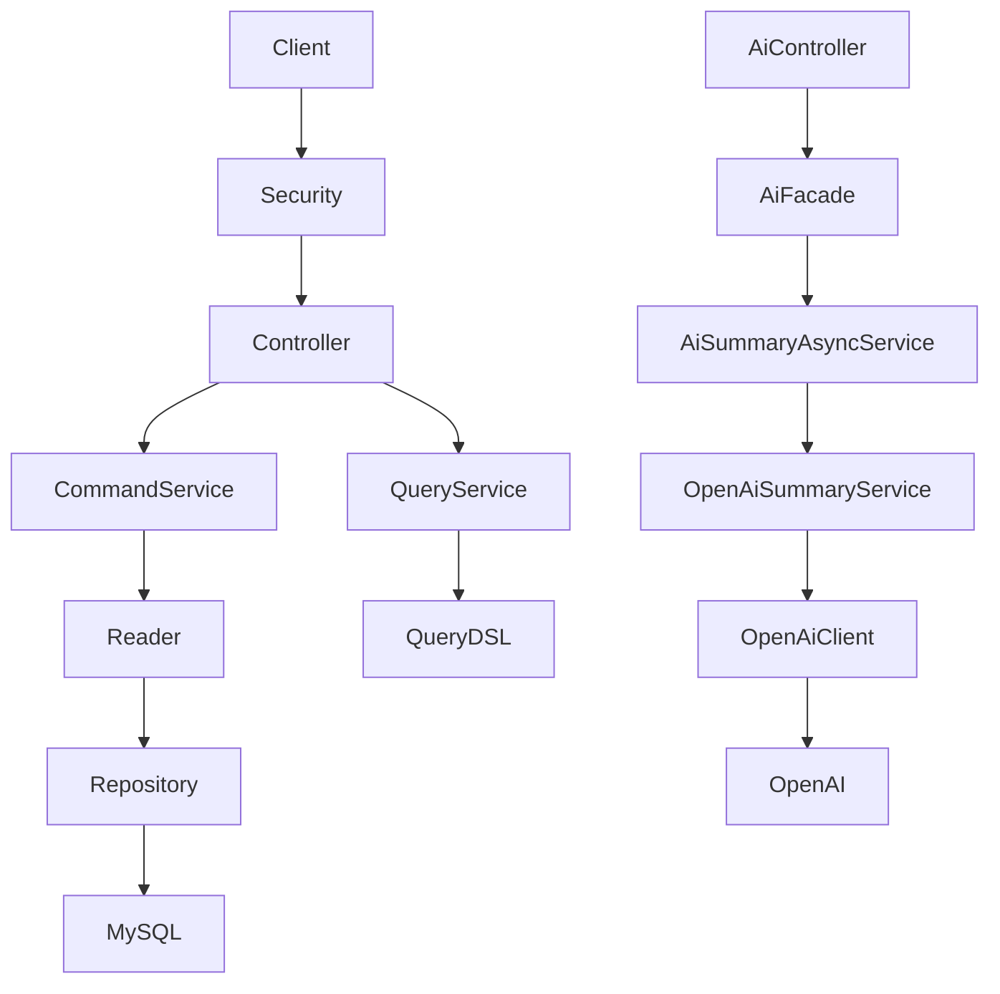
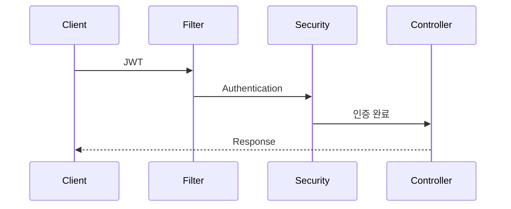

# 📘 FELDBUCH DEVELOPMENT BOOK

> AI 기반 개발 학습 노트 서비스의 설계부터 구현까지

------------------------------------------------------------------------

# 프로젝트를 시작한 이유

개발을 공부하면서 ChatGPT와의 대화, 트러블슈팅, 환경설정, 배운 내용을
검색 가능한 형태로 정리하고 싶다는 생각에서 Feldbuch를 시작했다.

목표는 단순 메모장이 아니라 **AI가 이해하는 개발 지식 저장소**를 만드는
것이다.

------------------------------------------------------------------------

# 기술 스택

  -----------------------------------------------------------------------------------------------------------------------------------------------------------------
  기술                                로고
  ----------------------------------- -----------------------------------------------------------------------------------------------------------------------------
  Java                                ``{=html}

  Spring Boot                         ``{=html}

  Docker                              ``{=html}

  MySQL                               ``{=html}

  Git                                 ``{=html}

  GitHub                              ``{=html}

  Gradle                              ``{=html}

  OpenAI                              ``{=html}
  -----------------------------------------------------------------------------------------------------------------------------------------------------------------

------------------------------------------------------------------------

# 프로젝트 목표

-   JWT 기반 인증
-   QueryDSL 검색
-   AI 요약
-   AI 태그 생성
-   AI 학습 추천
-   AI 코드 리뷰
-   AWS 배포
-   Docker 운영

------------------------------------------------------------------------

# 개발 과정



------------------------------------------------------------------------

# 현재 아키텍처



------------------------------------------------------------------------

# JWT 인증 흐름



------------------------------------------------------------------------

# 리팩토링 히스토리

## Reader Pattern

기존

``` text
Service
  ↓
Repository
```

개선

``` text
Service
  ↓
Reader
  ↓
Repository
```

------------------------------------------------------------------------

## CQRS

``` text
NoteService

↓

NoteCommandService

+

NoteQueryService
```

------------------------------------------------------------------------

## AI 구조

``` text
AiController
    ↓
AiFacade
    ↓
AiSummaryAsyncService
    ↓
SummaryService
    ↓
OpenAiSummaryService
    ↓
OpenAiClient
    ↓
OpenAI API
```

------------------------------------------------------------------------

# 구현 완료

-   Spring Security
-   JWT
-   회원가입
-   로그인
-   JWT Filter
-   CRUD
-   QueryDSL
-   PageableExecutionUtils
-   Reader Pattern
-   Mapper Pattern
-   CQRS
-   Facade
-   Async
-   RestClient
-   OpenAI API 연결

------------------------------------------------------------------------

# 앞으로 구현

## AI

-   SummaryPromptTemplate
-   Prompt Versioning
-   AI 태그 생성
-   제목 추천
-   코드 리뷰
-   퀴즈 생성
-   학습 로드맵

## 인프라

-   Redis
-   Docker Compose
-   GitHub Actions
-   AWS EC2
-   Nginx
-   HTTPS

## 고도화

-   이벤트 기반 처리
-   RAG
-   Vector Search
-   Knowledge Graph

------------------------------------------------------------------------

# 프로젝트 철학

1.  작은 커밋
2.  리팩토링을 두려워하지 않기
3.  테스트 우선
4.  실무 구조 지향
5.  AI와 백엔드의 결합

------------------------------------------------------------------------

# 대표 커밋

``` text
기능: JWT 로그인 구현
기능: 노트 CRUD 구현
기능: QueryDSL 검색 구현
리팩토링: Reader 패턴 도입
리팩토링: CQRS 적용
기능: AI 도메인 분리
기능: OpenAI API 클라이언트 구현
기능: OpenAI 요약 서비스 구현
```

------------------------------------------------------------------------

# 향후 목표

Feldbuch를 단순 포트폴리오가 아니라

**AI 기반 개발 지식 관리 플랫폼**으로 발전시키는 것이 목표이다.
