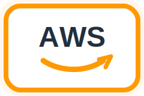
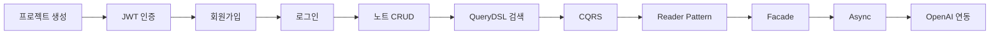
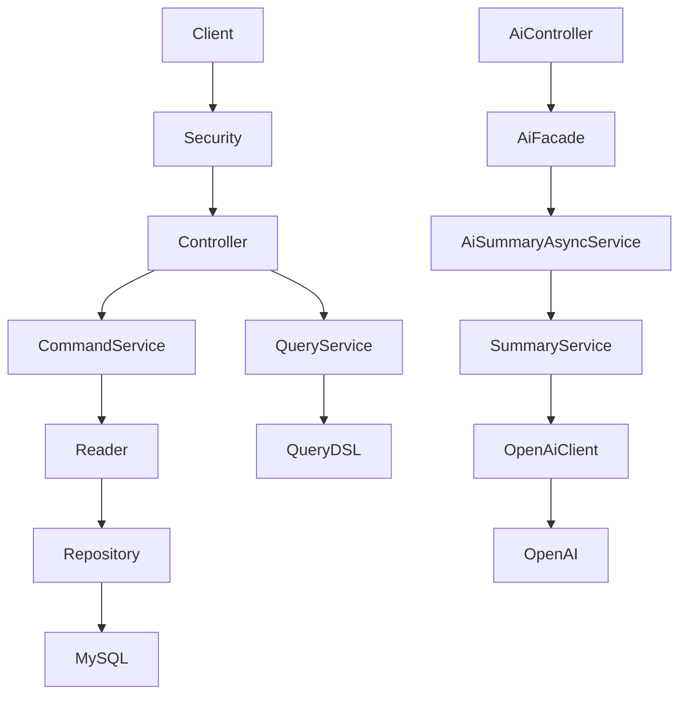
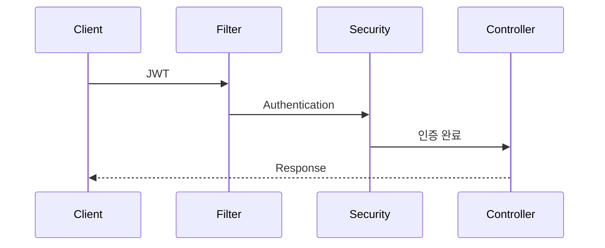

# FELDBUCH DEVELOPMENT DOCUMENTATION

> AI 기반 개발 학습 노트 서비스 Feldbuch의 프로젝트 소개, 개발 기록, 아키텍처, 이미지 자료를 정리한 문서입니다.

---

## README

### 프로젝트 소개

Feldbuch는 개발자가 학습하며 얻은 지식, 트러블슈팅, 코드, 환경 설정을 기록하고 검색할 수 있는 개발 지식 관리 플랫폼입니다.

단순한 메모 앱이 아니라 AI가 개발 노트를 이해하여 요약, 태깅, 추천, 코드 리뷰까지 수행하는 서비스를 목표로 합니다.

### 핵심 기능

- JWT 기반 회원가입과 로그인
- Spring Security 기반 인증/인가
- 개발 노트 CRUD
- QueryDSL 기반 검색
- 페이지네이션
- Pin 기능
- 학습 상태 관리
- OpenAI 기반 AI 요약
- 비동기 AI 처리

### 프로젝트 구조

```text
src/main/java
└── io.github.kaltz.feldbuch
    ├── ai
    ├── auth
    ├── common
    ├── config
    ├── note
    └── user
```

---

## FELDBUCH DEVELOPMENT BOOK

### 프로젝트 목표

- JWT 기반 인증 구현
- QueryDSL 검색 구현
- AI 요약 기능 구현
- AI 태그 생성
- 제목 추천
- 코드 리뷰
- 학습 로드맵 추천
- Docker 기반 운영 환경 구성
- AWS 배포

### 기술 스택

| Category | Stack |
| --- | --- |
| Language | Java 21 |
| Framework | Spring Boot 3 |
| Security | Spring Security, JWT |
| Database | MySQL, H2 |
| ORM | Spring Data JPA |
| Query | QueryDSL |
| Build | Gradle |
| AI | OpenAI REST API |
| Infra | Docker, AWS |
| Test | JUnit5, MockMvc |

### 기술 로고

| Java | Spring Boot | Docker | MySQL | Gradle | OpenAI |
| --- | --- | --- | --- | --- | --- |
|  |  |  |  |  |  |

| AWS | GitHub | GitHub Actions | Nginx | React | Redis | MariaDB |
| --- | --- | --- | --- | --- | --- | --- |
|  |  |  |  |  |  |  |

---

## FELDBUCH DEVELOPMENT LOG

### 개발을 시작한 계기

개발 공부 과정에서 ChatGPT와 나눈 대화, 삽질 기록, 환경 설정, 문제 해결 과정을 노트처럼 정리하고 싶었습니다.

Feldbuch의 목표는 개발자의 학습 기록을 저장하는 데서 끝나지 않고, AI가 그 기록을 이해해 더 나은 학습을 돕는 지식 관리 플랫폼으로 발전하는 것입니다.

### 지금까지의 개발 흐름



### 구현 완료

- Spring Security
- JWT 로그인
- CustomUserDetails
- JWT Filter
- 회원가입
- 로그인
- 노트 생성, 조회, 수정, 삭제
- QueryDSL 검색
- Pagination
- Pin
- StudyStatus
- Reader Pattern
- Mapper Pattern
- CQRS
- Facade
- Async
- RestClient
- OpenAI API 연동

### 2026-07 추가 개발 로그

- AI Job Entity, Service, Controller 구현
- Async와 Transaction 이슈 해결
- Job 상태 흐름 정리: Requested -> Processing -> Completed
- OpenAI API 실제 연동 검증
- `.env` 기반 OpenAI API Key 로딩 구성
- GitHub Push Protection 대응: 커밋 히스토리에서 `.env` 제거

---

## Architecture

### 현재 백엔드 아키텍처



### JWT 인증 흐름



### AI 요약 처리 흐름

```text
AiController
    ↓
AiFacade
    ↓
AiSummaryAsyncService
    ↓
SummaryService
    ↓
OpenAiClient
    ↓
OpenAI API
```

### AWS 배포 아키텍처 이미지

아래 이미지는 첨부 스크린샷을 그대로 쓰지 않고, 문서용으로 새로 정리한 배포 아키텍처 SVG입니다.


이미지 파일 경로:

```text
docs/images/diagrams/feldbuch-architecture.svg
```

### 아키텍처 구성 요소 로고

| 단계 | 이미지 | 설명 |
| --- | --- | --- |
| Source |  | GitHub 저장소에 코드를 push |
| CI/CD |  | GitHub Actions로 체크아웃, 빌드, 배포 파이프라인 실행 |
| Build |  | Gradle로 Spring Boot 애플리케이션 빌드 |
| Container |  | Docker 이미지 빌드 및 실행 |
| Cloud |  | EC2, RDS, S3, ELB, Route 53 기반 운영 |
| Backend |  | API 서버 |
| Frontend |  | 사용자 화면 |
| Cache |  | 캐시와 비동기 처리 보조 |
| Database |  | 운영 데이터 저장 |

---

## Refactoring History

### Reader Pattern

기존에는 Service가 Repository를 직접 호출했습니다.

```text
Service
  ↓
Repository
```

Reader Pattern 적용 후 조회 책임을 Reader로 분리했습니다.

```text
Service
  ↓
Reader
  ↓
Repository
```

### CQRS

노트 기능은 명령과 조회 책임을 분리했습니다.

```text
NoteCommandService
    +
NoteQueryService
```

### Facade

AI 기능은 Controller가 여러 서비스를 직접 조합하지 않도록 Facade를 두었습니다.

```text
AiController
    ↓
AiFacade
    ↓
AI Service Layer
```

### Async Processing

AI 요약은 외부 API 호출 시간이 발생하므로 비동기 처리 구조를 적용했습니다.

```text
요약 요청
  ↓
Job 생성
  ↓
비동기 처리 시작
  ↓
OpenAI API 호출
  ↓
Job 상태 업데이트
```

---

## Roadmap

### AI

- SummaryPromptTemplate 고도화
- Prompt Versioning
- AI Prompt Log
- AI 태그 생성
- 제목 추천
- 코드 리뷰
- 퀴즈 생성
- 학습 로드맵 추천

### Backend

- Redis Cache
- Event Driven Architecture
- Spring Batch
- API 문서화
- 테스트 커버리지 확장

### Infra

- Docker Compose 정리
- GitHub Actions
- AWS EC2 배포
- Nginx
- HTTPS
- Monitoring

### Advanced

- RAG
- Vector Search
- Knowledge Graph

---

## Image References

문서에서 이미지가 잘 보이도록 다음 기준으로 관리합니다.

- 스크린샷, 다이어그램 등 직접 만든 이미지는 `docs/images/diagrams/`에 저장합니다.
- 기술 로고는 `docs/images/logos/`에 각각 저장합니다.
- Markdown에서는 상대 경로를 사용합니다.
- 문서 안에서는 외부 URL 대신 저장소 내부 이미지 파일을 참조합니다.
- 이미지 alt 텍스트를 함께 작성합니다.

### 현재 로컬 이미지

| 이름 | 경로 | 용도 |
| --- | --- | --- |
| Feldbuch Deployment Architecture | `docs/images/diagrams/feldbuch-architecture.svg` | AWS, Docker, GitHub Actions, Route 53, S3, RDS 구성 다이어그램 |
| AWS | `docs/images/logos/aws.svg` | AWS 클라우드 영역 |
| Spring Boot | `docs/images/logos/springboot.svg` | 백엔드 API |
| Docker | `docs/images/logos/docker.svg` | 컨테이너 실행 환경 |
| React | `docs/images/logos/react.svg` | 프론트엔드 |
| Redis | `docs/images/logos/redis.svg` | 캐시 |
| MariaDB | `docs/images/logos/mariadb.svg` | 운영 DB |
| GitHub Actions | `docs/images/logos/githubactions.svg` | CI/CD |

### Markdown 이미지 예시

```markdown

```

### HTML 이미지 예시

```html


```

---

## Commit History Style

기능 단위로 작은 커밋을 유지합니다.

```text
기능: JWT 로그인 구현
기능: 노트 CRUD 구현
기능: QueryDSL 검색 구현
리팩토링: Reader 패턴 도입
리팩토링: CQRS 적용
기능: AI 도메인 분리
기능: OpenAI API 클라이언트 구현
기능: OpenAI 요약 서비스 구현
```

---

## Project Philosophy

Feldbuch는 단순한 포트폴리오 프로젝트가 아니라, 개발자의 학습 기록을 AI가 이해하고 활용하는 개발 지식 관리 플랫폼을 목표로 합니다.

기능 구현뿐 아니라 리팩토링, 테스트, 아키텍처, 유지보수성을 함께 고민하며 장기적으로 발전시키는 프로젝트입니다.
