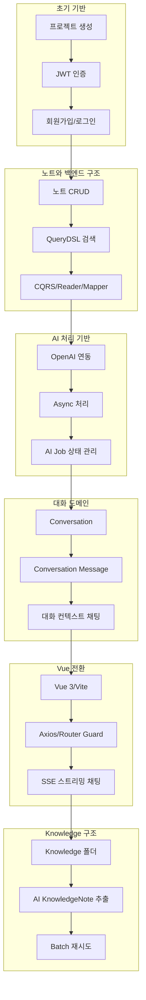
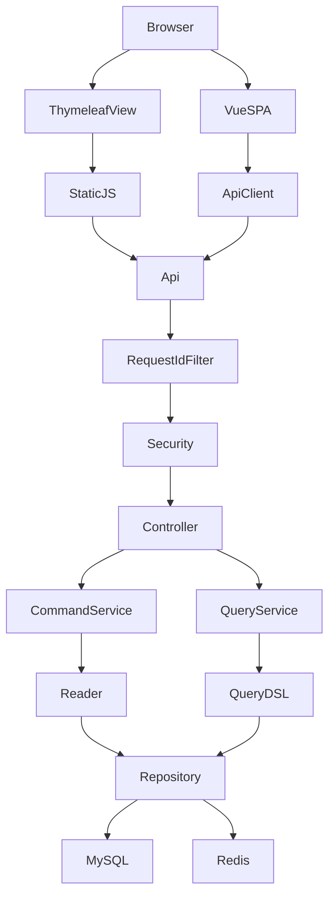
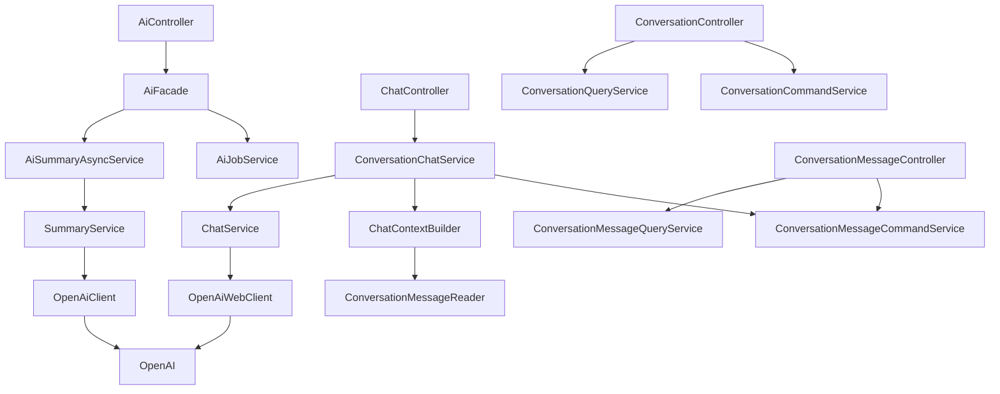
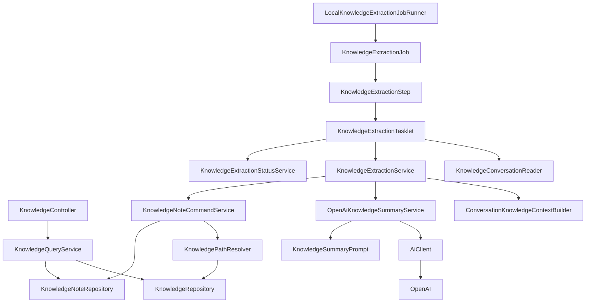
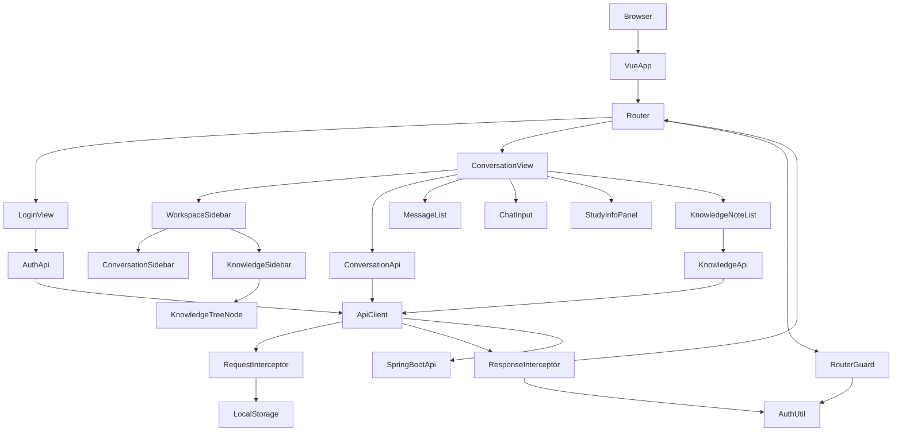

# FELDBUCH DEVELOPMENT DOCUMENTATION

> AI 기반 개발 학습 노트 서비스 Feldbuch의 현재 구현, 개발 흐름, 아키텍처를 정리한 문서입니다.

## Project Overview

Feldbuch는 개발자가 학습하며 얻은 지식, 트러블슈팅, 코드, 환경 설정을 기록하고 검색할 수 있는 개발 지식 관리 플랫폼입니다.

현재 구현은 대화 중심 학습 흐름을 기준으로 구성되어 있습니다. 사용자는 Vue SPA에서 AI와 개발 학습 대화를 나누고, 완료된 대화는 Batch를 통해 Knowledge 폴더와 KnowledgeNote로 추출됩니다.

## Current Product Surface

메인 사용자 화면은 `frontend/src/views/ConversationView.vue`입니다.

- `WorkspaceSidebar`가 왼쪽 고정 영역에서 `대화`와 `지식` 탭을 전환합니다.
- `대화` 모드에서는 대화 목록, 채팅 메시지, 입력창, 선택 대화의 학습 정보 패널을 렌더링합니다.
- `지식` 모드에서는 Knowledge 폴더 트리를 보여주고, 선택된 폴더의 KnowledgeNote 목록을 조회합니다.
- 로그아웃은 대화/지식 모드 양쪽 헤더에서 동일하게 제공됩니다.
- 대화 메시지 전송은 사용자 메시지와 빈 Assistant 메시지를 낙관적으로 추가한 뒤 SSE 토큰을 누적 표시하고, 완료 후 상세를 재조회합니다.

## Main Screen


## Tech Stack

| Category | Stack |
| --- | --- |
| Language | Java 21 |
| Framework | Spring Boot 3.5 |
| Security | Spring Security, JWT |
| Database | MySQL, H2 Test DB |
| ORM / Query | Spring Data JPA, QueryDSL |
| AI | OpenAI REST API, OpenAI SSE Streaming |
| Batch / Infra | Spring Batch, Redis, Docker Compose |
| Frontend | Vue 3, Vite, Vue Router, Axios, Fetch SSE, marked, highlight.js, DOMPurify |
| Legacy View | Thymeleaf, static CSS/JS |
| Test | JUnit 5, MockMvc, Spring Security Test, Spring Batch Test |

## Development Flow


```mermaid
flowchart TD
    subgraph Phase1["초기 기반"]
        A[프로젝트 생성] --> B[JWT 인증] --> C[회원가입/로그인]
    end

    subgraph Phase2["노트와 백엔드 구조"]
        D[노트 CRUD] --> E[QueryDSL 검색] --> F[CQRS/Reader/Mapper]
    end

    subgraph Phase3["AI 처리 기반"]
        G[OpenAI 연동] --> H[Async 처리] --> I[AI Job 상태 관리]
    end

    subgraph Phase4["대화 도메인"]
        J[Conversation] --> K[Conversation Message] --> L[대화 컨텍스트 채팅]
    end

    subgraph Phase5["Vue 전환"]
        M[Vue 3/Vite] --> N[Axios/Router Guard] --> O[SSE 스트리밍 채팅]
    end

    subgraph Phase6["Knowledge 구조"]
        P[Knowledge 폴더] --> Q[AI KnowledgeNote 추출] --> R[Batch 재시도]
    end

    C --> D
    F --> G
    I --> J
    L --> M
    O --> P
```

## Implemented Features

- Spring Security, JWT 로그인, JWT Claims 기반 `userId`, `email`, `role` 저장
- CustomUserDetails, JWT Filter, JWT AuthenticationEntryPoint 401 처리
- Vite 개발 서버 `http://localhost:5173` CORS 허용
- 회원가입, 로그인, 클라이언트 로그아웃
- 노트 생성, 조회, 수정, 삭제
- QueryDSL 검색, Pagination, Pin, StudyStatus
- Reader Pattern, Mapper Pattern, CQRS, Facade
- RestClient 기반 OpenAI 일반 요청
- WebClient 기반 OpenAI Chat Completion SSE 스트리밍
- AI Job Entity, Reader, Service, Controller
- AI Job 상태 조회 API
- Conversation Entity, Controller, Command/Query Service
- Conversation 제목 수정/삭제 API
- ConversationMessage Entity, Controller, Command/Query Service
- Conversation별 메시지 순서 저장
- 대화 내역을 OpenAI Chat Completion 메시지 컨텍스트로 변환
- Conversation Chat API와 Conversation Chat Stream API
- `StreamResponse` 기반 `TOKEN`, `COMPLETE`, `ERROR` 스트리밍 이벤트 계약
- 첫 사용자 메시지 기반 Conversation 제목 자동 생성
- Conversation Knowledge 추출 상태 필드와 실패 재시도 메타데이터
- Knowledge Entity, KnowledgeNote Entity, KnowledgeNote Keyword ElementCollection
- KnowledgeRepository, KnowledgeNoteRepository
- KnowledgePathResolver
- AiKnowledgeSummaryResponse
- KnowledgeSummaryPrompt
- AiKnowledgeSummaryService, OpenAiKnowledgeSummaryService
- KnowledgeExtractionService, KnowledgeExtractionStatusService
- ConversationKnowledgeContextBuilder
- KnowledgeConversationReader
- KnowledgeExtractionBatchConfig, KnowledgeExtractionTasklet, LocalKnowledgeExtractionJobRunner
- 사용자별 Knowledge 루트/자식 조회, 동일 폴더명 중복 확인 쿼리
- QueryDSL 기반 Knowledge 추출 대상 Conversation 조회 쿼리
- KnowledgeNote의 Knowledge별/Conversation별/사용자별 조회 쿼리
- Knowledge Tree 조회 API, KnowledgeNote 목록/상세 조회 API
- Thymeleaf 기반 로그인/대화 비교 화면
- Vue 3 + Vite SPA: `LoginView`, `ConversationView`
- Vue 컴포넌트: `WorkspaceSidebar`, `ConversationSidebar`, `MessageList`, `ChatInput`, `StudyInfoPanel`, `KnowledgeSidebar`, `KnowledgeTreeNode`, `KnowledgeNoteList`
- 새 대화 생성, 대화 제목 인라인 수정, 대화 삭제 UI
- 대화 생성/수정/삭제/메시지 전송 중복 요청 방지 상태
- 메시지 전송 중 AI 응답 작성 로딩 표시
- 메시지 목록 자동 스크롤
- AI 응답 Markdown 렌더링, highlight.js 코드 문법 강조, DOMPurify sanitize
- 코드 블록 언어 표시와 클립보드 COPY 버튼
- Request ID Filter, SLF4J MDC 기반 requestId 저장/해제, `X-Request-Id` 응답 헤더
- Axios 공통 API client와 Request/Response Interceptor
- Vue Router Guard 기반 인증 라우트 보호
- `localStorage` 기반 `accessToken`, `userId` 저장/삭제 유틸리티
- RedisTemplate 구성
- Spring Batch Summary Job 구성
- 주요 도메인/서비스/컨트롤러 통합 테스트와 Knowledge 추출 Batch 테스트

## Runtime Configuration

- 기본 활성 프로필: `local`
- 공통 설정 파일: `src/main/resources/application.yml`
- 로컬 설정 파일: `src/main/resources/application-local.yml`
- 운영 설정 파일: `src/main/resources/application-prod.yml`
- OpenAI Base URL: `https://api.openai.com/v1`
- OpenAI 모델 설정 키: `openai.model`
- 현재 기본 모델: `gpt-4.1-nano`
- 로컬 Docker 인프라: MySQL, Redis
- Spring Batch 기본 자동 실행: `spring.batch.job.enabled=false`
- Knowledge 추출 배치 로컬 실행 플래그: `feldbuch.batch.knowledge-extraction.run=true`
- Knowledge 추출 배치 Job 이름: `knowledgeExtractionJob`
- Knowledge 추출 배치 Step 이름: `knowledgeExtractionStep`

## Architecture

### System Overview


Spring Boot는 인증, REST API, AI 호출, Batch 처리를 담당합니다. Vue SPA는 독립 프론트엔드로 개발하며, Thymeleaf 화면은 전환 과정의 비교용 구현으로 남겨둡니다.


```mermaid
flowchart TD
    Browser --> VueSPA
    Browser --> ThymeleafView

    VueSPA --> ApiClient
    ThymeleafView --> StaticJS
    StaticJS --> Api
    ApiClient --> Api

    Api --> RequestIdFilter
    RequestIdFilter --> Security
    Security --> Controller

    Controller --> CommandService
    Controller --> QueryService
    CommandService --> Reader
    QueryService --> QueryDSL
    Reader --> Repository
    QueryDSL --> Repository

    Repository --> MySQL
    Repository --> Redis
```

### AI and Conversation


```mermaid
flowchart TD
    AiController --> AiFacade
    AiFacade --> AiJobService
    AiFacade --> AiSummaryAsyncService
    AiSummaryAsyncService --> SummaryService
    SummaryService --> OpenAiClient
    OpenAiClient --> OpenAI

    ChatController --> ConversationChatService
    ConversationChatService --> ConversationMessageCommandService
    ConversationChatService --> ChatContextBuilder
    ConversationChatService --> ChatService
    ChatContextBuilder --> ConversationMessageReader
    ChatService --> OpenAiWebClient
    OpenAiWebClient --> OpenAI

    ConversationController --> ConversationCommandService
    ConversationController --> ConversationQueryService
    ConversationMessageController --> ConversationMessageCommandService
    ConversationMessageController --> ConversationMessageQueryService
```

### Knowledge and Batch



```mermaid
flowchart TD
    KnowledgeController --> KnowledgeQueryService
    KnowledgeQueryService --> KnowledgeRepository
    KnowledgeQueryService --> KnowledgeNoteRepository

    OpenAiKnowledgeSummaryService --> AiClient
    OpenAiKnowledgeSummaryService --> KnowledgeSummaryPrompt
    AiClient --> OpenAI

    KnowledgeNoteCommandService --> KnowledgePathResolver
    KnowledgePathResolver --> KnowledgeRepository
    KnowledgeNoteCommandService --> KnowledgeNoteRepository

    LocalKnowledgeExtractionJobRunner --> KnowledgeExtractionJob
    KnowledgeExtractionJob --> KnowledgeExtractionStep
    KnowledgeExtractionStep --> KnowledgeExtractionTasklet
    KnowledgeExtractionTasklet --> KnowledgeConversationReader
    KnowledgeExtractionTasklet --> KnowledgeExtractionService
    KnowledgeExtractionTasklet --> KnowledgeExtractionStatusService
    KnowledgeExtractionService --> ConversationKnowledgeContextBuilder
    KnowledgeExtractionService --> OpenAiKnowledgeSummaryService
    KnowledgeExtractionService --> KnowledgeNoteCommandService
```

## Client Architecture



```mermaid
flowchart TD
    Browser --> VueApp
    VueApp --> Router
    Router --> LoginView
    Router --> ConversationView
    Router --> RouterGuard
    RouterGuard --> AuthUtil

    LoginView --> AuthApi
    ConversationView --> WorkspaceSidebar
    WorkspaceSidebar --> ConversationSidebar
    WorkspaceSidebar --> KnowledgeSidebar
    KnowledgeSidebar --> KnowledgeTreeNode

    ConversationView --> ConversationApi
    ConversationView --> MessageList
    ConversationView --> ChatInput
    ConversationView --> StudyInfoPanel
    ConversationView --> KnowledgeNoteList
    KnowledgeNoteList --> KnowledgeApi

    AuthApi --> ApiClient
    ConversationApi --> ApiClient
    KnowledgeApi --> ApiClient
    ApiClient --> RequestInterceptor
    ApiClient --> ResponseInterceptor
    RequestInterceptor --> LocalStorage
    ResponseInterceptor --> AuthUtil
    ResponseInterceptor --> Router
    ApiClient --> SpringBootApi
```

클라이언트 책임 분리:

- `App.vue`: `RouterView`를 렌더링하는 Vue 앱 루트
- `router/index.js`: `/login`, `/conversations` 라우트와 인증 Guard 관리
- `LoginView.vue`: 로그인 폼, 로그인 API 호출, 토큰 저장, 대화 화면 이동
- `ConversationView.vue`: 대화/지식 워크스페이스 컨테이너, 선택 상태와 요청 중 상태 관리
- `WorkspaceSidebar.vue`: 대화/지식 탭 전환과 하위 사이드바 이벤트 중계
- `ConversationSidebar.vue`: 대화 목록, 선택 상태, 새 대화 생성, 인라인 제목 수정, 삭제 버튼
- `KnowledgeSidebar.vue`: Knowledge 폴더 트리 조회, 새로고침, 선택 이벤트 전달
- `KnowledgeTreeNode.vue`: 재귀 폴더 노드 렌더링, 펼침/접힘, 폴더 선택
- `KnowledgeNoteList.vue`: 선택 Knowledge 폴더의 노트 목록 조회
- `MessageList.vue`: `USER`, `ASSISTANT` 메시지 렌더링, Markdown, 코드 강조, COPY 버튼, 로딩 메시지
- `ChatInput.vue`: 사용자 입력을 `send` 이벤트로 상위 컴포넌트에 전달하고 전송 중 입력 비활성화
- `StudyInfoPanel.vue`: 선택 대화의 주제, 상태, 메시지 수, 생성일, 수정일, 활동 신호 표시
- `apiClient.js`: Axios instance, baseURL, Request/Response Interceptor 관리
- `authApi.js`, `conversationApi.js`, `knowledgeApi.js`: 도메인별 API 호출 함수
- `utils/markdownRenderer.js`: marked, highlight.js, DOMPurify 조합 Markdown 렌더링
- `utils/auth.js`: `accessToken`, `userId` 저장/조회/삭제와 로그인 여부 판단

대화 화면 데이터 흐름:

```text
ConversationView mounted
  ↓
getConversations()
  ↓
대화 목록 저장
  ↓
첫 번째 대화 자동 선택
  ↓
getConversation(conversationId)
  ↓
conversation / messages 상태 갱신
  ↓
ConversationSidebar / MessageList / StudyInfoPanel 렌더링
```

메시지 스트리밍 전송 흐름:

```text
ChatInput send event
  ↓
ConversationView.sendMessage(content)
  ↓
sendingMessage = true
  ↓
사용자 메시지와 빈 ASSISTANT 메시지 낙관적 추가
  ↓
conversationApi.streamMessage(conversationId, message)
  ↓
POST /api/conversations/{conversationId}/chat/stream
  ↓
SSE TOKEN 이벤트마다 ASSISTANT 메시지 content 누적
  ↓
COMPLETE 이벤트 수신
  ↓
getConversation(conversationId) 재조회
  ↓
메시지 목록과 제목 최신화
  ↓
대화 목록 최상단 이동과 자동 스크롤
```

Knowledge 화면 데이터 흐름:

```text
WorkspaceSidebar 지식 탭 선택
  ↓
KnowledgeSidebar mounted
  ↓
GET /api/knowledge/tree
  ↓
KnowledgeTreeNode 재귀 렌더링
  ↓
폴더 선택
  ↓
ConversationView.selectedKnowledgeId 갱신
  ↓
KnowledgeNoteList
  ↓
GET /api/knowledge/{knowledgeId}/notes
  ↓
노트 제목 목록 렌더링
```

## API Communication

공통 규칙:

- 요청 본문은 JSON을 사용합니다.
- 일반 응답은 `ApiResponse<T>` 형식으로 통일하고 실제 데이터는 `data` 필드에 담습니다.
- 로그인 성공 시 `accessToken`, `userId`를 `localStorage`에 저장합니다.
- Axios Request Interceptor가 `Authorization: Bearer <accessToken>` 헤더를 자동으로 추가합니다.
- Axios Response Interceptor가 `401 Unauthorized`를 감지하면 `logout()`으로 클라이언트 토큰을 제거하고 `/login`으로 이동합니다.
- Fetch 기반 SSE 스트리밍 함수는 `Authorization` 헤더를 직접 추가합니다.
- 백엔드는 `RequestIdFilter`로 모든 요청에 UUID 기반 `requestId`를 부여하고, MDC와 `X-Request-Id` 응답 헤더에 기록합니다.

주요 API:

| Method | Path | Purpose |
| --- | --- | --- |
| `POST` | `/api/auth/login` | 로그인 |
| `GET` | `/api/conversations` | 대화 목록 조회 |
| `POST` | `/api/conversations` | 새 대화 생성 |
| `GET` | `/api/conversations/{conversationId}` | 대화 상세와 메시지 조회 |
| `PATCH` | `/api/conversations/{conversationId}` | 대화 제목 수정 |
| `DELETE` | `/api/conversations/{conversationId}` | 대화 삭제 |
| `POST` | `/api/conversations/{conversationId}/chat` | 일반 대화형 AI 요청 |
| `POST` | `/api/conversations/{conversationId}/chat/stream` | SSE 대화형 AI 요청 |
| `GET` | `/api/knowledge/tree` | Knowledge 폴더 트리 조회 |
| `GET` | `/api/knowledge/{knowledgeId}/notes` | Knowledge 폴더별 노트 목록 조회 |
| `GET` | `/api/knowledge/notes/{noteId}` | Knowledge 노트 상세 조회 |
| `GET` | `/api/ai/jobs/{jobId}` | AI Job 상태 조회 |

SSE 이벤트 계약:

```text
StreamResponse
  type: TOKEN | COMPLETE | ERROR
  content: TOKEN일 때 새 토큰 조각, ERROR일 때 오류 메시지
```

## Database Model


현재 영속 모델은 `users`, `notes`, `ai_job`, `conversations`, `conversation_messages`, `knowledge`, `knowledge_notes`, `knowledge_note_keywords`를 중심으로 구성합니다.

- `users`: 노트, 대화, Knowledge의 소유자
- `notes`: 개발 노트와 학습 상태
- `ai_job`: 비동기 AI 요약 작업 상태
- `conversations`: AI 학습 대화 세션과 Knowledge 추출 상태
- `conversation_messages`: 대화별 USER/ASSISTANT 메시지
- `knowledge`: 사용자별 지식 폴더 트리
- `knowledge_notes`: 대화에서 AI가 추출한 학습 노트
- `knowledge_note_keywords`: KnowledgeNote 키워드 ElementCollection

## Knowledge Extraction Batch

Knowledge 추출 배치는 완료된 대화를 AI 학습 노트로 증류하기 위한 Spring Batch 작업입니다.

- Job 이름: `knowledgeExtractionJob`
- Step 이름: `knowledgeExtractionStep`
- 실행 방식: Tasklet 기반 단일 Step
- 실행 시점: `local` 프로필에서 `feldbuch.batch.knowledge-extraction.run=true` 설정 시 애플리케이션 시작 직후 1회 실행
- Job Parameter: `executionTime=System.currentTimeMillis()`로 매 실행을 고유 Job 인스턴스로 구분
- 반복 방식: 한 번 실행할 때 조회된 대상 Conversation 목록을 순회 처리
- 현재 정기 주기: 별도 Scheduler/Cron은 아직 없음
- 대상 조건: `status = COMPLETED`이고 `knowledgeExtractStatus = NONE`
- 재시도 조건: `knowledgeExtractStatus = FAILED`, `knowledgeExtractRetryCount < 3`, `knowledgeExtractFailedAt <= now - 1 minute`
- 성공 처리: `PROCESSING -> COMPLETED`, 오류 메시지와 실패 시각 초기화
- 실패 처리: `FAILED`로 변경, 재시도 횟수 증가, 실패 메시지와 실패 시각 저장

## Project Structure

```text
src/main/java/io.github.kaltz.feldbuch
├── ai
│   ├── client          # OpenAI REST/SSE 클라이언트
│   ├── dto             # OpenAI/AI 응답 DTO
│   ├── facade          # AI 요청 진입 Facade
│   ├── job             # 비동기 AI Job 상태 관리
│   ├── mapper          # 요청/응답/메시지 변환
│   ├── model           # 채팅/제목 생성 모델
│   ├── prompt          # Summary/Knowledge/Title 프롬프트
│   └── service         # 요약, 채팅, Knowledge 요약 서비스
├── auth
├── batch
├── common
├── config
├── conversation
├── knowledge
├── note
├── redis
└── user

src/main/resources
├── templates           # Thymeleaf 비교용 화면
└── static              # Thymeleaf 화면용 CSS/JS

frontend/src
├── api
├── assets
├── components
│   ├── chat
│   ├── conversation
│   ├── knowledge
│   └── layout
├── router
├── utils
└── views
```

## Design Points

- CQRS 기반 Command/Query 책임 분리
- Reader Pattern으로 조회 전용 도메인 접근 책임 분리
- Mapper Pattern으로 DTO/도메인/OpenAI 메시지 변환 분리
- Facade와 Async Service를 통한 AI Job 요청 흐름 분리
- OpenAI 일반 요청과 SSE 스트리밍 요청 계층 분리
- Conversation 메시지 영속화 후 AI 컨텍스트 구성
- 낙관적 사용자 메시지와 스트리밍 Assistant 메시지 렌더링
- Markdown 렌더링과 sanitize 책임을 `markdownRenderer.js`로 분리
- Knowledge 폴더 트리 자기 참조 모델링
- KnowledgePathResolver로 AI 응답 경로 기반 폴더 자동 조회/생성
- Batch 대상 조회와 재시도 조건을 QueryDSL로 관리
- Knowledge 추출 상태 변경은 별도 트랜잭션으로 반영
- Request ID 기반 요청 추적
- Thymeleaf 화면은 비교용으로 유지하고 Vue SPA를 주 사용자 화면으로 전환

## Roadmap

- Knowledge 노트 상세 화면 연결
- Knowledge 폴더/노트 관리 UI 확장
- Vue 화면 상태 관리 구조 정리
- Vue 삭제 확인 UX 개선
- Knowledge 추출 Batch 정기 스케줄러 연결
- Knowledge 추출 대상 조회 인덱스 추가
- AI 태그 생성
- 코드 리뷰
- 학습 퀴즈 생성
- 학습 로드맵 추천
- Docker Compose 운영 구성 정리
- 테스트 커버리지 확장
- Monitoring
