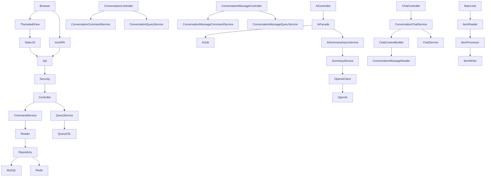
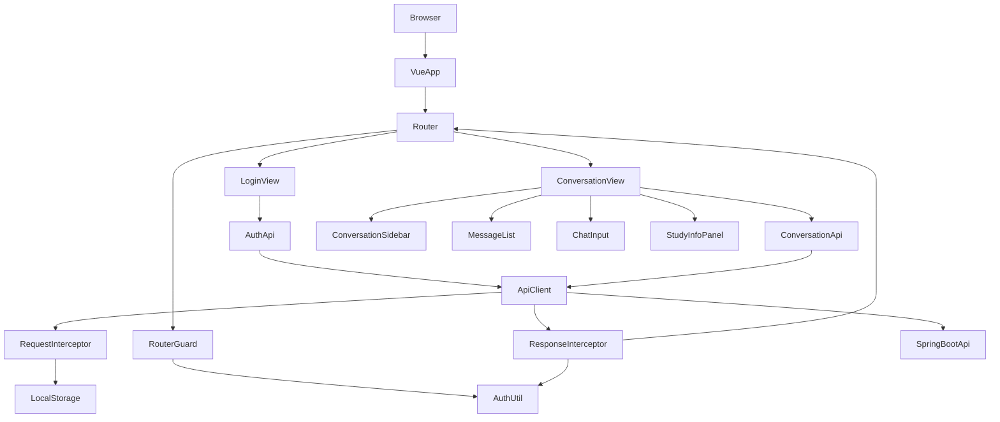
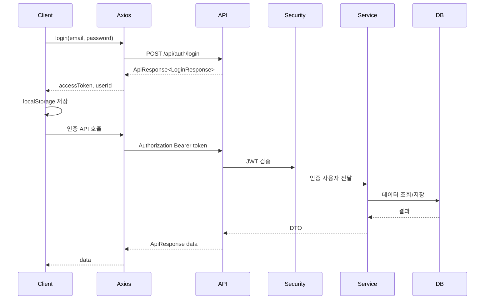
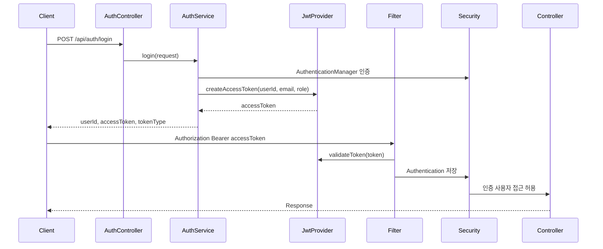
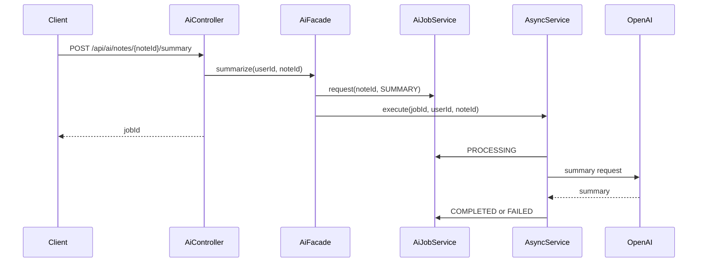

# FELDBUCH DEVELOPMENT DOCUMENTATION

> AI 기반 개발 학습 노트 서비스 Feldbuch의 프로젝트 소개, 개발 기록, 아키텍처, 이미지 자료를 정리한 문서입니다.

---

## README

### 프로젝트 소개

Feldbuch는 개발자가 학습하며 얻은 지식, 트러블슈팅, 코드, 환경 설정을 기록하고 검색할 수 있는 개발 지식 관리 플랫폼입니다.

단순한 메모 앱이 아니라 AI가 개발 노트를 이해하여 요약, 태깅, 추천, 코드 리뷰까지 수행하는 서비스를 목표로 합니다.

### 핵심 기능

- JWT 기반 회원가입과 로그인
- 클라이언트 로그아웃
- Spring Security 기반 인증/인가
- 개발 노트 CRUD
- QueryDSL 기반 검색
- 페이지네이션
- Pin 기능
- 학습 상태 관리
- OpenAI 기반 AI 요약
- 비동기 AI 처리
- AI Job 생성 및 상태 조회
- Conversation 생성, 목록 조회, 단건 조회
- Conversation 삭제
- Conversation Message 저장 및 조회
- Conversation 컨텍스트 기반 AI 채팅
- 첫 사용자 메시지 기반 Conversation 제목 자동 생성
- Thymeleaf 기반 로그인/대화 화면
- Vue 3 + Vite 로그인/대화 화면 전환
- Axios API client, Request/Response Interceptor
- Vue Router Guard 기반 인증 라우팅
- Conversation Sidebar, Message List, Study Info Panel 기반 대화 화면
- 새 대화 생성/삭제 UI와 중복 요청 방지 상태
- AI 응답 Markdown 렌더링 및 DOMPurify sanitize 처리
- 메시지 전송 중 로딩 표시와 자동 스크롤
- Redis, Spring Batch 기반 확장 구성

### 프로젝트 구조

```text
backend
└── src/main/java/io.github.kaltz.feldbuch
    ├── ai               # OpenAI 연동, 요약, 채팅
    ├── auth             # 로그인, JWT 인증
    ├── batch            # Spring Batch 요약 파이프라인
    ├── common           # 공통 응답, 예외
    ├── config           # Security, Redis, OpenAI, Batch 설정
    ├── conversation     # 대화, 메시지, 대화형 AI
    ├── home             # 서버 렌더링 진입점
    ├── note             # 개발 노트 CRUD/Search
    ├── redis            # Redis 유틸리티
    └── user             # 회원, 사용자 조회

legacy-view
└── src/main/resources
    ├── templates        # Thymeleaf 비교용 화면
    └── static           # Thymeleaf 화면용 CSS/JS

frontend
└── src
    ├── api              # Axios API client와 도메인별 API 함수
    ├── components       # Vue 컴포넌트: Sidebar, MessageList, ChatInput, StudyInfoPanel
    ├── router           # Vue Router
    ├── utils            # 토큰 저장, 로그아웃 등 인증 유틸리티
    └── views            # Vue 화면
```

---

## FELDBUCH DEVELOPMENT BOOK

### 프로젝트 목표

- JWT 기반 인증 구현
- QueryDSL 검색 구현
- AI 요약 기능 구현
- 대화 제목 자동 생성
- AI 태그 생성
- 코드 리뷰
- 학습 로드맵 추천
- Docker 기반 운영 환경 구성

### 기술 스택

| Category | Stack |
| --- | --- |
| Language | Java 21 |
| Framework | Spring Boot 3 |
| Security | Spring Security, JWT |
| Database | MySQL, H2 |
| ORM | Spring Data JPA |
| Query | QueryDSL |
| Build | Gradle |
| AI | OpenAI REST API |
| Infra | Docker, Redis |
| Batch | Spring Batch |
| View | Thymeleaf, Static CSS/JS, Vue 3, Vite, Vue Router, Axios, marked, DOMPurify |
| Test | JUnit5, MockMvc |

### 기술 로고

| Java | Spring Boot | Docker | MySQL | Gradle | OpenAI |
| --- | --- | --- | --- | --- | --- |
|  |  |  |  |  |  |

| Spring Security | JWT | Spring Data JPA | QueryDSL | Redis | Spring Batch | H2 Test DB | RestClient |
| --- | --- | --- | --- | --- | --- | --- | --- |
| 인증/인가 | 토큰 인증 | ORM | 동적 검색 | 캐시/임시 저장소 | 요약 배치 파이프라인 | 테스트 DB | OpenAI API 호출 |

| Vue.js | Vite | Vue Router | Axios | marked | DOMPurify | Thymeleaf |
| --- | --- | --- | --- | --- | --- | --- |
|  | 프론트엔드 개발/빌드 | 클라이언트 라우팅 | HTTP client / interceptor | Markdown 렌더링 | HTML sanitize | 비교용 서버 렌더링 화면 |

---

## FELDBUCH DEVELOPMENT LOG

### 개발을 시작한 계기

개발 공부 과정에서 ChatGPT와 나눈 대화, 삽질 기록, 환경 설정, 문제 해결 과정을 노트처럼 정리하고 싶었습니다.

Feldbuch의 목표는 개발자의 학습 기록을 저장하는 데서 끝나지 않고, AI가 그 기록을 이해해 더 나은 학습을 돕는 지식 관리 플랫폼으로 발전하는 것입니다.

### 지금까지의 개발 흐름


```mermaid
flowchart LR
    A[프로젝트 생성]
    --> B[JWT 인증]
    --> C[회원가입]
    --> D[로그인]
    --> E[노트 CRUD]
    --> F[QueryDSL 검색]
    --> G[CQRS]
    --> H[Reader Pattern]
    --> I[Facade]
    --> J[Async]
    --> K[OpenAI 연동]
    --> L[AI Job 상태 관리]
    --> M[Conversation 도메인 추가]
    --> N[Spring Batch 구성]
    --> O[Thymeleaf 비교 화면 구성]
    --> P[Vue.js 로그인/대화 화면 전환]
    --> Q[Axios/Interceptor 인증 통신 구성]
```

### 구현 완료

- Spring Security
- JWT 로그인
- JWT Claims 기반 `userId`, `email`, `role` 저장
- CustomUserDetails
- JWT Filter
- JWT AuthenticationEntryPoint 401 처리
- CORS 설정: Vite 개발 서버 `http://localhost:5173` 허용
- 회원가입
- 로그인
- 클라이언트 로그아웃
- 노트 생성, 조회, 수정, 삭제
- QueryDSL 검색
- Pagination
- Pin
- StudyStatus
- Reader Pattern
- Mapper Pattern
- CQRS
- Facade
- Async
- RestClient
- OpenAI API 연동
- AI Job Entity, Reader, Service, Controller
- AI Job 상태 조회 API
- Conversation Entity, Controller, Command/Query Service
- Conversation 삭제 API
- ConversationMessage Entity, Controller, Command/Query Service
- Conversation별 메시지 순서 저장
- 대화 내역을 OpenAI Chat Completion 메시지 컨텍스트로 변환
- Conversation Chat API
- 첫 사용자 메시지 기반 Conversation 제목 자동 생성
- Thymeleaf 기반 로그인/대화 화면
- `frontend/` Vue 3 + Vite 프로젝트 구성
- Vue 로그인 화면: `LoginView`
- Vue 대화 화면: `ConversationView`
- Vue 컴포넌트: `ConversationSidebar`, `MessageList`, `ChatInput`, `StudyInfoPanel`
- 새 대화 생성 UI
- 대화 삭제 UI
- 대화 생성/삭제/메시지 전송 중복 요청 방지 상태
- 메시지 전송 중 AI 응답 작성 로딩 표시
- 메시지 목록 자동 스크롤
- AI 응답 Markdown 렌더링
- DOMPurify 기반 렌더링 HTML sanitize
- Axios 공통 API client
- Axios Request Interceptor 기반 JWT Authorization 헤더 자동 주입
- Axios Response Interceptor 기반 401 감지, 로그아웃, 로그인 화면 이동
- Vue Router Guard 기반 인증 라우트 보호
- `localStorage` 기반 `accessToken`, `userId` 저장/삭제 유틸리티
- RedisTemplate 구성
- Spring Batch Summary Job 구성

### 2026-07 추가 개발 로그

- AI Job Entity, Service, Controller 구현
- Async와 Transaction 이슈 해결
- Job 상태 흐름 정리: Requested -> Processing -> Completed
- OpenAI API 실제 연동 검증
- 환경별 프로필 기반 OpenAI API Key 로딩 구성
- GitHub Push Protection 대응: 커밋 히스토리에서 `.env` 제거
- Conversation 도메인 추가: 대화 컨텍스트 생성을 위한 `Conversation` 모델과 생성/조회 API 구현
- Conversation Message 도메인 추가: `USER`, `ASSISTANT` 역할별 메시지 저장과 목록 조회 API 구현
- `ConversationChatService` 추가: 사용자 메시지 저장 -> 대화 컨텍스트 구성 -> OpenAI 호출 -> AI 응답 저장 흐름 구현
- `ChatContextBuilder`, `ChatMessageMapper` 추가: 저장된 대화 메시지를 OpenAI 요청 메시지로 변환
- `TitlePromptFactory` 추가: 기본 제목인 `새 대화` 상태에서 첫 사용자 메시지를 기반으로 짧은 한국어 제목 자동 생성
- `ChatModelProvider` 전략 추가: `openai.model` 설정값으로 OpenAI 모델 선택
- Thymeleaf 기반 `/login`, `/conversations` 화면과 정적 CSS/JS 구성
- Thymeleaf 화면은 Vue.js 화면과 비교하기 위한 기준 구현으로 유지
- `frontend/`에 Vue 3 + Vite + Vue Router 기반 SPA 프로젝트 추가
- Vue 채팅 화면 컴포넌트 초안 구성: 입력 컴포넌트에서 부모로 메시지를 emit하고 메시지 목록 컴포넌트가 렌더링
- `authApi`, `conversationApi`로 프론트 API 호출 책임 분리
- `apiClient`에 Axios baseURL `http://localhost:8080/api` 설정
- Request Interceptor에서 `localStorage.accessToken`을 `Authorization: Bearer` 헤더로 주입
- Response Interceptor에서 401 응답 시 토큰과 사용자 ID를 삭제하고 `/login`으로 리다이렉트
- `router.beforeEach`로 인증이 필요한 `/conversations` 접근 전 토큰 존재 여부 확인
- 로그아웃 버튼에서 클라이언트 저장 토큰을 삭제하고 로그인 화면으로 이동
- `ConversationView`에서 대화 목록 조회, 첫 대화 자동 선택, 단건 대화 상세 조회, 메시지 전송 후 상세 재조회 흐름 구성
- `ConversationView`에서 새 대화 생성 후 목록을 재조회하고 생성한 대화를 자동 선택
- `ConversationView`에서 대화 삭제 전 확인창을 띄우고, 삭제한 대화가 선택 상태이면 다음 대화를 자동 선택
- `ConversationView`에서 `creatingConversation`, `deletingConversationId`, `sendingMessage`로 중복 요청 방지
- `ConversationView`에서 `nextTick` 이후 메시지 컨테이너를 하단으로 자동 스크롤
- `ConversationSidebar`에서 대화 목록, 선택 상태, 생성 버튼, 삭제 버튼 렌더링
- `MessageList`에서 `USER`, `ASSISTANT` 메시지 버블 렌더링
- `MessageList`에서 `marked`와 `DOMPurify`로 AI 응답 Markdown을 안전하게 렌더링
- `ChatInput`에서 메시지 전송 중 입력과 버튼 비활성화
- `StudyInfoPanel`에서 대화 제목, 상태, 메시지 수, 생성일 표시
- `ConversationDetailResponse`에 대화 메타데이터, 메시지 목록, 메시지 수 포함
- Spring Security CORS 설정으로 Vite 개발 서버 `http://localhost:5173` 허용
- Spring Batch 기반 `summaryJob`/`summaryStep` 구성
- Docker Compose에 MySQL, Redis 로컬 인프라 구성
- 테스트 확장: Auth, Note, AI, OpenAI Client, Redis, Batch, Conversation 통합 테스트 구성

### 현재 설정 기준

- 기본 활성 프로필: `local`
- 공통 설정 파일: `src/main/resources/application.yml`
- 로컬 설정 파일: `src/main/resources/application-local.yml`
- 운영 설정 파일: `src/main/resources/application-prod.yml`
- OpenAI Base URL: `https://api.openai.com/v1`
- OpenAI 모델 설정 키: `openai.model`
- 현재 기본 모델: `gpt-4.1-nano`
- 로컬 Docker 인프라: MySQL, Redis

---

## Architecture

### 현재 아키텍처

현재 서버 내부에는 Thymeleaf 기반 화면이 있으며, 이 화면은 Vue.js 전환 과정에서 비교용 기준 구현으로 유지합니다. 앞으로의 사용자 화면은 `frontend/`의 Vue.js SPA를 중심으로 구성하고, Spring Boot는 REST API 서버 역할에 집중합니다.


```mermaid
flowchart TD
    Browser --> ThymeleafView
    Browser --> VueSPA

    ThymeleafView --> StaticJS
    StaticJS --> Api
    VueSPA --> Api

    Api --> Security
    Security --> Controller

    Controller --> CommandService
    Controller --> QueryService

    CommandService --> Reader
    QueryService --> QueryDSL

    Reader --> Repository
    Repository --> MySQL
    Repository --> Redis

    AiController --> AiFacade
    AiFacade --> AiJob
    AiFacade --> AiSummaryAsyncService
    AiSummaryAsyncService --> SummaryService
    SummaryService --> OpenAiClient
    OpenAiClient --> OpenAI

    ConversationController --> ConversationCommandService
    ConversationController --> ConversationQueryService
    ConversationMessageController --> ConversationMessageCommandService
    ConversationMessageController --> ConversationMessageQueryService
    ChatController --> ConversationChatService
    ConversationChatService --> ChatContextBuilder
    ChatContextBuilder --> ConversationMessageReader
    ConversationChatService --> ChatService

    BatchJob --> ItemReader
    ItemReader --> ItemProcessor
    ItemProcessor --> ItemWriter
```

### 프론트엔드 전환 방향

```text
현재
Browser
  ↓
Spring MVC Controller
  ↓
Thymeleaf Template + Static JS
  ↓
Spring Boot REST API

목표
Browser
  ↓
Vue 3 + Vite SPA
  ↓
Axios API Client
  ↓
Spring Boot REST API
```

Thymeleaf 화면은 `/login`, `/conversations`에서 동작하는 비교용 화면입니다. Vue 화면은 `frontend/`에서 별도 개발하며, 같은 백엔드 API 계약을 사용해 로그인, 대화 목록, 메시지 조회, AI 채팅 요청을 구현합니다.

### 클라이언트 아키텍처



```mermaid
flowchart TD
    Browser --> VueApp
    VueApp --> Router
    Router --> LoginView
    Router --> ConversationView

    Router --> RouterGuard
    RouterGuard --> AuthUtil

    LoginView --> AuthApi
    ConversationView --> ConversationApi
    ConversationView --> ConversationSidebar
    ConversationView --> MessageList
    ConversationView --> ChatInput
    ConversationView --> StudyInfoPanel

    AuthApi --> ApiClient
    ConversationApi --> ApiClient
    ApiClient --> RequestInterceptor
    ApiClient --> ResponseInterceptor
    RequestInterceptor --> LocalStorage
    ResponseInterceptor --> AuthUtil
    ResponseInterceptor --> Router

    ApiClient --> SpringBootApi
```

클라이언트 책임 분리:

- `App.vue`: `RouterView`를 렌더링하는 Vue 앱 루트
- `router/index.js`: `/login`, `/conversations` 라우트와 인증 Guard 관리
- `LoginView.vue`: 로그인 폼, 로그인 API 호출, 토큰 저장, 대화 화면 이동
- `ConversationView.vue`: 대화 화면 컨테이너, 대화 목록/선택 대화/메시지/요청 중 상태 관리
- `ConversationSidebar.vue`: 대화 목록, 현재 선택 상태, 새 대화 생성 버튼, 대화 삭제 버튼 렌더링
- `MessageList.vue`: `USER`, `ASSISTANT` 메시지 렌더링, AI 응답 Markdown 렌더링, 로딩 메시지 표시
- `ChatInput.vue`: 사용자 입력을 `send` 이벤트로 상위 컴포넌트에 전달하고 전송 중 입력을 비활성화
- `StudyInfoPanel.vue`: 선택한 대화의 학습 주제, 상태, 메시지 수, 생성일 표시
- `apiClient.js`: Axios instance, baseURL, Request/Response Interceptor 관리
- `authApi.js`, `conversationApi.js`: 도메인별 API 호출 함수 제공
- `utils/auth.js`: `accessToken`, `userId` 저장/조회/삭제와 로그인 여부 판단

대화 화면 데이터 흐름:

```text
ConversationView mounted
  ↓
getConversations()
  ↓
대화 목록 저장
  ↓
첫 번째 대화 자동 선택
  ↓
getConversation(conversationId)
  ↓
conversation / messages 상태 갱신
  ↓
Sidebar / MessageList / StudyInfoPanel 렌더링
```

새 대화 생성 흐름:

```text
ConversationSidebar create event
  ↓
ConversationView.createNewConversation()
  ↓
creatingConversation = true
  ↓
POST /api/conversations
  ↓
getConversations()
  ↓
생성된 conversationId 자동 선택
  ↓
creatingConversation = false
```

대화 삭제 흐름:

```text
ConversationSidebar delete event
  ↓
window.confirm()
  ↓
deletingConversationId 설정
  ↓
DELETE /api/conversations/{conversationId}
  ↓
목록에서 제거
  ↓
삭제한 대화가 선택 상태이면 다음 대화 자동 선택
```

메시지 전송 흐름:

```text
ChatInput send event
  ↓
ConversationView.sendMessage(content)
  ↓
sendingMessage = true
  ↓
conversationApi.sendMessage(conversationId, message)
  ↓
POST /api/conversations/{conversationId}/chat
  ↓
AI 응답 저장 후 반환
  ↓
getConversation(conversationId) 재조회
  ↓
메시지 목록과 제목 최신화
  ↓
메시지 컨테이너 하단으로 자동 스크롤
```

### 통신 방식

클라이언트와 서버는 JSON 기반 REST API로 통신합니다.

```text
Vue
  ↓
Axios API Client
  ↓
Request Interceptor
  ↓ HTTP JSON
Spring Security + JWT Filter
  ↓
Controller
  ↓
Service
  ↓
Repository / OpenAI
```

공통 규칙:

- 요청 본문은 JSON을 사용합니다.
- 응답은 `ApiResponse<T>` 형식으로 통일하고 실제 데이터는 `data` 필드에 담습니다.
- 로그인 API는 인증 없이 호출합니다.
- 로그인 성공 시 받은 `accessToken`, `userId`를 `localStorage`에 저장합니다.
- Axios Request Interceptor가 인증 API 호출 전에 `Authorization: Bearer <accessToken>` 헤더를 자동으로 추가합니다.
- Axios Response Interceptor가 `401 Unauthorized`를 감지하면 `logout()`으로 클라이언트 토큰을 제거하고 `/login`으로 이동합니다.
- 로그아웃은 stateless JWT 구조에 맞춰 서버 세션 폐기 없이 클라이언트 저장소의 `accessToken`, `userId`를 제거합니다.
- Vue Router Guard는 `meta.requiresAuth`가 있는 라우트에 진입하기 전에 토큰 존재 여부를 확인합니다.
- 대화 목록은 `GET /api/conversations`로 조회합니다.
- 대화 상세는 `GET /api/conversations/{conversationId}`로 조회하며, `ConversationDetailResponse`가 대화 정보와 메시지 목록, 메시지 수를 함께 반환합니다.
- 새 대화는 `POST /api/conversations`로 생성하고, 응답으로 생성된 `conversationId`를 받습니다.
- 대화 삭제는 `DELETE /api/conversations/{conversationId}`로 처리하며, 백엔드는 해당 대화의 메시지를 먼저 삭제한 뒤 대화를 삭제합니다.
- 메시지 전송은 `POST /api/conversations/{conversationId}/chat`로 처리하고, 전송 후 상세를 재조회해 사용자 메시지, AI 응답, 자동 생성 제목을 한 번에 최신화합니다.
- 백엔드는 `JwtAuthenticationEntryPoint`로 미인증 요청에 401을 반환합니다.
- 백엔드는 Vite 개발 서버인 `http://localhost:5173` origin을 CORS로 허용합니다.
- 기존 Thymeleaf 정적 JS는 `fetch`와 `localStorage`를 사용하는 비교용 구현으로 유지합니다.

대표 통신 흐름:


```mermaid
sequenceDiagram
    participant Client
    participant Axios
    participant API
    participant Security
    participant Service
    participant DB

    Client->>Axios: login(email, password)
    Axios->>API: POST /api/auth/login
    API-->>Axios: ApiResponse<LoginResponse>
    Axios-->>Client: accessToken, userId
    Client->>Client: localStorage 저장
    Client->>Axios: 인증 API 호출
    Axios->>API: Authorization Bearer token
    API->>Security: JWT 검증
    Security->>Service: 인증 사용자 전달
    Service->>DB: 데이터 조회/저장
    DB-->>Service: 결과
    Service-->>API: DTO
    API-->>Axios: ApiResponse data
    Axios-->>Client: data
```

401 응답 처리:

```text
API 401 Unauthorized
  ↓
Axios Response Interceptor
  ↓
logout()
  ↓
localStorage accessToken/userId 삭제
  ↓
router.push('/login')
```

Vue 라우팅:

```text
/              -> /login redirect
/login         -> LoginView
/conversations -> ConversationView, requiresAuth
```

AI 요약은 즉시 결과를 반환하지 않고 Job 상태 조회 방식으로 처리합니다.

```text
POST /api/ai/notes/{noteId}/summary
  ↓
jobId 반환
  ↓
GET /api/ai/jobs/{jobId}
  ↓
REQUESTED / PROCESSING / COMPLETED / FAILED 확인
```

대화형 AI는 현재 단일 요청/응답 방식입니다.

```text
POST /api/conversations/{conversationId}/chat
  ↓
USER 메시지 저장
  ↓
OpenAI 호출
  ↓
ASSISTANT 메시지 저장
  ↓
ChatResponse 반환
```

### JWT 인증 흐름


```mermaid
sequenceDiagram
    participant Client
    participant AuthController
    participant AuthService
    participant JwtProvider
    participant Filter
    participant Security
    participant Controller

    Client->>AuthController: POST /api/auth/login
    AuthController->>AuthService: login(request)
    AuthService->>Security: AuthenticationManager 인증
    AuthService->>JwtProvider: createAccessToken(userId, email, role)
    JwtProvider-->>AuthService: accessToken
    AuthService-->>Client: userId, accessToken, tokenType
    Client->>Filter: Authorization Bearer accessToken
    Filter->>JwtProvider: validateToken(token)
    Filter->>Security: Authentication 저장
    Security->>Controller: 인증 사용자 접근 허용
    Controller-->>Client: Response
```

`JwtProvider`는 HS256 계열 HMAC SecretKey를 초기화하고, Access Token의 subject에는 변경되지 않는 사용자 PK인 `userId`를 저장합니다. Claim에는 `email`, `role`을 함께 담아 인증 이후 사용자 식별과 권한 판단에 활용합니다.

JWT 구성:

```text
subject: userId
claims:
  email
  role
issuedAt
expiration
signature
```

인증 실패 처리:

```text
토큰 없음 / 유효하지 않은 토큰 / 만료 토큰
  ↓
SecurityContext 인증 없음
  ↓
JwtAuthenticationEntryPoint
  ↓
401 Unauthorized
  ↓
Axios Response Interceptor
  ↓
클라이언트 로그아웃 및 /login 이동
```

현재 로그아웃은 서버 세션을 사용하지 않는 stateless JWT 구조에 맞춘 클라이언트 로그아웃입니다. `frontend/src/utils/auth.js`에서 `accessToken`과 `userId`를 `localStorage`에서 삭제하고, 화면은 Vue Router를 통해 `/login`으로 이동합니다.

### AI 요약 처리 흐름

```text
AiController
    ↓
AiFacade
    ↓
AiJob 생성
    ↓
AiSummaryAsyncService
    ↓
SummaryService
    ↓
OpenAiClient
    ↓
OpenAI API
```

요약 요청은 즉시 `jobId`를 반환하고, 백그라운드 스레드에서 OpenAI 호출과 노트 요약 저장을 진행합니다.


```mermaid
sequenceDiagram
    participant Client
    participant AiController
    participant AiFacade
    participant AiJobService
    participant AsyncService
    participant OpenAI

    Client->>AiController: POST /api/ai/notes/{noteId}/summary
    AiController->>AiFacade: summarize(userId, noteId)
    AiFacade->>AiJobService: request(noteId, SUMMARY)
    AiFacade->>AsyncService: execute(jobId, userId, noteId)
    AiController-->>Client: jobId
    AsyncService->>AiJobService: PROCESSING
    AsyncService->>OpenAI: summary request
    OpenAI-->>AsyncService: summary
    AsyncService->>AiJobService: COMPLETED or FAILED
```

### AI Job 상태 흐름

```text
REQUESTED
  ↓
PROCESSING
  ↓
COMPLETED
```

실패 시 `FAILED` 상태와 `errorMessage`를 저장합니다.

### Conversation 도메인

Conversation은 사용자별 AI 대화 세션을 저장하기 위한 도메인입니다. 현재 구현 범위는 대화 생성, 목록 조회, 단건 조회, 삭제, 메시지 저장/조회, 대화 컨텍스트 기반 AI 채팅입니다.

```text
ConversationController
  ↓
ConversationCommandService / ConversationQueryService
  ↓
ConversationReader
  ↓
ConversationRepository
```

대화 삭제는 사용자 소유권을 `findByIdAndUserId`로 확인한 뒤 `ConversationMessageRepository.deleteAllByConversationId`로 메시지를 먼저 삭제하고, 마지막에 Conversation을 삭제합니다.

Conversation 메시지는 별도 엔티티로 저장합니다.

```text
ConversationMessageController
  ↓
ConversationMessageCommandService / ConversationMessageQueryService
  ↓
ConversationMessageReader
  ↓
ConversationMessageRepository
```

메시지는 `conversationId`, `sequence`, `role`, `content`를 기준으로 저장하며, 역할은 `USER`, `ASSISTANT`로 구분합니다.

### Conversation Chat 처리 흐름

```text
ChatController
  ↓
ConversationChatService
  ↓
사용자 메시지 저장
  ↓
ChatContextBuilder
  ↓
ConversationMessageReader
  ↓
ChatService
  ↓
OpenAiClient
  ↓
AI 응답 저장
```

`POST /api/conversations/{conversationId}/chat` 요청은 사용자 메시지를 먼저 저장하고, 저장된 메시지 목록을 OpenAI Chat Completion 요청 컨텍스트로 변환한 뒤 AI 응답을 다시 `ASSISTANT` 메시지로 저장합니다.

대화 제목이 기본값인 `새 대화`이면 첫 사용자 메시지를 기반으로 `TitlePromptFactory`가 제목 생성 프롬프트를 만들고, AI 응답 제목으로 Conversation 제목을 변경합니다.

### Spring Batch 요약 파이프라인

```text
summaryJob
  ↓
summaryStep
  ↓
SummaryItemReader
  ↓
SummaryItemProcessor
  ↓
SummaryItemWriter
```

요청 기반 비동기 요약과 별도로, 배치 기반 요약 처리 확장을 위한 파이프라인이 구성되어 있습니다.

### 프로젝트 아키텍처 이미지

아래 이미지는 현재 프로젝트에서 실제로 사용하는 기술을 기준으로 정리한 아키텍처 SVG입니다.


AI 요약 요청과 Job 상태 흐름은 별도 SVG로 관리합니다.


Vue 클라이언트의 라우팅, 컴포넌트, API client, Interceptor 흐름은 별도 SVG로 관리합니다.


이미지 파일 경로:

```text
docs/images/diagrams/feldbuch-architecture.svg
docs/images/diagrams/feldbuch-client-architecture.svg
docs/images/diagrams/feldbuch-ai-job-flow.svg
```

### 아키텍처 구성 요소 로고

| 단계 | 이미지 | 설명 |
| --- | --- | --- |
| Build |  | Gradle로 Spring Boot 애플리케이션 빌드 |
| Runtime |  | Docker Compose 기반 로컬 인프라 실행 |
| Backend |  | API 서버 |
| Security | JWT | Spring Security 기반 토큰 인증 |
| Query | QueryDSL | 동적 검색 |
| Database |  | 운영 데이터 저장 |
| Cache |  | 캐시/임시 저장소 |
| Batch | Spring Batch | 요약 배치 파이프라인 |
| Test Database | H2 | 테스트 환경 인메모리 DB |
| AI |  | OpenAI API 기반 AI 요약 |
| Frontend |  | Vue.js 기반 SPA 전환 대상 |

---

## Refactoring History

### Reader Pattern

기존에는 Service가 Repository를 직접 호출했습니다.

```text
Service
  ↓
Repository
```

Reader Pattern 적용 후 조회 책임을 Reader로 분리했습니다.

```text
Service
  ↓
Reader
  ↓
Repository
```

### CQRS

노트 기능은 명령과 조회 책임을 분리했습니다.

```text
NoteCommandService
    +
NoteQueryService
```

### Facade

AI 기능은 Controller가 여러 서비스를 직접 조합하지 않도록 Facade를 두었습니다.

```text
AiController
    ↓
AiFacade
    ↓
AI Service Layer
```

### Async Processing

AI 요약은 외부 API 호출 시간이 발생하므로 비동기 처리 구조를 적용했습니다.

```text
요약 요청
  ↓
Job 생성
  ↓
비동기 처리 시작
  ↓
OpenAI API 호출
  ↓
Job 상태 업데이트
```

---

## Roadmap

### AI

- SummaryPromptTemplate 고도화
- Prompt Versioning
- AI Prompt Log
- AI 태그 생성
- 코드 리뷰
- 퀴즈 생성
- 학습 로드맵 추천

### Backend

- Event Driven Architecture
- API 문서화
- 테스트 커버리지 확장

### Frontend

- Vue 대화 목록/메시지 화면 상태 관리 정리
- Vue 대화 제목 수정 UI 정리
- Vue 삭제 확인 UX 개선
- Thymeleaf 화면과 Vue 화면 기능 비교
- Vite 개발 서버와 Spring Boot API 서버 연동 방식 정리

### Infra

- Docker Compose 정리
- Monitoring

### Advanced

- RAG
- Vector Search
- Knowledge Graph

---

## Image References

문서에서 이미지가 잘 보이도록 다음 기준으로 관리합니다.

- 스크린샷, 다이어그램 등 직접 만든 이미지는 `docs/images/diagrams/`에 저장합니다.
- 기술 로고는 `docs/images/logos/`에 각각 저장합니다.
- Markdown에서는 상대 경로를 사용합니다.
- 문서 안에서는 외부 URL 대신 저장소 내부 이미지 파일을 참조합니다.
- 이미지 alt 텍스트를 함께 작성합니다.

### 현재 로컬 이미지

| 이름 | 경로 | 용도 |
| --- | --- | --- |
| Feldbuch Project Architecture | `docs/images/diagrams/feldbuch-architecture.svg` | 현재 프로젝트의 Spring Boot, Security, QueryDSL, JPA, MySQL, H2, Docker, OpenAI 구조 |
| Feldbuch Client Architecture | `docs/images/diagrams/feldbuch-client-architecture.svg` | Vue Router, View, Component, Axios API client, Interceptor, Spring Boot API 통신 구조 |
| Feldbuch AI Job Flow | `docs/images/diagrams/feldbuch-ai-job-flow.svg` | AI 요약 요청, Job 상태 변경, OpenAI 호출 흐름 |
| Spring Boot | `docs/images/logos/springboot.svg` | 백엔드 API |
| Docker | `docs/images/logos/docker.svg` | 컨테이너 실행 환경 |
| MySQL | `docs/images/logos/mysql.svg` | 운영 DB |
| Redis | `docs/images/logos/redis.svg` | 캐시/임시 저장소 |
| OpenAI | `docs/images/logos/openai.svg` | AI 요약 API |
| Gradle | `docs/images/logos/gradle.svg` | 빌드 |
| Vue.js | `docs/images/logos/vue.svg` | Vue.js 기반 SPA 전환 문서화 |

### 외부 이미지 출처

| 이미지 | 출처 | 라이선스 |
| --- | --- | --- |
| Vue.js Logo | [Wikimedia Commons - Vue.js Logo 2.svg](https://commons.wikimedia.org/wiki/File:Vue.js_Logo_2.svg) | CC BY 4.0 |

### Markdown 이미지 예시

```markdown


```

### HTML 이미지 예시

```html


```

---

## Commit History Style

기능 단위로 작은 커밋을 유지합니다.

```text
기능: JWT 로그인 구현
기능: 노트 CRUD 구현
기능: QueryDSL 검색 구현
리팩토링: Reader 패턴 도입
리팩토링: CQRS 적용
기능: AI 도메인 분리
기능: OpenAI API 클라이언트 구현
기능: OpenAI 요약 서비스 구현
```

---

## Project Philosophy

Feldbuch는 단순한 포트폴리오 프로젝트가 아니라, 개발자의 학습 기록을 AI가 이해하고 활용하는 개발 지식 관리 플랫폼을 목표로 합니다.

기능 구현뿐 아니라 리팩토링, 테스트, 아키텍처, 유지보수성을 함께 고민하며 장기적으로 발전시키는 프로젝트입니다.
