# FELDBUCH DEVELOPMENT DOCUMENTATION

> AI 기반 개발 학습 노트 서비스 Feldbuch의 프로젝트 소개, 개발 기록, 아키텍처, 이미지 자료를 정리한 문서입니다.

---

## README

### 프로젝트 소개

Feldbuch는 개발자가 학습하며 얻은 지식, 트러블슈팅, 코드, 환경 설정을 기록하고 검색할 수 있는 개발 지식 관리 플랫폼입니다.

단순한 메모 앱이 아니라 AI가 개발 노트를 이해하여 요약, 태깅, 추천, 코드 리뷰까지 수행하는 서비스를 목표로 합니다.

### 메인 화면

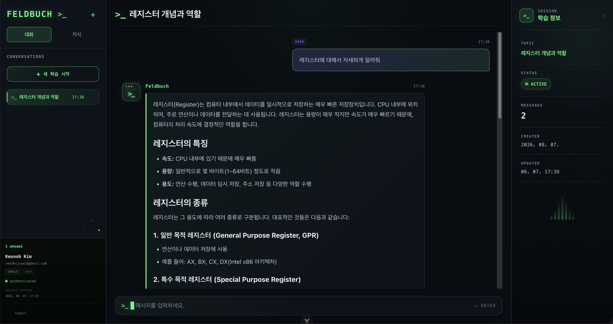

현재 메인 화면은 Vue 3 기반 AI 학습 대화 화면입니다. 왼쪽 사이드바는 대화 목록과 새 학습 시작을 담당하고, 중앙 영역은 사용자 메시지와 AI 응답을 Markdown으로 렌더링하며, 오른쪽 패널은 선택한 대화의 주제, 상태, 메시지 수, 생성일, 수정일을 한눈에 보여줍니다.

### ERD

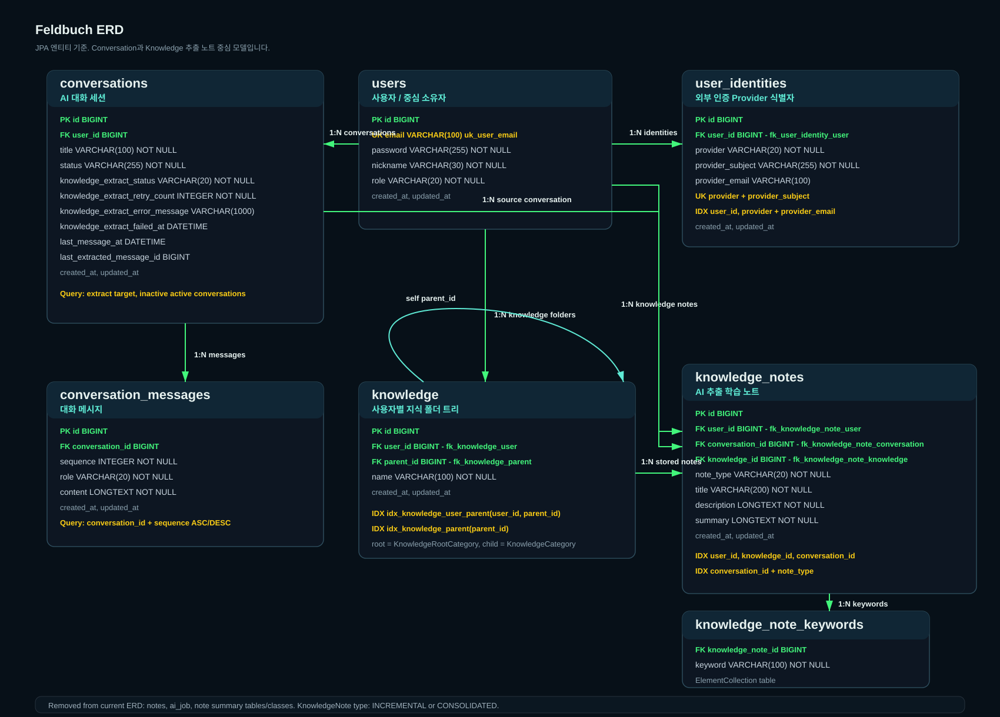

현재 데이터 모델은 사용자, 개발 노트, AI Job, 대화 세션, 대화 메시지, Knowledge 폴더, AI 추출 학습 노트를 중심으로 구성합니다. `knowledge`는 사용자별 지식 폴더 트리를 자기 참조로 표현하고, `knowledge_notes`는 원본 대화에서 추출한 학습 노트의 제목, 설명, 요약, 키워드를 특정 지식 폴더에 저장합니다.

### 핵심 기능

- JWT 기반 회원가입과 로그인
- 클라이언트 로그아웃
- Spring Security 기반 인증/인가
- 개발 노트 CRUD
- QueryDSL 기반 검색
- 페이지네이션
- Pin 기능
- 학습 상태 관리
- OpenAI 기반 AI 요약
- 비동기 AI 처리
- AI Job 생성 및 상태 조회
- Conversation 생성, 목록 조회, 단건 조회
- Conversation 제목 수정
- Conversation 삭제
- Conversation Message 저장 및 조회
- Conversation 완료 상태 기반 Knowledge 추출 대상 관리
- Knowledge 추출 상태 관리: `NONE`, `PROCESSING`, `COMPLETED`, `FAILED`
- Knowledge 추출 실패 재시도 횟수, 실패 메시지, 실패 시각 저장
- Conversation 컨텍스트 기반 AI 채팅
- SSE 기반 AI 응답 스트리밍 API
- OpenAI WebClient 기반 스트리밍 호출
- 첫 사용자 메시지 기반 Conversation 제목 자동 생성
- Knowledge 폴더 트리 도메인
- Conversation 기반 AI 추출 학습 노트 도메인
- AI 지식 요약 구조화 응답 DTO
- AI 지식 요약 프롬프트와 OpenAI 요약 서비스
- Knowledge 경로 자동 조회/생성
- AI 요약 결과의 KnowledgeNote 저장 Command 서비스
- Knowledge 추출 배치 Job/Step/Tasklet
- QueryDSL 기반 Knowledge 추출 대상 Conversation 조회
- 실패한 Knowledge 추출의 지연 재시도
- KnowledgeNote 제목, 설명, 요약, 키워드 저장
- KnowledgeNote 키워드 ElementCollection 저장
- Thymeleaf 기반 로그인/대화 화면
- Vue 3 + Vite 로그인/대화 화면 전환
- Axios API client, Request/Response Interceptor
- Vue Router Guard 기반 인증 라우팅
- Conversation Sidebar, Message List, Study Info Panel 기반 대화 화면
- 새 대화 생성/제목 수정/삭제 UI와 중복 요청 방지 상태
- AI 응답 Markdown 렌더링 및 DOMPurify sanitize 처리
- highlight.js 기반 코드 문법 강조
- 코드 블록 언어 표시와 클립보드 COPY 버튼
- 메시지 전송 중 로딩 표시와 자동 스크롤
- 사용자 메시지와 스트리밍 AI 메시지 낙관적 표시 후 대화 상세 재조회
- 다크 터미널 스타일의 Vue 메인 채팅 화면
- 선택한 대화의 상태, 메시지 수, 생성일, 수정일, 활동 신호 표시
- Request ID 기반 요청 추적과 `X-Request-Id` 응답 헤더
- Redis, Spring Batch 기반 확장 구성

### 프로젝트 구조

```text
backend
└── src/main/java/io.github.kaltz.feldbuch
    ├── ai               # OpenAI 연동, 요약, 채팅
    ├── auth             # 로그인, JWT 인증
    ├── batch            # Spring Batch 요약 파이프라인
    ├── common           # 공통 응답, 예외, 요청 추적 로깅
    ├── config           # Security, Redis, OpenAI, Batch 설정
    ├── conversation     # 대화, 메시지, 대화형 AI
    ├── home             # 서버 렌더링 진입점
    ├── knowledge        # 지식 폴더, AI 추출 학습 노트
    ├── note             # 개발 노트 CRUD/Search
    ├── redis            # Redis 유틸리티
    └── user             # 회원, 사용자 조회

legacy-view
└── src/main/resources
    ├── templates        # Thymeleaf 비교용 화면
    └── static           # Thymeleaf 화면용 CSS/JS

frontend
└── src
    ├── api              # Axios API client와 도메인별 API 함수
    ├── assets           # Vue 전역 스타일과 디자인 토큰
    ├── components       # Vue 컴포넌트: Sidebar, MessageList, ChatInput, StudyInfoPanel
    ├── router           # Vue Router
    ├── utils            # 토큰 저장, 로그아웃 등 인증 유틸리티
    └── views            # Vue 화면
```

---

## FELDBUCH DEVELOPMENT BOOK

### 프로젝트 목표

- JWT 기반 인증 구현
- QueryDSL 검색 구현
- AI 요약 기능 구현
- 대화 제목 자동 생성
- AI 태그 생성
- 코드 리뷰
- 학습 로드맵 추천
- Docker 기반 운영 환경 구성

### 기술 스택

| Category | Stack |
| --- | --- |
| Language | Java 21 |
| Framework | Spring Boot 3 |
| Security | Spring Security, JWT |
| Database | MySQL, H2 |
| ORM | Spring Data JPA |
| Query | QueryDSL |
| Build | Gradle |
| AI | OpenAI REST API, OpenAI SSE Streaming |
| Infra | Docker, Redis |
| Batch | Spring Batch |
| View | Thymeleaf, Static CSS/JS, Vue 3, Vite, Vue Router, Axios, Fetch SSE, marked, highlight.js, DOMPurify |
| Test | JUnit5, MockMvc |

### 기술 로고

| Java | Spring Boot | Docker | MySQL | Gradle | OpenAI |
| --- | --- | --- | --- | --- | --- |
|  |  |  |  |  | 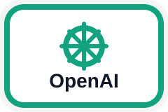 |

| Spring Security | JWT | Spring Data JPA | QueryDSL | Redis | Spring Batch | H2 Test DB | RestClient |
| --- | --- | --- | --- | --- | --- | --- | --- |
| 인증/인가 | 토큰 인증 | ORM | 동적 검색 | 캐시/임시 저장소 | 요약 배치 파이프라인 | 테스트 DB | OpenAI API 호출 |

| Vue.js | Vite | Vue Router | Axios | Fetch SSE | marked | highlight.js | DOMPurify | Thymeleaf |
| --- | --- | --- | --- | --- | --- | --- | --- | --- |
|  | 프론트엔드 개발/빌드 | 클라이언트 라우팅 | HTTP client / interceptor | AI 응답 스트리밍 | Markdown 렌더링 | 코드 문법 강조 | HTML sanitize | 비교용 서버 렌더링 화면 |

---

## FELDBUCH DEVELOPMENT LOG

### 개발을 시작한 계기

개발 공부 과정에서 ChatGPT와 나눈 대화, 삽질 기록, 환경 설정, 문제 해결 과정을 노트처럼 정리하고 싶었습니다.

Feldbuch의 목표는 개발자의 학습 기록을 저장하는 데서 끝나지 않고, AI가 그 기록을 이해해 더 나은 학습을 돕는 지식 관리 플랫폼으로 발전하는 것입니다.

### 지금까지의 개발 흐름

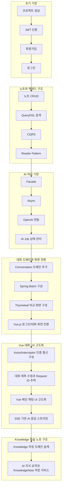
```mermaid
flowchart TD
    subgraph Phase1["초기 기반"]
        direction LR
        A[프로젝트 생성] --> B[JWT 인증] --> C[회원가입] --> D[로그인]
    end

    subgraph Phase2["노트와 백엔드 구조"]
        direction LR
        E[노트 CRUD] --> F[QueryDSL 검색] --> G[CQRS] --> H[Reader Pattern]
    end

    subgraph Phase3["AI 처리 기반"]
        direction LR
        I[Facade] --> J[Async] --> K[OpenAI 연동] --> L[AI Job 상태 관리]
    end

    subgraph Phase4["대화 도메인과 화면 전환"]
        direction LR
        M[Conversation 도메인 추가] --> N[Spring Batch 구성] --> O[Thymeleaf 비교 화면 구성] --> P[Vue.js 로그인/대화 화면 전환]
    end

    subgraph Phase5["Vue 대화 UX 고도화"]
        direction LR
        Q[Axios/Interceptor 인증 통신 구성] --> R[대화 제목 수정과 Request ID 추적] --> S[Vue 메인 채팅 UI 고도화] --> T[SSE 기반 AI 응답 스트리밍]
    end

    subgraph Phase6["Knowledge 학습 노트 구조"]
        direction LR
        U[Knowledge 저장 도메인 설계] --> V[AI 지식 요약과 KnowledgeNote 저장 서비스]
    end

    D --> E
    H --> I
    L --> M
    P --> Q
    T --> U
```

### 구현 완료

- Spring Security
- JWT 로그인
- JWT Claims 기반 `userId`, `email`, `role` 저장
- CustomUserDetails
- JWT Filter
- JWT AuthenticationEntryPoint 401 처리
- CORS 설정: Vite 개발 서버 `http://localhost:5173` 허용
- 회원가입
- 로그인
- 클라이언트 로그아웃
- 노트 생성, 조회, 수정, 삭제
- QueryDSL 검색
- Pagination
- Pin
- StudyStatus
- Reader Pattern
- Mapper Pattern
- CQRS
- Facade
- Async
- RestClient
- WebClient
- OpenAI API 연동
- OpenAI Chat Completion SSE 스트리밍 연동
- AI Job Entity, Reader, Service, Controller
- AI Job 상태 조회 API
- Conversation Entity, Controller, Command/Query Service
- Conversation 제목 수정 API
- Conversation 삭제 API
- ConversationMessage Entity, Controller, Command/Query Service
- Conversation별 메시지 순서 저장
- 대화 내역을 OpenAI Chat Completion 메시지 컨텍스트로 변환
- Conversation Chat API
- Conversation Chat Stream API
- `StreamResponse` 기반 `TOKEN`, `COMPLETE`, `ERROR` 스트리밍 이벤트 계약
- Conversation Knowledge 추출 상태 필드
- Conversation Knowledge 추출 재시도 횟수, 실패 메시지, 실패 시각 필드
- 첫 사용자 메시지 기반 Conversation 제목 자동 생성
- Knowledge Entity
- KnowledgeNote Entity
- KnowledgeNote Keyword ElementCollection
- KnowledgeRepository
- KnowledgeNoteRepository
- KnowledgePathResolver
- KnowledgeNoteCommandService
- AiKnowledgeSummaryResponse
- KnowledgeSummaryPrompt
- AiKnowledgeSummaryService
- OpenAiKnowledgeSummaryService
- KnowledgeExtractionService
- KnowledgeExtractionStatusService
- KnowledgeConversationReader
- KnowledgeExtractionBatchConfig
- KnowledgeExtractionTasklet
- LocalKnowledgeExtractionJobRunner
- 사용자별 Knowledge 루트/자식 조회, 동일 폴더명 중복 확인 쿼리
- QueryDSL 기반 Knowledge 추출 대상 Conversation 조회 쿼리
- KnowledgeNote의 Knowledge별/Conversation별/사용자별 조회 쿼리
- Thymeleaf 기반 로그인/대화 화면
- `frontend/` Vue 3 + Vite 프로젝트 구성
- Vue 로그인 화면: `LoginView`
- Vue 대화 화면: `ConversationView`
- Vue 컴포넌트: `ConversationSidebar`, `MessageList`, `ChatInput`, `StudyInfoPanel`
- 새 대화 생성 UI
- 대화 제목 인라인 수정 UI
- 대화 삭제 UI
- 대화 생성/수정/삭제/메시지 전송 중복 요청 방지 상태
- 메시지 전송 중 AI 응답 작성 로딩 표시
- 메시지 목록 자동 스크롤
- AI 응답 Markdown 렌더링
- highlight.js 기반 코드 문법 강조
- DOMPurify 기반 렌더링 HTML sanitize
- Request ID Filter
- SLF4J MDC 기반 requestId 저장/해제
- `X-Request-Id` 응답 헤더
- Axios 공통 API client
- Axios Request Interceptor 기반 JWT Authorization 헤더 자동 주입
- Axios Response Interceptor 기반 401 감지, 로그아웃, 로그인 화면 이동
- Vue Router Guard 기반 인증 라우트 보호
- `localStorage` 기반 `accessToken`, `userId` 저장/삭제 유틸리티
- RedisTemplate 구성
- Spring Batch Summary Job 구성

### 2026-07 추가 개발 로그

- AI Job Entity, Service, Controller 구현
- Async와 Transaction 이슈 해결
- Job 상태 흐름 정리: Requested -> Processing -> Completed
- OpenAI API 실제 연동 검증
- 환경별 프로필 기반 OpenAI API Key 로딩 구성
- GitHub Push Protection 대응: 커밋 히스토리에서 `.env` 제거
- Conversation 도메인 추가: 대화 컨텍스트 생성을 위한 `Conversation` 모델과 생성/조회 API 구현
- Conversation Message 도메인 추가: `USER`, `ASSISTANT` 역할별 메시지 저장과 목록 조회 API 구현
- `ConversationChatService` 추가: 사용자 메시지 저장 -> 대화 컨텍스트 구성 -> OpenAI 호출 -> AI 응답 저장 흐름 구현
- `ChatContextBuilder`, `ChatMessageMapper` 추가: 저장된 대화 메시지를 OpenAI 요청 메시지로 변환
- `TitlePromptFactory` 추가: 기본 제목인 `새 대화` 상태에서 첫 사용자 메시지를 기반으로 짧은 한국어 제목 자동 생성
- `ChatModelProvider` 전략 추가: `openai.model` 설정값으로 OpenAI 모델 선택
- Thymeleaf 기반 `/login`, `/conversations` 화면과 정적 CSS/JS 구성
- Thymeleaf 화면은 Vue.js 화면과 비교하기 위한 기준 구현으로 유지
- `frontend/`에 Vue 3 + Vite + Vue Router 기반 SPA 프로젝트 추가
- Vue 채팅 화면 컴포넌트 초안 구성: 입력 컴포넌트에서 부모로 메시지를 emit하고 메시지 목록 컴포넌트가 렌더링
- `authApi`, `conversationApi`로 프론트 API 호출 책임 분리
- `apiClient`에 Axios baseURL `http://localhost:8080/api` 설정
- Request Interceptor에서 `localStorage.accessToken`을 `Authorization: Bearer` 헤더로 주입
- Response Interceptor에서 401 응답 시 토큰과 사용자 ID를 삭제하고 `/login`으로 리다이렉트
- `router.beforeEach`로 인증이 필요한 `/conversations` 접근 전 토큰 존재 여부 확인
- 로그아웃 버튼에서 클라이언트 저장 토큰을 삭제하고 로그인 화면으로 이동
- `ConversationView`에서 대화 목록 조회, 첫 대화 자동 선택, 단건 대화 상세 조회, 메시지 전송 후 상세 재조회 흐름 구성
- `ConversationView`에서 새 대화 생성 후 목록을 재조회하고 생성한 대화를 자동 선택
- `ConversationView`에서 대화 제목 수정 후 목록과 상세 상태를 함께 갱신
- `ConversationView`에서 대화 삭제 전 확인창을 띄우고, 삭제한 대화가 선택 상태이면 다음 대화를 자동 선택
- `ConversationView`에서 메시지 전송 후 해당 대화를 목록 최상단으로 이동
- `ConversationView`에서 `creatingConversation`, `updatingConversationId`, `deletingConversationId`, `sendingMessage`로 중복 요청 방지
- `ConversationView`에서 사용자 메시지를 먼저 낙관적으로 표시하고, API 응답 후 상세를 재조회해 최종 상태로 동기화
- `ConversationView`에서 `nextTick` 이후 메시지 컨테이너를 하단으로 자동 스크롤
- `ConversationSidebar`에서 대화 목록, 선택 상태, 생성 버튼, 인라인 제목 수정 입력, 삭제 버튼 렌더링
- `ConversationSidebar`에서 더블클릭으로 제목 수정 모드 진입, Enter/blur로 저장, Esc로 취소
- `MessageList`에서 `USER`, `ASSISTANT` 메시지 버블 렌더링
- `MessageList`에서 `marked`와 `DOMPurify`로 AI 응답 Markdown을 안전하게 렌더링
- `MessageList`에서 코드 블록 언어 라벨과 클립보드 COPY 버튼 제공
- `MessageList`에서 전송 중 `PROCESSING` 라벨과 터미널 스타일 로딩 메시지 표시
- `ChatInput`에서 메시지 전송 중 입력과 버튼 비활성화
- `StudyInfoPanel`에서 대화 제목, 상태, 메시지 수, 생성일, 수정일, 활동 신호 표시
- `frontend/src/assets/main.css`에서 다크 터미널 톤의 전역 색상 토큰, 레이아웃 폭, 스크롤바, 포커스 스타일 관리
- `ConversationDetailResponse`에 대화 메타데이터, 메시지 목록, 메시지 수, 수정일 포함
- `OpenAiWebClientConfig`와 WebClient 기반 OpenAI 스트리밍 호출 구성
- `ChatCompletionStreamRequest` 추가: 기존 Chat Completion 요청에 `stream=true`를 적용하는 스트리밍 요청 DTO 구성
- `ChatCompletionChunkResponse`, `ChunkChoice`, `Delta`로 OpenAI SSE 청크에서 텍스트 토큰 추출
- `ChatService.stream`, `OpenAiChatService.stream`, `OpenAiClient.stream`으로 스트리밍 처리 계층 확장
- `POST /api/conversations/{conversationId}/chat/stream` SSE API 추가
- `ConversationChatService.stream`에서 사용자 메시지 저장, 컨텍스트 생성, 토큰 누적, 스트림 완료 후 Assistant 메시지 저장 처리
- `StreamResponse`, `StreamType` 추가: `TOKEN`, `COMPLETE`, `ERROR` 이벤트 계약 정의
- Spring Security에서 SSE 비동기 디스패치 인증 오류를 피하도록 비동기 요청 흐름 보완
- `conversationApi.streamMessage`에서 Fetch API로 `text/event-stream` 응답을 읽고 `data:` 이벤트를 파싱
- Vue `ConversationView`에서 사용자 메시지와 Assistant 스트리밍 메시지를 낙관적으로 추가하고 토큰 수신 시 실시간 누적 렌더링
- `markdownRenderer.js`로 Markdown 렌더링 책임 분리
- `highlight.js`로 AI 응답 코드 블록 문법 강조 적용
- 코드 복사 UX 개선: 복사 성공/실패 상태 표시와 타이머 정리
- `Knowledge` 엔티티 추가: 사용자별 지식 폴더, 상위 폴더 자기 참조, 루트/자식 생성, 이름 변경, 폴더 이동 검증
- `KnowledgeNote` 엔티티 추가: 대화에서 추출한 학습 노트 제목/설명/요약, 사용자, 원본 대화, 저장 지식 폴더 연결
- `knowledge_note_keywords` ElementCollection 추가: 학습 노트별 최대 10개 키워드 저장
- `KnowledgeRepository` 추가: 사용자별 루트/자식 폴더 조회와 같은 parent 내 이름 중복 확인
- `KnowledgeNoteRepository` 추가: Knowledge별, Conversation별, 사용자별 학습 노트 조회와 대화 기반 생성 여부 확인
- Knowledge 관련 FK와 조회 인덱스 정의: `idx_knowledge_user_parent`, `idx_knowledge_parent`, `idx_knowledge_note_user`, `idx_knowledge_note_knowledge`, `idx_knowledge_note_conversation`
- `KnowledgePathResolver` 추가: AI가 반환한 `knowledgePath`를 순서대로 조회하고 없는 폴더는 자동 생성
- `KnowledgePathResolver`에서 빈 경로, 빈 항목, 앞뒤 공백, 저장되지 않은 사용자 검증
- `AiKnowledgeSummaryResponse` 추가: `knowledgePath`, `title`, `description`, `summary`, `keywords` 구조화 응답 모델
- `KnowledgeSummaryPrompt` 추가: 대화를 학습 노트용 JSON으로 변환하기 위한 시스템/사용자 프롬프트
- `AiKnowledgeSummaryService`, `OpenAiKnowledgeSummaryService` 추가: OpenAI 응답 JSON을 `AiKnowledgeSummaryResponse`로 파싱
- `KnowledgeNoteCommandService` 추가: AI 요약 응답을 Knowledge 경로에 저장하고 `KnowledgeNote`를 생성
- 테스트 추가: `KnowledgePathResolverTest`, `KnowledgeNoteCommandServiceTest`, `OpenAiKnowledgeSummaryServiceTest`
- `Conversation`에 Knowledge 추출 상태 추가: `knowledgeExtractStatus`, `knowledgeExtractRetryCount`, `knowledgeExtractErrorMessage`, `knowledgeExtractFailedAt`
- `KnowledgeExtractStatus` 추가: `NONE`, `PROCESSING`, `COMPLETED`, `FAILED`
- `ConversationRepositoryCustom`, `ConversationRepositoryImpl` 추가: QueryDSL로 Knowledge 추출 대상 대화 조회
- Knowledge 추출 대상 조건 추가: `ConversationStatus.COMPLETED`이고 `knowledgeExtractStatus = NONE`
- Knowledge 추출 재시도 조건 추가: `FAILED` 상태, 재시도 3회 미만, 실패 후 1분 경과
- `KnowledgeConversationReader` 추가: 배치에서 사용할 추출 대상 대화 조회 책임 분리
- `ConversationKnowledgeContextBuilder` 추가: 대화 메시지를 `USER:`/`AI:` 텍스트 컨텍스트로 변환
- `KnowledgeExtractionService` 추가: 사용자/대화 조회, 컨텍스트 생성, AI 지식 요약, KnowledgeNote 저장 흐름 연결
- `KnowledgeExtractionStatusService` 추가: `REQUIRES_NEW` 트랜잭션으로 시작/완료/실패 상태를 독립 반영
- `KnowledgeExtractionBatchConfig` 추가: `knowledgeExtractionJob`, `knowledgeExtractionStep` 구성
- `KnowledgeExtractionTasklet` 추가: 대상 대화 목록을 순회하며 지식 추출 실행
- `LocalKnowledgeExtractionJobRunner` 추가: `local` 프로필과 `feldbuch.batch.knowledge-extraction.run=true` 설정에서 애플리케이션 시작 시 1회 실행
- 테스트 추가: `KnowledgeExtractionBatchConfigTest`, `KnowledgeExtractionTaskletTest`, `KnowledgeExtractionServiceTest`, `ConversationKnowledgeContextBuilderTest`, `ConversationRepositoryTest`
- Spring Security CORS 설정으로 Vite 개발 서버 `http://localhost:5173` 허용
- `RequestIdFilter`에서 요청마다 UUID를 생성하고 MDC와 `X-Request-Id` 응답 헤더에 기록
- Spring Batch 기반 `summaryJob`/`summaryStep` 구성
- Docker Compose에 MySQL, Redis 로컬 인프라 구성
- 테스트 확장: Auth, Note, AI, OpenAI Client, Redis, Batch, Conversation 통합 테스트 구성

### 현재 설정 기준

- 기본 활성 프로필: `local`
- 공통 설정 파일: `src/main/resources/application.yml`
- 로컬 설정 파일: `src/main/resources/application-local.yml`
- 운영 설정 파일: `src/main/resources/application-prod.yml`
- OpenAI Base URL: `https://api.openai.com/v1`
- OpenAI 모델 설정 키: `openai.model`
- 현재 기본 모델: `gpt-4.1-nano`
- 로컬 Docker 인프라: MySQL, Redis
- Spring Batch 기본 자동 실행: `spring.batch.job.enabled=false`
- Knowledge 추출 배치 로컬 실행 플래그: `feldbuch.batch.knowledge-extraction.run=true`
- Knowledge 추출 배치 Job 이름: `knowledgeExtractionJob`
- Knowledge 추출 배치 Step 이름: `knowledgeExtractionStep`

---

## Architecture

### 현재 아키텍처

현재 서버 내부에는 Thymeleaf 기반 화면이 있으며, 이 화면은 Vue.js 전환 과정에서 비교용 기준 구현으로 유지합니다. 앞으로의 사용자 화면은 `frontend/`의 Vue.js SPA를 중심으로 구성하고, Spring Boot는 REST API 서버 역할에 집중합니다.

#### 요청 진입과 공통 백엔드 계층

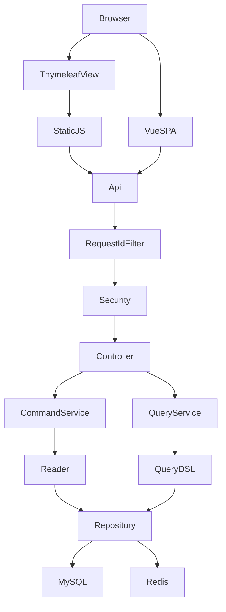
```mermaid
flowchart TD
    Browser --> ThymeleafView
    Browser --> VueSPA

    ThymeleafView --> StaticJS
    StaticJS --> Api
    VueSPA --> Api

    Api --> RequestIdFilter
    RequestIdFilter --> Security
    Security --> Controller

    Controller --> CommandService
    Controller --> QueryService

    CommandService --> Reader
    QueryService --> QueryDSL

    Reader --> Repository
    QueryDSL --> Repository

    Repository --> MySQL
    Repository --> Redis
```

#### AI 요약과 대화 처리 계층

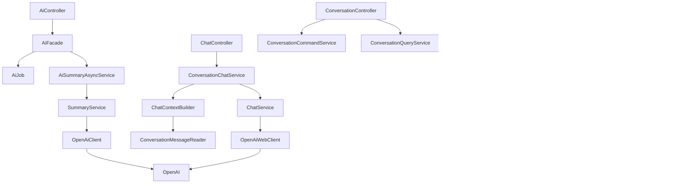
```mermaid
flowchart TD
    AiController --> AiFacade
    AiFacade --> AiJob
    AiFacade --> AiSummaryAsyncService
    AiSummaryAsyncService --> SummaryService
    SummaryService --> OpenAiClient
    OpenAiClient --> OpenAI

    ChatController --> ConversationChatService
    ConversationChatService --> ChatContextBuilder
    ChatContextBuilder --> ConversationMessageReader
    ConversationChatService --> ChatService
    ChatService --> OpenAiWebClient
    OpenAiWebClient --> OpenAI

    ConversationController --> ConversationCommandService
    ConversationController --> ConversationQueryService
    ConversationMessageController --> ConversationMessageCommandService
    ConversationMessageController --> ConversationMessageQueryService
```

#### Knowledge 저장과 Batch 확장 계층

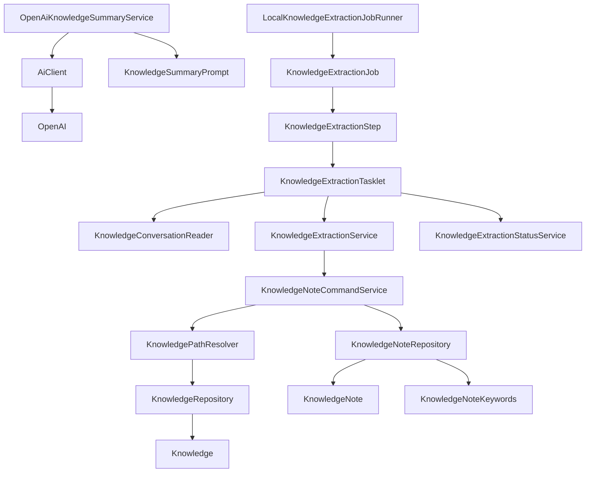
```mermaid
flowchart TD
    OpenAiKnowledgeSummaryService --> AiClient
    OpenAiKnowledgeSummaryService --> KnowledgeSummaryPrompt
    AiClient --> OpenAI

    KnowledgeNoteCommandService --> KnowledgePathResolver
    KnowledgeNoteCommandService --> KnowledgeNoteRepository
    KnowledgePathResolver --> KnowledgeRepository

    KnowledgeRepository --> Knowledge
    KnowledgeNoteRepository --> KnowledgeNote
    KnowledgeNoteRepository --> KnowledgeNoteKeywords

    LocalKnowledgeExtractionJobRunner --> KnowledgeExtractionJob
    KnowledgeExtractionJob --> KnowledgeExtractionStep
    KnowledgeExtractionStep --> KnowledgeExtractionTasklet
    KnowledgeExtractionTasklet --> KnowledgeConversationReader
    KnowledgeExtractionTasklet --> KnowledgeExtractionService
    KnowledgeExtractionTasklet --> KnowledgeExtractionStatusService
    KnowledgeExtractionService --> KnowledgeNoteCommandService
```

### 프론트엔드 전환 방향

```text
현재
Browser
  ↓
Spring MVC Controller
  ↓
Thymeleaf Template + Static JS
  ↓
Spring Boot REST API

목표
Browser
  ↓
Vue 3 + Vite SPA
  ↓
Axios API Client
  ↓
Spring Boot REST API
```

Thymeleaf 화면은 `/login`, `/conversations`에서 동작하는 비교용 화면입니다. Vue 화면은 `frontend/`에서 별도 개발하며, 같은 백엔드 API 계약을 사용해 로그인, 대화 목록, 메시지 조회, AI 채팅 요청을 구현합니다.

### 클라이언트 아키텍처

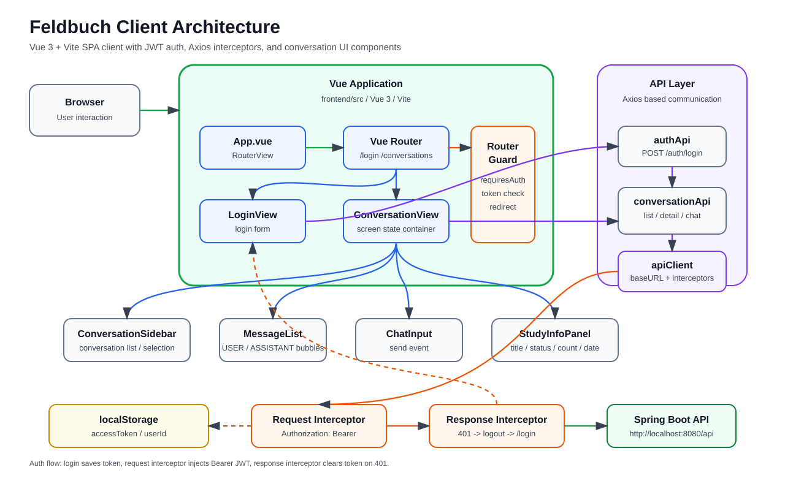

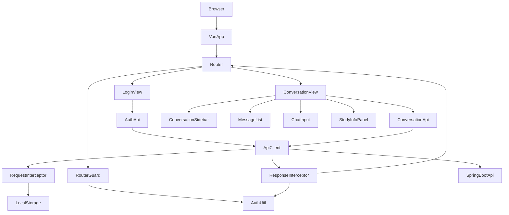
```mermaid
flowchart TD
    Browser --> VueApp
    VueApp --> Router
    Router --> LoginView
    Router --> ConversationView

    Router --> RouterGuard
    RouterGuard --> AuthUtil

    LoginView --> AuthApi
    ConversationView --> ConversationApi
    ConversationView --> ConversationSidebar
    ConversationView --> MessageList
    ConversationView --> ChatInput
    ConversationView --> StudyInfoPanel

    AuthApi --> ApiClient
    ConversationApi --> ApiClient
    ApiClient --> RequestInterceptor
    ApiClient --> ResponseInterceptor
    RequestInterceptor --> LocalStorage
    ResponseInterceptor --> AuthUtil
    ResponseInterceptor --> Router

    ApiClient --> SpringBootApi
```

클라이언트 책임 분리:

- `App.vue`: `RouterView`를 렌더링하는 Vue 앱 루트
- `router/index.js`: `/login`, `/conversations` 라우트와 인증 Guard 관리
- `LoginView.vue`: 로그인 폼, 로그인 API 호출, 토큰 저장, 대화 화면 이동
- `ConversationView.vue`: 대화 화면 컨테이너, 대화 목록/선택 대화/메시지/요청 중 상태 관리
- `ConversationSidebar.vue`: 대화 목록, 현재 선택 상태, 새 대화 생성 버튼, 인라인 제목 수정 입력, 대화 삭제 버튼 렌더링
- `MessageList.vue`: `USER`, `ASSISTANT` 메시지 렌더링, AI 응답 Markdown 렌더링, highlight.js 코드 문법 강조, 코드 블록 COPY 버튼, 로딩 메시지 표시
- `ChatInput.vue`: 사용자 입력을 `send` 이벤트로 상위 컴포넌트에 전달하고 전송 중 입력을 비활성화
- `StudyInfoPanel.vue`: 선택한 대화의 학습 주제, 상태, 메시지 수, 생성일, 수정일, 활동 신호 표시
- `assets/main.css`: Vue 앱의 다크 터미널 톤 디자인 토큰, 레이아웃 폭, 공통 포커스/스크롤 스타일 관리
- `apiClient.js`: Axios instance, baseURL, Request/Response Interceptor 관리
- `authApi.js`, `conversationApi.js`: 도메인별 API 호출 함수와 Fetch 기반 SSE 스트리밍 함수 제공
- `utils/markdownRenderer.js`: marked, highlight.js, DOMPurify를 조합해 AI 응답 Markdown 렌더링 책임 분리
- `utils/auth.js`: `accessToken`, `userId` 저장/조회/삭제와 로그인 여부 판단

대화 화면 데이터 흐름:

```text
ConversationView mounted
  ↓
getConversations()
  ↓
대화 목록 저장
  ↓
첫 번째 대화 자동 선택
  ↓
getConversation(conversationId)
  ↓
conversation / messages 상태 갱신
  ↓
Sidebar / MessageList / StudyInfoPanel 렌더링
```

새 대화 생성 흐름:

```text
ConversationSidebar create event
  ↓
ConversationView.createNewConversation()
  ↓
creatingConversation = true
  ↓
POST /api/conversations
  ↓
getConversations()
  ↓
생성된 conversationId 자동 선택
  ↓
creatingConversation = false
```

대화 삭제 흐름:

```text
ConversationSidebar delete event
  ↓
window.confirm()
  ↓
deletingConversationId 설정
  ↓
DELETE /api/conversations/{conversationId}
  ↓
목록에서 제거
  ↓
삭제한 대화가 선택 상태이면 다음 대화 자동 선택
```

대화 제목 수정 흐름:

```text
ConversationSidebar double click
  ↓
editingConversationId / editingTitle 설정
  ↓
Enter 또는 blur
  ↓
ConversationView.renameConversation()
  ↓
updatingConversationId 설정
  ↓
PATCH /api/conversations/{conversationId}
  ↓
목록과 현재 상세 conversation 제목 갱신
```

메시지 스트리밍 전송 흐름:

```text
ChatInput send event
  ↓
ConversationView.sendMessage(content)
  ↓
sendingMessage = true
  ↓
사용자 메시지와 빈 ASSISTANT 메시지 낙관적 추가
  ↓
conversationApi.streamMessage(conversationId, message)
  ↓
POST /api/conversations/{conversationId}/chat/stream
  ↓
SSE TOKEN 이벤트 수신마다 ASSISTANT 메시지 content 누적
  ↓
COMPLETE 이벤트 수신
  ↓
getConversation(conversationId) 재조회
  ↓
메시지 목록과 제목 최신화
  ↓
메시지 컨테이너 하단으로 자동 스크롤
```

### 통신 방식

클라이언트와 서버는 JSON 기반 REST API로 통신합니다.

```text
Vue
  ↓
Axios API Client
  ↓
Request Interceptor
  ↓ HTTP JSON
Spring Security + JWT Filter
  ↓
Controller
  ↓
Service
  ↓
Repository / OpenAI
```

공통 규칙:

- 요청 본문은 JSON을 사용합니다.
- 응답은 `ApiResponse<T>` 형식으로 통일하고 실제 데이터는 `data` 필드에 담습니다.
- 로그인 API는 인증 없이 호출합니다.
- 로그인 성공 시 받은 `accessToken`, `userId`를 `localStorage`에 저장합니다.
- Axios Request Interceptor가 인증 API 호출 전에 `Authorization: Bearer <accessToken>` 헤더를 자동으로 추가합니다.
- Axios Response Interceptor가 `401 Unauthorized`를 감지하면 `logout()`으로 클라이언트 토큰을 제거하고 `/login`으로 이동합니다.
- 로그아웃은 stateless JWT 구조에 맞춰 서버 세션 폐기 없이 클라이언트 저장소의 `accessToken`, `userId`를 제거합니다.
- Vue Router Guard는 `meta.requiresAuth`가 있는 라우트에 진입하기 전에 토큰 존재 여부를 확인합니다.
- 대화 목록은 `GET /api/conversations`로 조회합니다.
- 대화 상세는 `GET /api/conversations/{conversationId}`로 조회하며, `ConversationDetailResponse`가 `id`, `title`, `status`, `createdAt`, `updatedAt`, `messages`, `messageCount`를 함께 반환합니다.
- 새 대화는 `POST /api/conversations`로 생성하고, 응답으로 생성된 `conversationId`를 받습니다.
- 대화 제목 수정은 `PATCH /api/conversations/{conversationId}`로 처리하며, 제목은 필수이고 최대 100자입니다.
- 대화 삭제는 `DELETE /api/conversations/{conversationId}`로 처리하며, 백엔드는 해당 대화의 메시지를 먼저 삭제한 뒤 대화를 삭제합니다.
- 일반 메시지 전송은 `POST /api/conversations/{conversationId}/chat`로 처리하고, 전송 후 상세를 재조회해 사용자 메시지, AI 응답, 자동 생성 제목을 한 번에 최신화합니다.
- Vue 메인 대화 화면의 메시지 전송은 `POST /api/conversations/{conversationId}/chat/stream` SSE API를 사용합니다.
- SSE API는 `text/event-stream`을 생산하며 `ApiResponse<T>`로 감싸지 않고 `StreamResponse`를 이벤트 단위로 전송합니다.
- `StreamResponse.type`은 `TOKEN`, `COMPLETE`, `ERROR` 중 하나이며, `TOKEN` 이벤트의 `content`에는 누적값이 아니라 새로 도착한 토큰 조각만 담습니다.
- Fetch 기반 스트리밍 함수는 `Authorization: Bearer <accessToken>` 헤더를 직접 추가하고, 401 응답이면 클라이언트 로그아웃 후 `/login`으로 이동합니다.
- 백엔드는 `JwtAuthenticationEntryPoint`로 미인증 요청에 401을 반환합니다.
- 백엔드는 `RequestIdFilter`로 모든 요청에 UUID 기반 `requestId`를 부여하고, MDC와 `X-Request-Id` 응답 헤더에 기록합니다.
- 백엔드는 Vite 개발 서버인 `http://localhost:5173` origin을 CORS로 허용합니다.
- 기존 Thymeleaf 정적 JS는 `fetch`와 `localStorage`를 사용하는 비교용 구현으로 유지합니다.

대표 통신 흐름:

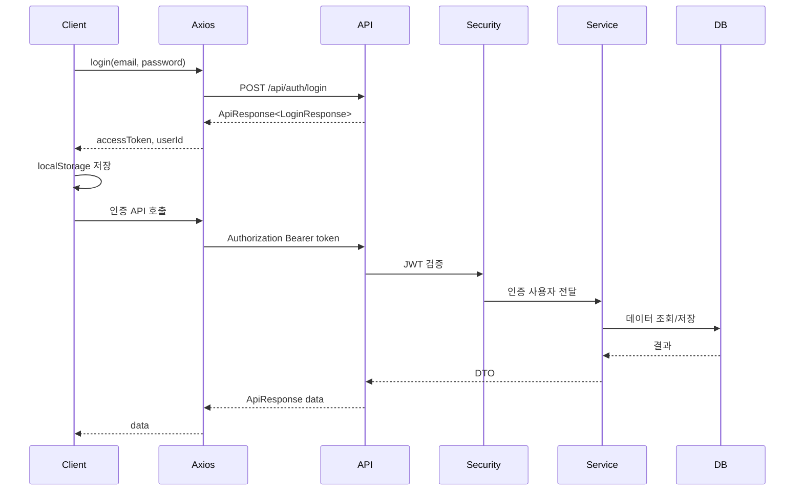
```mermaid
sequenceDiagram
    participant Client
    participant Axios
    participant API
    participant Security
    participant Service
    participant DB

    Client->>Axios: login(email, password)
    Axios->>API: POST /api/auth/login
    API-->>Axios: ApiResponse<LoginResponse>
    Axios-->>Client: accessToken, userId
    Client->>Client: localStorage 저장
    Client->>Axios: 인증 API 호출
    Axios->>API: Authorization Bearer token
    API->>Security: JWT 검증
    Security->>Service: 인증 사용자 전달
    Service->>DB: 데이터 조회/저장
    DB-->>Service: 결과
    Service-->>API: DTO
    API-->>Axios: ApiResponse data
    Axios-->>Client: data
```

401 응답 처리:

```text
API 401 Unauthorized
  ↓
Axios Response Interceptor
  ↓
logout()
  ↓
localStorage accessToken/userId 삭제
  ↓
router.push('/login')
```

Vue 라우팅:

```text
/              -> /login redirect
/login         -> LoginView
/conversations -> ConversationView, requiresAuth
```

AI 요약은 즉시 결과를 반환하지 않고 Job 상태 조회 방식으로 처리합니다.

```text
POST /api/ai/notes/{noteId}/summary
  ↓
jobId 반환
  ↓
GET /api/ai/jobs/{jobId}
  ↓
REQUESTED / PROCESSING / COMPLETED / FAILED 확인
```

대화형 AI는 현재 단일 요청/응답 방식입니다.

```text
POST /api/conversations/{conversationId}/chat
  ↓
USER 메시지 저장
  ↓
OpenAI 호출
  ↓
ASSISTANT 메시지 저장
  ↓
ChatResponse 반환
```

### JWT 인증 흐름

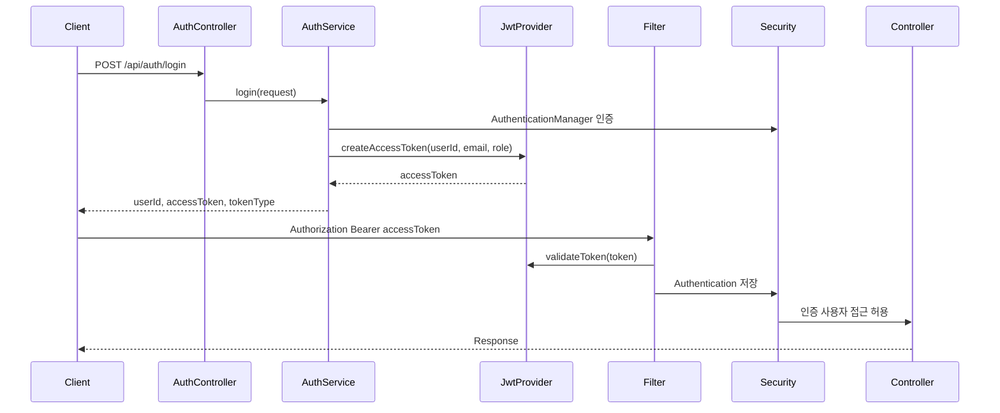
```mermaid
sequenceDiagram
    participant Client
    participant AuthController
    participant AuthService
    participant JwtProvider
    participant Filter
    participant Security
    participant Controller

    Client->>AuthController: POST /api/auth/login
    AuthController->>AuthService: login(request)
    AuthService->>Security: AuthenticationManager 인증
    AuthService->>JwtProvider: createAccessToken(userId, email, role)
    JwtProvider-->>AuthService: accessToken
    AuthService-->>Client: userId, accessToken, tokenType
    Client->>Filter: Authorization Bearer accessToken
    Filter->>JwtProvider: validateToken(token)
    Filter->>Security: Authentication 저장
    Security->>Controller: 인증 사용자 접근 허용
    Controller-->>Client: Response
```

`JwtProvider`는 HS256 계열 HMAC SecretKey를 초기화하고, Access Token의 subject에는 변경되지 않는 사용자 PK인 `userId`를 저장합니다. Claim에는 `email`, `role`을 함께 담아 인증 이후 사용자 식별과 권한 판단에 활용합니다.

JWT 구성:

```text
subject: userId
claims:
  email
  role
issuedAt
expiration
signature
```

인증 실패 처리:

```text
토큰 없음 / 유효하지 않은 토큰 / 만료 토큰
  ↓
SecurityContext 인증 없음
  ↓
JwtAuthenticationEntryPoint
  ↓
401 Unauthorized
  ↓
Axios Response Interceptor
  ↓
클라이언트 로그아웃 및 /login 이동
```

현재 로그아웃은 서버 세션을 사용하지 않는 stateless JWT 구조에 맞춘 클라이언트 로그아웃입니다. `frontend/src/utils/auth.js`에서 `accessToken`과 `userId`를 `localStorage`에서 삭제하고, 화면은 Vue Router를 통해 `/login`으로 이동합니다.

### Request ID 추적 흐름

`RequestIdFilter`는 모든 HTTP 요청마다 UUID 기반 `requestId`를 생성합니다. 생성한 값은 SLF4J MDC에 저장되어 같은 요청 범위의 로그를 추적할 수 있고, 클라이언트가 문제 상황을 함께 전달할 수 있도록 응답 헤더 `X-Request-Id`에도 기록합니다.

```text
HTTP Request
  ↓
RequestIdFilter
  ↓
UUID requestId 생성
  ↓
MDC.put("requestId", requestId)
  ↓
response header X-Request-Id 설정
  ↓
Controller / Service / Repository
  ↓
finally MDC.remove("requestId")
```

요청 추적 규칙:

- MDC key: `requestId`
- Response header: `X-Request-Id`
- 생성 방식: `UUID.randomUUID()`
- 정리 방식: 요청 처리 완료 후 `finally` 블록에서 MDC 제거

### AI 요약 처리 흐름

```text
AiController
    ↓
AiFacade
    ↓
AiJob 생성
    ↓
AiSummaryAsyncService
    ↓
SummaryService
    ↓
OpenAiClient
    ↓
OpenAI API
```

요약 요청은 즉시 `jobId`를 반환하고, 백그라운드 스레드에서 OpenAI 호출과 노트 요약 저장을 진행합니다.

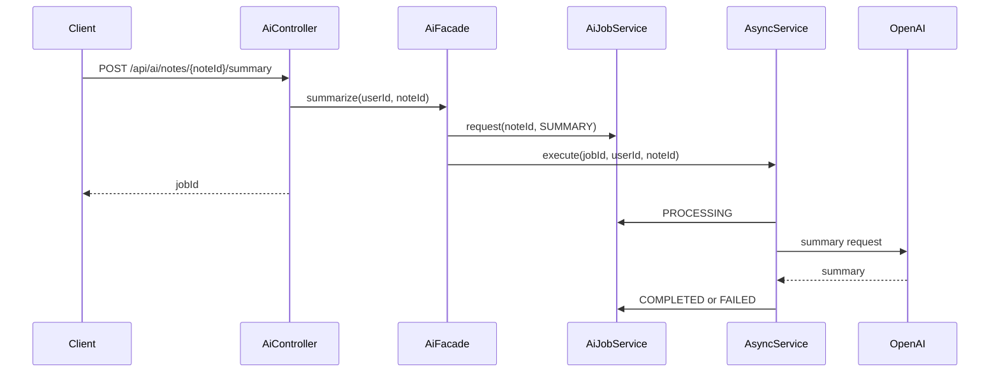
```mermaid
sequenceDiagram
    participant Client
    participant AiController
    participant AiFacade
    participant AiJobService
    participant AsyncService
    participant OpenAI

    Client->>AiController: POST /api/ai/notes/{noteId}/summary
    AiController->>AiFacade: summarize(userId, noteId)
    AiFacade->>AiJobService: request(noteId, SUMMARY)
    AiFacade->>AsyncService: execute(jobId, userId, noteId)
    AiController-->>Client: jobId
    AsyncService->>AiJobService: PROCESSING
    AsyncService->>OpenAI: summary request
    OpenAI-->>AsyncService: summary
    AsyncService->>AiJobService: COMPLETED or FAILED
```

### AI Job 상태 흐름

```text
REQUESTED
  ↓
PROCESSING
  ↓
COMPLETED
```

실패 시 `FAILED` 상태와 `errorMessage`를 저장합니다.

### Conversation 도메인

Conversation은 사용자별 AI 대화 세션을 저장하기 위한 도메인입니다. 현재 구현 범위는 대화 생성, 목록 조회, 단건 조회, 제목 수정, 삭제, 메시지 저장/조회, 대화 컨텍스트 기반 AI 채팅입니다.

```text
ConversationController
  ↓
ConversationCommandService / ConversationQueryService
  ↓
ConversationReader
  ↓
ConversationRepository
```

대화 삭제는 사용자 소유권을 `findByIdAndUserId`로 확인한 뒤 `ConversationMessageRepository.deleteAllByConversationId`로 메시지를 먼저 삭제하고, 마지막에 Conversation을 삭제합니다.

대화 제목 수정은 사용자 소유권을 확인한 뒤 `Conversation.changeTitle`로 제목을 변경합니다. 요청 DTO는 `UpdateConversationRequest`이며 제목은 빈 문자열을 허용하지 않고 최대 100자까지 허용합니다.

Conversation 메시지는 별도 엔티티로 저장합니다.

```text
ConversationMessageController
  ↓
ConversationMessageCommandService / ConversationMessageQueryService
  ↓
ConversationMessageReader
  ↓
ConversationMessageRepository
```

메시지는 `conversationId`, `sequence`, `role`, `content`를 기준으로 저장하며, 역할은 `USER`, `ASSISTANT`로 구분합니다.

### Conversation Chat 처리 흐름

```text
ChatController
  ↓
ConversationChatService
  ↓
사용자 메시지 저장
  ↓
ChatContextBuilder
  ↓
ConversationMessageReader
  ↓
ChatService
  ↓
OpenAiClient
  ↓
AI 응답 저장
```

`POST /api/conversations/{conversationId}/chat` 요청은 사용자 메시지를 먼저 저장하고, 저장된 메시지 목록을 OpenAI Chat Completion 요청 컨텍스트로 변환한 뒤 AI 응답을 다시 `ASSISTANT` 메시지로 저장합니다.

대화 제목이 기본값인 `새 대화`이면 첫 사용자 메시지를 기반으로 `TitlePromptFactory`가 제목 생성 프롬프트를 만들고, AI 응답 제목으로 Conversation 제목을 변경합니다.

### Conversation Chat Streaming 처리 흐름

```text
ChatController.stream
  ↓
ConversationChatService.stream
  ↓
사용자 소유 대화 검증
  ↓
USER 메시지 저장
  ↓
ChatContextBuilder로 방금 저장한 메시지까지 포함한 컨텍스트 생성
  ↓
OpenAiChatService.stream
  ↓
OpenAiClient.stream(WebClient + text/event-stream)
  ↓
OpenAI SSE chunk 수신
  ↓
ChatCompletionChunkResponse.content()로 delta.content 추출
  ↓
StreamResponse.token(content) 전송
  ↓
스트림 완료 후 누적된 AI 응답을 ASSISTANT 메시지로 저장
  ↓
StreamResponse.complete() 전송
```

스트리밍 계약:

| 구분 | 값 |
| --- | --- |
| Endpoint | `POST /api/conversations/{conversationId}/chat/stream` |
| Produces | `text/event-stream` |
| Request Body | `{ "message": "..." }` |
| Auth | `Authorization: Bearer <accessToken>` |
| Response Wrapper | 사용하지 않음 |
| Event DTO | `StreamResponse(type, content)` |
| Event Type | `TOKEN`, `COMPLETE`, `ERROR` |
| 저장 시점 | USER 메시지는 스트림 시작 전 저장, ASSISTANT 메시지는 스트림 완료 후 누적 본문 저장 |

### AI 지식 요약 저장 흐름

오늘 기준으로 대화를 학습 노트로 증류하기 위한 1차 서비스 계층이 구성되어 있습니다. 아직 Batch 자동 실행과 `/study` 화면은 연결 전이며, 현재 구현은 AI 구조화 요약 결과를 Knowledge 경로에 맞춰 저장하는 도메인/서비스 기반입니다.

```text
대화 원문 문자열
  ↓
OpenAiKnowledgeSummaryService.summarize(conversation)
  ↓
KnowledgeSummaryPrompt.systemPrompt / userPrompt
  ↓
AiClient.chat(ChatCompletionRequest)
  ↓
OpenAI JSON 응답
  ↓
AiKnowledgeSummaryResponse 파싱
  ↓
KnowledgeNoteCommandService.saveAiSummary(user, conversation, response)
  ↓
KnowledgePathResolver.resolve(user, response.knowledgePath())
  ↓
기존 Knowledge 경로 재사용 또는 누락 경로 자동 생성
  ↓
KnowledgeNote.create(...)
  ↓
KnowledgeNoteRepository.save(note)
```

구조화 요약 응답 계약:

| Field | Type | 설명 |
| --- | --- | --- |
| `knowledgePath` | `List<String>` | 가장 넓은 분류부터 구체적인 분류까지 이어지는 Knowledge 폴더 경로 |
| `title` | `String` | 학습 노트 제목 |
| `description` | `String` | 학습 내용을 한 문장으로 설명하는 부제 |
| `summary` | `String` | 대화에서 추출한 학습용 요약 |
| `keywords` | `List<String>` | 검색과 복습에 사용할 핵심 키워드 |

Knowledge 경로 처리 규칙:

- 경로가 비어 있으면 `IllegalArgumentException`을 발생시킵니다.
- 각 경로 항목의 앞뒤 공백을 제거합니다.
- 빈 문자열 항목은 제거합니다.
- 저장되지 않은 사용자는 Knowledge 경로를 생성할 수 없습니다.
- 루트 경로는 `findByUserIdAndParentIsNullAndName`으로 조회하고, 없으면 `Knowledge.createRoot`로 생성합니다.
- 자식 경로는 `findByUserIdAndParentIdAndName`으로 조회하고, 없으면 `Knowledge.createChild`로 생성합니다.
- 최종 경로의 `Knowledge`를 반환해 `KnowledgeNote` 저장 위치로 사용합니다.

현재 테스트 범위:

- `KnowledgePathResolverTest`: 누락 경로 생성, 기존 경로 재사용, 공백/빈 항목 정규화, 빈 경로 예외, 저장되지 않은 사용자 예외
- `KnowledgeNoteCommandServiceTest`: AI 요약 응답을 Knowledge 경로에 연결하고 `KnowledgeNote`로 저장
- `OpenAiKnowledgeSummaryServiceTest`: OpenAI JSON 응답 파싱과 빈 응답 예외
- `KnowledgeExtractionServiceTest`: 대화 컨텍스트를 AI 지식 요약으로 변환하고 KnowledgeNote 저장까지 연결
- `ConversationKnowledgeContextBuilderTest`: 대화 메시지를 `USER:`/`AI:` 형식의 요약 컨텍스트로 변환

### Knowledge 추출 Batch

Knowledge 추출 배치는 완료된 대화를 AI가 구조화된 학습 노트로 요약하고, `Knowledge` 경로를 자동 생성한 뒤 `KnowledgeNote`로 저장하는 작업입니다.

```text
LocalKnowledgeExtractionJobRunner
  ↓
knowledgeExtractionJob
  ↓
knowledgeExtractionStep
  ↓
KnowledgeExtractionTasklet
  ↓
KnowledgeConversationReader.findExtractionTargets()
  ↓
KnowledgeExtractionStatusService.start(conversationId)
  ↓
KnowledgeExtractionService.extract(userId, conversationId)
  ↓
KnowledgeExtractionStatusService.complete(conversationId)
```

배치 구성:

| 구분 | 값 |
| --- | --- |
| Job | `knowledgeExtractionJob` |
| Step | `knowledgeExtractionStep` |
| 구현 방식 | Tasklet 기반 단일 Step |
| 대상 조회 | `KnowledgeConversationReader` -> `ConversationRepository.findKnowledgeExtractionTargets()` |
| 핵심 처리 | `KnowledgeExtractionService.extract(userId, conversationId)` |
| 상태 처리 | `KnowledgeExtractionStatusService.start/complete/fail` |
| 테스트 | `KnowledgeExtractionBatchConfigTest`, `KnowledgeExtractionTaskletTest`, `ConversationRepositoryTest` |

실행 시간과 주기:

- 현재 정기 Scheduler나 Cron은 연결되어 있지 않습니다.
- `spring.batch.job.enabled=false`로 Spring Boot의 기본 Batch 자동 실행은 비활성화되어 있습니다.
- 로컬 프로필에서 `feldbuch.batch.knowledge-extraction.run=true`를 설정하면 `LocalKnowledgeExtractionJobRunner`가 애플리케이션 시작 직후 `knowledgeExtractionJob`을 1회 실행합니다.
- Job Parameter는 `executionTime=System.currentTimeMillis()`를 사용합니다. 같은 Job도 실행 시각이 달라지므로 매번 별도 JobInstance로 기록됩니다.
- 반복 실행이 필요하면 현재 단계에서는 애플리케이션을 다시 실행하거나 같은 설정으로 Job을 다시 실행해야 합니다.
- 1시간 주기 또는 매일 새벽 실행은 다음 단계에서 Spring Scheduler나 운영 스케줄러로 연결할 예정입니다.

대상 조회 조건:

- `Conversation.status = COMPLETED`
- `knowledgeExtractStatus = NONE`
- 또는 `knowledgeExtractStatus = FAILED`
- 실패 재시도는 `knowledgeExtractRetryCount < 3`
- 실패 재시도는 `knowledgeExtractFailedAt <= 현재 시각 - 1분`
- 조회 순서는 `updatedAt ASC`로 오래된 대화부터 처리합니다.

상태 전이:

```text
NONE
  ↓
PROCESSING
  ↓
COMPLETED
```

실패 시:

```text
PROCESSING
  ↓
FAILED
  ↓ 1분 이후, retryCount < 3
PROCESSING
```

상태 필드:

| Field | 설명 |
| --- | --- |
| `knowledgeExtractStatus` | `NONE`, `PROCESSING`, `COMPLETED`, `FAILED` |
| `knowledgeExtractRetryCount` | 실패 재시도 횟수. 실패할 때마다 증가 |
| `knowledgeExtractErrorMessage` | 실패 메시지. 최대 1000자 |
| `knowledgeExtractFailedAt` | 마지막 실패 시각. 재시도 지연 기준 |

Tasklet 처리 규칙:

- 조회된 대상 Conversation을 한 번씩 순회합니다.
- 각 대화 처리 전 `PROCESSING` 상태로 변경합니다.
- 추출 성공 시 `COMPLETED` 상태로 변경하고 실패 메시지/실패 시각을 초기화합니다.
- 추출 실패 시 `FAILED` 상태로 변경하고 재시도 횟수, 실패 메시지, 실패 시각을 기록합니다.
- 한 대화의 추출이 실패해도 배치 전체를 중단하지 않고 다음 대화를 계속 처리합니다.
- 상태 변경은 `REQUIRES_NEW` 트랜잭션으로 분리해 배치 외부 트랜잭션과 독립적으로 반영합니다.

### Database ERD


ERD는 JPA 엔티티와 `@Table`, `@JoinColumn`, `@CollectionTable`, 리포지토리 조회 메서드를 기준으로 작성했습니다. `users`를 중앙 소유자로 두고 좌측은 노트/AI Job, 우측은 대화/메시지, 하단은 Knowledge 학습 노트 저장 구조로 분리해 관계선 겹침을 줄였습니다. `BaseEntity`를 상속하는 엔티티는 공통으로 `created_at`, `updated_at` 감사 컬럼을 가집니다.

#### 테이블 요약

| Table | 한글명 | 역할 |
| --- | --- | --- |
| `users` | 사용자 | 로그인 주체, 노트/대화/지식 폴더/학습 노트의 소유자 |
| `notes` | 개발 노트 | 사용자가 직접 작성하는 개발 학습 노트 |
| `ai_job` | AI 작업 | 비동기 AI 요약 등 백그라운드 작업 상태 추적 |
| `conversations` | AI 대화 세션 | 사용자별 AI 채팅 세션 |
| `conversation_messages` | 대화 메시지 | 대화별 USER/ASSISTANT 메시지와 순서 저장 |
| `knowledge` | 지식 폴더 | 사용자별 지식 분류 트리, 자기 참조 폴더 구조 |
| `knowledge_notes` | AI 추출 학습 노트 | 대화에서 추출해 Knowledge 폴더에 저장하는 제목, 설명, 요약 |
| `knowledge_note_keywords` | 학습 노트 키워드 | `KnowledgeNote.keywords` ElementCollection 저장 테이블 |

#### 컬럼 상세

| Table | Column | Key | Type / 제약 | 설명 |
| --- | --- | --- | --- | --- |
| `users` / 사용자 | `id` | PK | BIGINT, identity | 사용자 PK |
| `users` / 사용자 | `email` | UK | VARCHAR(100), NOT NULL | 로그인 이메일, `uk_user_email` |
| `users` / 사용자 | `password` |  | VARCHAR(255), NOT NULL | 암호화 비밀번호 |
| `users` / 사용자 | `nickname` |  | VARCHAR(30), NOT NULL | 표시 이름 |
| `users` / 사용자 | `role` |  | VARCHAR(20), NOT NULL | `USER`, `ADMIN` |
| `users` / 사용자 | `created_at`, `updated_at` |  | DATETIME | 생성/수정 시각 |
| `notes` / 개발 노트 | `id` | PK | BIGINT, identity | 노트 PK |
| `notes` / 개발 노트 | `user_id` | FK | BIGINT, NOT NULL | `users.id`, `fk_note_user` |
| `notes` / 개발 노트 | `title` |  | VARCHAR(200), NOT NULL | 노트 제목 |
| `notes` / 개발 노트 | `content` |  | LOB, NOT NULL | 노트 본문 |
| `notes` / 개발 노트 | `summary` |  | VARCHAR(500), NULL | AI 요약 결과 |
| `notes` / 개발 노트 | `category` |  | VARCHAR(30), NOT NULL | `STUDY`, `ERROR`, `ENVIRONMENT`, `AI`, `MEMO` |
| `notes` / 개발 노트 | `pinned` |  | BOOLEAN, NOT NULL | 상단 고정 여부 |
| `notes` / 개발 노트 | `study_status` |  | VARCHAR(30), NOT NULL | `TODO`, `IN_PROGRESS`, `DONE` |
| `notes` / 개발 노트 | `summary_status` |  | VARCHAR(20), NOT NULL | `NONE`, `PENDING`, `COMPLETED`, `FAILED` |
| `notes` / 개발 노트 | `created_at`, `updated_at` |  | DATETIME | 생성/수정 시각 |
| `ai_job` / AI 작업 | `id` | PK | BIGINT, identity | Job PK |
| `ai_job` / AI 작업 | `note_id` | Logical FK | BIGINT | 현재 JPA FK 없이 노트 ID 값으로 보관 |
| `ai_job` / AI 작업 | `job_type` |  | VARCHAR(255) | `SUMMARY`, `TAG`, `QUIZ`, `REVIEW`, `ROADMAP` |
| `ai_job` / AI 작업 | `status` |  | VARCHAR(255) | `REQUESTED`, `PROCESSING`, `COMPLETED`, `FAILED` |
| `ai_job` / AI 작업 | `requested_at`, `started_at`, `completed_at` |  | DATETIME | Job 처리 시각 |
| `ai_job` / AI 작업 | `error_message` |  | VARCHAR(1000), NULL | 실패 사유 |
| `ai_job` / AI 작업 | `created_at`, `updated_at` |  | DATETIME | 생성/수정 시각 |
| `conversations` / AI 대화 세션 | `id` | PK | BIGINT, identity | 대화 PK |
| `conversations` / AI 대화 세션 | `user_id` | FK | BIGINT, NOT NULL | `users.id` |
| `conversations` / AI 대화 세션 | `title` |  | VARCHAR(100), NOT NULL | 대화 제목, 기본값 `새 대화` |
| `conversations` / AI 대화 세션 | `status` |  | VARCHAR(255), NOT NULL | `ACTIVE`, `COMPLETED` |
| `conversations` / AI 대화 세션 | `knowledge_extract_status` |  | VARCHAR(20), NOT NULL | Knowledge 추출 상태: `NONE`, `PROCESSING`, `COMPLETED`, `FAILED` |
| `conversations` / AI 대화 세션 | `knowledge_extract_retry_count` |  | INTEGER, NOT NULL | Knowledge 추출 실패 재시도 횟수 |
| `conversations` / AI 대화 세션 | `knowledge_extract_error_message` |  | VARCHAR(1000), NULL | Knowledge 추출 실패 메시지 |
| `conversations` / AI 대화 세션 | `knowledge_extract_failed_at` |  | DATETIME, NULL | Knowledge 추출 마지막 실패 시각 |
| `conversations` / AI 대화 세션 | `created_at`, `updated_at` |  | DATETIME | 생성/수정 시각, 목록 정렬 기준은 `updated_at DESC` |
| `conversation_messages` / 대화 메시지 | `id` | PK | BIGINT, identity | 메시지 PK |
| `conversation_messages` / 대화 메시지 | `conversation_id` | FK | BIGINT, NOT NULL | `conversations.id` |
| `conversation_messages` / 대화 메시지 | `sequence` |  | INTEGER, NOT NULL | 대화 내 메시지 순서 |
| `conversation_messages` / 대화 메시지 | `role` |  | VARCHAR(20), NOT NULL | `USER`, `ASSISTANT` |
| `conversation_messages` / 대화 메시지 | `content` |  | LONGTEXT, NOT NULL | 메시지 본문 |
| `conversation_messages` / 대화 메시지 | `created_at`, `updated_at` |  | DATETIME | 생성/수정 시각 |
| `knowledge` / 지식 폴더 | `id` | PK | BIGINT, identity | Knowledge PK |
| `knowledge` / 지식 폴더 | `user_id` | FK, IDX | BIGINT, NOT NULL | `users.id`, `fk_knowledge_user` |
| `knowledge` / 지식 폴더 | `parent_id` | FK, IDX | BIGINT, NULL | `knowledge.id`, `fk_knowledge_parent`, NULL이면 최상위 |
| `knowledge` / 지식 폴더 | `name` |  | VARCHAR(100), NOT NULL | 폴더 이름 |
| `knowledge` / 지식 폴더 | `created_at`, `updated_at` |  | DATETIME | 생성/수정 시각 |
| `knowledge_notes` / AI 추출 학습 노트 | `id` | PK | BIGINT, identity | KnowledgeNote PK |
| `knowledge_notes` / AI 추출 학습 노트 | `user_id` | FK, IDX | BIGINT, NOT NULL | `users.id`, `fk_knowledge_note_user` |
| `knowledge_notes` / AI 추출 학습 노트 | `conversation_id` | FK, IDX | BIGINT, NOT NULL | `conversations.id`, `fk_knowledge_note_conversation` |
| `knowledge_notes` / AI 추출 학습 노트 | `knowledge_id` | FK, IDX | BIGINT, NOT NULL | `knowledge.id`, `fk_knowledge_note_knowledge` |
| `knowledge_notes` / AI 추출 학습 노트 | `title` |  | VARCHAR(200), NOT NULL | AI가 생성한 학습 노트 제목 |
| `knowledge_notes` / AI 추출 학습 노트 | `description` |  | VARCHAR(300), NOT NULL | AI가 생성한 한 줄 설명 |
| `knowledge_notes` / AI 추출 학습 노트 | `summary` |  | LOB, NOT NULL | 대화에서 추출한 학습 요약 |
| `knowledge_notes` / AI 추출 학습 노트 | `created_at`, `updated_at` |  | DATETIME | 생성/수정 시각 |
| `knowledge_note_keywords` / 학습 노트 키워드 | `knowledge_note_id` | FK | BIGINT, NOT NULL | `knowledge_notes.id`, `fk_knowledge_note_keyword_note` |
| `knowledge_note_keywords` / 학습 노트 키워드 | `keyword` |  | VARCHAR(100), NOT NULL | 검색/복습용 키워드, 엔티티에서 공백 제거, 중복 제거, 최대 10개 제한 |

#### 참조 관계

| 관계 | Cardinality | FK / 기준 컬럼 | 설명 |
| --- | --- | --- | --- |
| `users` -> `notes` | 1:N | `notes.user_id` | 사용자가 작성한 개발 노트 |
| `notes` -> `ai_job` | 1:N logical | `ai_job.note_id` | AI Job이 대상 노트 ID를 값으로 보관합니다. 현재 DB FK는 정의하지 않았습니다. |
| `users` -> `conversations` | 1:N | `conversations.user_id` | 사용자별 대화 세션 |
| `conversations` -> `conversation_messages` | 1:N | `conversation_messages.conversation_id` | 한 대화의 USER/ASSISTANT 메시지 |
| `users` -> `knowledge` | 1:N | `knowledge.user_id` | 사용자별 지식 폴더 트리 |
| `knowledge` -> `knowledge` | 1:N self | `knowledge.parent_id` | 상위/하위 Knowledge 폴더 |
| `users` -> `knowledge_notes` | 1:N | `knowledge_notes.user_id` | 사용자별 AI 추출 학습 노트 조회 최적화 |
| `conversations` -> `knowledge_notes` | 1:N | `knowledge_notes.conversation_id` | 한 대화에서 여러 학습 노트가 추출될 수 있습니다. |
| `knowledge` -> `knowledge_notes` | 1:N | `knowledge_notes.knowledge_id` | 특정 지식 폴더에 저장된 학습 노트 |
| `knowledge_notes` -> `knowledge_note_keywords` | 1:N | `knowledge_note_keywords.knowledge_note_id` | ElementCollection 키워드 |

#### 인덱스와 조회 패턴

| Table | Index / Constraint | Columns | 근거 / 사용 패턴 |
| --- | --- | --- | --- |
| `users` | `uk_user_email` | `email` | 로그인, 회원가입 중복 확인 |
| `knowledge` | `idx_knowledge_user_parent` | `user_id`, `parent_id` | 루트/자식 폴더 목록 조회, 같은 parent 내 이름 중복 확인 |
| `knowledge` | `idx_knowledge_parent` | `parent_id` | 하위 폴더 탐색, 자기 참조 트리 이동/조회 |
| `knowledge_notes` | `idx_knowledge_note_user` | `user_id` | 사용자별 최근 학습 노트 조회 |
| `knowledge_notes` | `idx_knowledge_note_knowledge` | `knowledge_id` | 특정 Knowledge 폴더 안의 학습 노트 목록 조회 |
| `knowledge_notes` | `idx_knowledge_note_conversation` | `conversation_id` | 한 대화에서 생성된 학습 노트 조회, 생성 여부 확인 |
| `notes` | 권장 | `user_id`, `pinned`, `created_at` | `findAllByUserIdOrderByPinnedDescCreatedAtDesc` 조회 패턴 |
| `conversations` | 권장 | `user_id`, `updated_at` | `findAllByUserIdOrderByUpdatedAtDesc` 조회 패턴 |
| `conversations` | 권장 | `status`, `knowledge_extract_status`, `knowledge_extract_failed_at`, `knowledge_extract_retry_count`, `updated_at` | Knowledge 추출 배치 대상 조회와 실패 재시도 조회 패턴 |
| `conversation_messages` | 권장 | `conversation_id`, `sequence` | 메시지 목록 정렬과 마지막 sequence 조회 패턴 |
| `ai_job` | 권장 | `note_id`, `status` | 노트별 AI 작업 추적과 상태 조회 확장 시 필요 |

### Spring Batch 파이프라인

```text
summaryJob
  ↓
summaryStep
  ↓
SummaryItemReader
  ↓
SummaryItemProcessor
  ↓
SummaryItemWriter
```

요청 기반 비동기 요약과 별도로, 기존 `summaryJob`/`summaryStep`은 배치 기반 요약 처리 확장을 위한 파이프라인입니다.

오늘 추가된 Knowledge 추출 배치는 `knowledgeExtractionJob`/`knowledgeExtractionStep`으로 분리되어 있습니다. 이 배치는 Chunk 기반 Reader/Processor/Writer가 아니라 Tasklet 기반으로 구현되어, 한 번 실행할 때 대상 Conversation 목록을 조회한 뒤 각 대화를 순회하며 KnowledgeNote를 생성합니다.

### 프로젝트 아키텍처 이미지

GitHub README에서 프로젝트의 현재 화면을 바로 확인할 수 있도록 메인 화면 스크린샷을 별도 자산으로 관리합니다.


아래 이미지는 현재 프로젝트에서 실제로 사용하는 기술을 기준으로 정리한 아키텍처 SVG입니다.

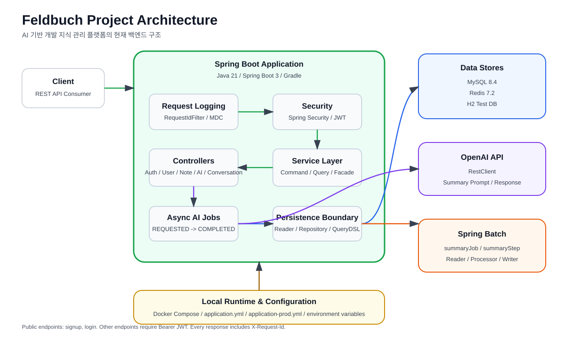

AI 요약 요청과 Job 상태 흐름은 별도 SVG로 관리합니다.

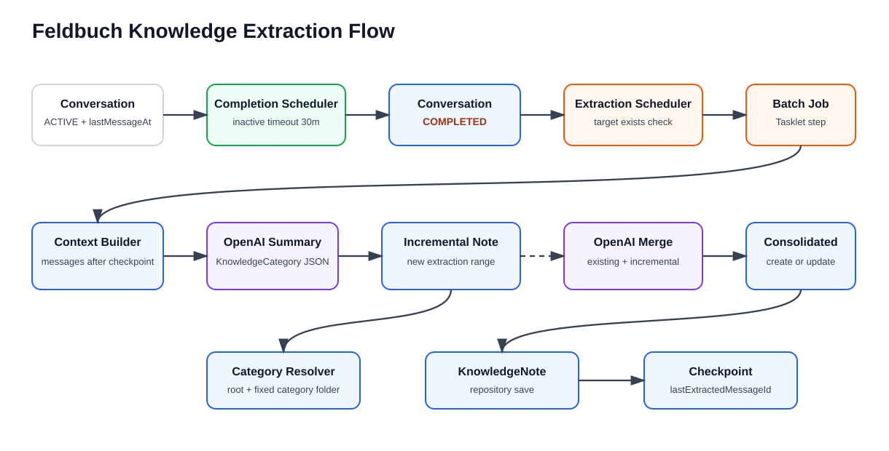

Vue 클라이언트의 라우팅, 컴포넌트, API client, Interceptor 흐름은 별도 SVG로 관리합니다.


엔티티, 컬럼, 참조 관계, 인덱스는 ERD SVG로 관리합니다.


이미지 파일 경로:

```text
docs/images/screenshots/feldbuch-main-chat-screen.png
docs/images/diagrams/feldbuch-architecture.svg
docs/images/diagrams/feldbuch-client-architecture.svg
docs/images/diagrams/feldbuch-erd.svg
docs/images/diagrams/feldbuch-ai-job-flow.svg
```

### 아키텍처 구성 요소 로고

| 단계 | 이미지 | 설명 |
| --- | --- | --- |
| Build |  | Gradle로 Spring Boot 애플리케이션 빌드 |
| Runtime |  | Docker Compose 기반 로컬 인프라 실행 |
| Backend |  | API 서버 |
| Logging | Request ID | `RequestIdFilter`, MDC, `X-Request-Id` 기반 요청 추적 |
| Security | JWT | Spring Security 기반 토큰 인증 |
| Query | QueryDSL | 동적 검색 |
| Database |  | 운영 데이터 저장 |
| Cache |  | 캐시/임시 저장소 |
| Batch | Spring Batch | 요약 배치 파이프라인 |
| Test Database | H2 | 테스트 환경 인메모리 DB |
| AI |  | OpenAI API 기반 AI 요약 |
| Frontend |  | Vue.js 기반 SPA 전환 대상 |

---

## Refactoring History

### Reader Pattern

기존에는 Service가 Repository를 직접 호출했습니다.

```text
Service
  ↓
Repository
```

Reader Pattern 적용 후 조회 책임을 Reader로 분리했습니다.

```text
Service
  ↓
Reader
  ↓
Repository
```

### CQRS

노트 기능은 명령과 조회 책임을 분리했습니다.

```text
NoteCommandService
    +
NoteQueryService
```

### Facade

AI 기능은 Controller가 여러 서비스를 직접 조합하지 않도록 Facade를 두었습니다.

```text
AiController
    ↓
AiFacade
    ↓
AI Service Layer
```

### Async Processing

AI 요약은 외부 API 호출 시간이 발생하므로 비동기 처리 구조를 적용했습니다.

```text
요약 요청
  ↓
Job 생성
  ↓
비동기 처리 시작
  ↓
OpenAI API 호출
  ↓
Job 상태 업데이트
```

---

## Roadmap

### AI

- SummaryPromptTemplate 고도화
- Prompt Versioning
- AI Prompt Log
- AI 태그 생성
- 코드 리뷰
- 퀴즈 생성
- 학습 로드맵 추천

### Backend

- Event Driven Architecture
- API 문서화
- 테스트 커버리지 확장
- Knowledge API 계층 추가
- KnowledgeNote 생성/조회 API 추가
- Knowledge 추출 Batch 정기 스케줄러 연결
- Knowledge 추출 대상 조회 인덱스 추가
- Knowledge 추출 재시도 정책 운영 설정화

### Frontend

- Vue 대화 목록/메시지 화면 상태 관리 정리
- Vue 삭제 확인 UX 개선
- 스트리밍 요청 취소 UX 정리
- Knowledge 폴더/학습 노트 화면 추가
- Thymeleaf 화면과 Vue 화면 기능 비교
- Vite 개발 서버와 Spring Boot API 서버 연동 방식 정리

### Infra

- Docker Compose 정리
- Monitoring

### Advanced

- RAG
- Vector Search
- Knowledge Graph

---

## Image References

문서에서 이미지가 잘 보이도록 다음 기준으로 관리합니다.

- 스크린샷, 다이어그램 등 직접 만든 이미지는 `docs/images/diagrams/`에 저장합니다.
- 화면 스크린샷은 `docs/images/screenshots/`에 저장합니다.
- 기술 로고는 `docs/images/logos/`에 각각 저장합니다.
- Markdown에서는 상대 경로를 사용합니다.
- 문서 안에서는 외부 URL 대신 저장소 내부 이미지 파일을 참조합니다.
- 이미지 alt 텍스트를 함께 작성합니다.

### 현재 로컬 이미지

| 이름 | 경로 | 용도 |
| --- | --- | --- |
| Feldbuch Project Architecture | `docs/images/diagrams/feldbuch-architecture.svg` | 현재 프로젝트의 Spring Boot, RequestIdFilter, Security, QueryDSL, JPA, MySQL, H2, Docker, OpenAI 구조 |
| Feldbuch Client Architecture | `docs/images/diagrams/feldbuch-client-architecture.svg` | Vue Router, View, Component, Axios API client, Interceptor, Spring Boot API 통신 구조 |
| Feldbuch Entity Relationship Diagram | `docs/images/diagrams/feldbuch-erd.svg` | users를 중앙에 둔 ERD. notes, ai_job, conversations, conversation_messages, knowledge, knowledge_notes, knowledge_note_keywords의 컬럼, 참조 관계, 인덱스 |
| Feldbuch AI Job Flow | `docs/images/diagrams/feldbuch-ai-job-flow.svg` | AI 요약 요청, Job 상태 변경, OpenAI 호출 흐름 |
| Feldbuch Main Chat Screen | `docs/images/screenshots/feldbuch-main-chat-screen.png` | Vue 기반 메인 대화 화면 |
| Spring Boot | `docs/images/logos/springboot.svg` | 백엔드 API |
| Docker | `docs/images/logos/docker.svg` | 컨테이너 실행 환경 |
| MySQL | `docs/images/logos/mysql.svg` | 운영 DB |
| Redis | `docs/images/logos/redis.svg` | 캐시/임시 저장소 |
| OpenAI | `docs/images/logos/openai.svg` | AI 요약 API |
| Gradle | `docs/images/logos/gradle.svg` | 빌드 |
| Vue.js | `docs/images/logos/vue.svg` | Vue.js 기반 SPA 전환 문서화 |

### 외부 이미지 출처

| 이미지 | 출처 | 라이선스 |
| --- | --- | --- |
| Vue.js Logo | [Wikimedia Commons - Vue.js Logo 2.svg](https://commons.wikimedia.org/wiki/File:Vue.js_Logo_2.svg) | CC BY 4.0 |

### Markdown 이미지 예시

```markdown


```

### HTML 이미지 예시

```html


```

---

## Commit History Style

기능 단위로 작은 커밋을 유지합니다.

```text
기능: JWT 로그인 구현
기능: 노트 CRUD 구현
기능: QueryDSL 검색 구현
리팩토링: Reader 패턴 도입
리팩토링: CQRS 적용
기능: AI 도메인 분리
기능: OpenAI API 클라이언트 구현
기능: OpenAI 요약 서비스 구현
```

---

## Project Philosophy

Feldbuch는 단순한 포트폴리오 프로젝트가 아니라, 개발자의 학습 기록을 AI가 이해하고 활용하는 개발 지식 관리 플랫폼을 목표로 합니다.

기능 구현뿐 아니라 리팩토링, 테스트, 아키텍처, 유지보수성을 함께 고민하며 장기적으로 발전시키는 프로젝트입니다.
