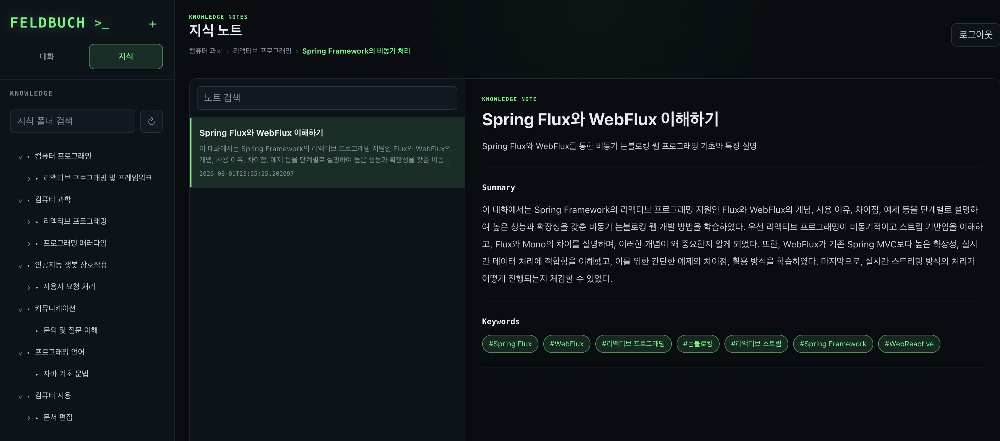
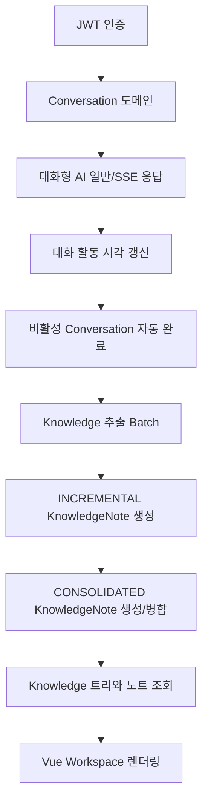
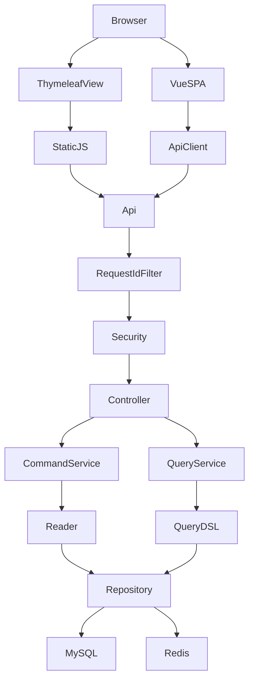
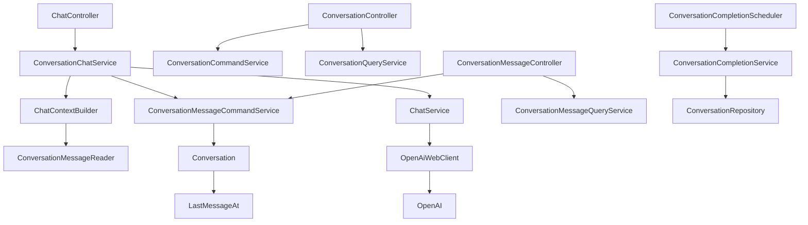
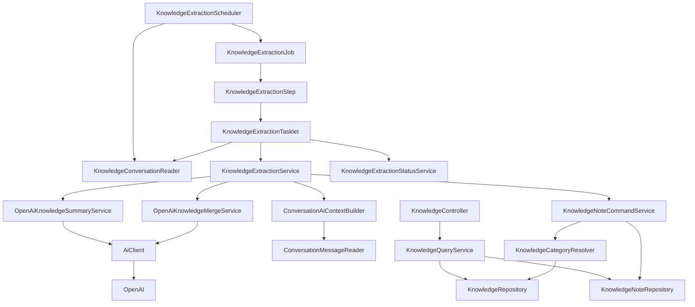
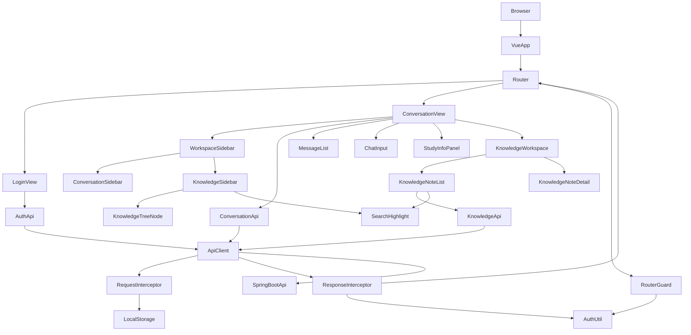

# FELDBUCH DEVELOPMENT DOCUMENTATION

> AI 기반 개발 학습 대화와 KnowledgeNote 추출 흐름을 정리한 현재 개발 문서입니다.

## Project Overview

Feldbuch는 개발자가 AI와 나눈 학습 대화를 저장하고, 완료된 대화를 Batch로 처리해 Knowledge 폴더와 KnowledgeNote로 추출하는 개발 지식 관리 플랫폼입니다.

현재 구현은 Conversation 중심입니다. 대화가 일정 시간 비활성 상태가 되면 자동으로 완료되고, 완료된 대화는 Knowledge 추출 Batch의 대상이 됩니다. 추출 결과는 매 실행마다 생성되는 `INCREMENTAL` 노트와 Conversation 단위로 누적 병합되는 `CONSOLIDATED` 노트로 나뉩니다.

## Current Product Surface

메인 사용자 화면은 `frontend/src/views/ConversationView.vue`입니다.

- `WorkspaceSidebar`가 왼쪽 고정 영역에서 `대화`와 `지식` 탭을 전환합니다.
- `대화` 모드에서는 대화 목록, 채팅 메시지, 입력창, 선택 대화의 학습 정보 패널을 렌더링합니다.
- `지식` 모드에서는 Knowledge 폴더 트리, 선택 폴더의 KnowledgeNote 목록, 선택 노트의 상세 요약과 키워드를 렌더링합니다.
- Knowledge 폴더는 `KnowledgeRootCategory` 대분류와 `KnowledgeCategory` 세부 카테고리 기준으로 생성됩니다.
- Knowledge 폴더와 노트 목록은 검색을 지원하고, 검색어는 `SearchHighlight`로 강조합니다.
- 선택한 사이드바 모드, 대화, Knowledge 폴더, Knowledge 경로, Knowledge 노트는 `localStorage`에 저장해 새로고침 후 복원합니다.
- 대화 메시지 전송은 사용자 메시지와 빈 Assistant 메시지를 낙관적으로 추가한 뒤 SSE 토큰을 누적 표시하고, 완료 후 상세를 재조회합니다.
- 메시지가 저장될 때 Conversation은 ACTIVE 상태와 `lastMessageAt`을 갱신하며, 완료된 대화에 새 메시지가 추가되면 다음 증분 Knowledge 추출을 위해 추출 상태를 다시 `NONE`으로 준비합니다.

## Screens




## Tech Stack

| Category | Stack |
| --- | --- |
| Language | Java 21 |
| Framework | Spring Boot 3.5 |
| Security | Spring Security, JWT |
| Auth Config | Google OAuth2 client properties |
| Database | MySQL, H2 Test DB |
| ORM / Query | Spring Data JPA, QueryDSL |
| AI | OpenAI REST API, OpenAI SSE Streaming |
| Batch / Infra | Spring Batch, Redis, Docker Compose |
| Frontend | Vue 3, Vite, Vue Router, Axios, Fetch SSE, marked, highlight.js, DOMPurify |
| Legacy View | Thymeleaf, static CSS/JS |
| Test | JUnit 5, MockMvc, Spring Security Test, Spring Batch Test |

## Development Flow


```mermaid
flowchart TD
    A[JWT 인증] --> B[Conversation 도메인]
    B --> C[대화형 AI 일반/SSE 응답]
    C --> D[대화 활동 시각 갱신]
    D --> E[비활성 Conversation 자동 완료]
    E --> F[Knowledge 추출 Batch]
    F --> G[INCREMENTAL KnowledgeNote 생성]
    G --> H[CONSOLIDATED KnowledgeNote 생성/병합]
    H --> I[Knowledge 트리와 노트 조회]
    I --> J[Vue Workspace 렌더링]
```

## Implemented Features

- Spring Security, JWT 로그인, JWT Claims 기반 `userId`, `email`, `role` 저장
- CustomUserDetails, JWT Filter, JWT AuthenticationEntryPoint 401 처리
- Vite 개발 서버 `http://localhost:5173` CORS 허용
- 회원가입, 로그인, 클라이언트 로그아웃
- RestClient 기반 OpenAI 일반 요청
- WebClient 기반 OpenAI Chat Completion SSE 스트리밍
- Conversation Entity, Controller, Command/Query Service
- Conversation 제목 수정/삭제 API
- ConversationMessage Entity, Controller, Command/Query Service
- Conversation별 메시지 순서 저장
- Conversation별 마지막 메시지 활동 시각 저장
- Conversation 자동 완료 Scheduler와 Completion Service
- 비활성 ACTIVE Conversation 조회 QueryDSL 쿼리
- 대화 내역을 OpenAI Chat Completion 메시지 컨텍스트로 변환
- Conversation Chat API와 Conversation Chat Stream API
- `StreamResponse` 기반 `TOKEN`, `COMPLETE`, `ERROR` 스트리밍 이벤트 계약
- 첫 사용자 메시지 기반 Conversation 제목 자동 생성
- Conversation Knowledge 추출 상태 필드와 실패 재시도 메타데이터
- Conversation Knowledge 추출 체크포인트 `lastExtractedMessageId`
- Knowledge Entity, KnowledgeNote Entity, KnowledgeNote Keyword ElementCollection
- `KnowledgeRootCategory` 기반 대분류 체계
- `KnowledgeCategory` 기반 세부 카테고리 체계
- KnowledgeNoteType 기반 `INCREMENTAL`, `CONSOLIDATED` 노트 분리
- KnowledgeRepository, KnowledgeNoteRepository
- KnowledgeCategoryResolver
- AiKnowledgeSummaryResponse, AiKnowledgeMergeResponse
- KnowledgeSummaryPrompt, KnowledgeMergePrompt
- AiKnowledgeSummaryService, OpenAiKnowledgeSummaryService
- AiKnowledgeMergeService, OpenAiKnowledgeMergeService
- KnowledgeExtractionService, KnowledgeExtractionStatusService
- ConversationAiContextBuilder
- KnowledgeConversationReader
- KnowledgeExtractionBatchConfig, KnowledgeExtractionTasklet
- KnowledgeExtractionScheduler
- 사용자별 Knowledge 루트/자식 조회, 동일 폴더명 중복 확인 쿼리
- QueryDSL 기반 Knowledge 추출 대상 Conversation 조회와 대상 존재 여부 확인 쿼리
- KnowledgeNote의 Knowledge별/Conversation별/사용자별/타입별 조회 쿼리
- Knowledge Tree 조회 API, KnowledgeNote 목록/상세 조회 API, Conversation별 통합 노트 조회 API
- Thymeleaf 기반 로그인/대화 비교 화면
- Vue 3 + Vite SPA: `LoginView`, `ConversationView`
- Vue 컴포넌트: `WorkspaceSidebar`, `SidebarHeader`, `SidebarTabs`, `SidebarSectionLabel`, `ConversationSidebar`, `MessageList`, `ChatInput`, `StudyInfoPanel`, `KnowledgeSidebar`, `KnowledgeTreeNode`, `KnowledgeWorkspace`, `KnowledgeNoteList`, `KnowledgeNoteDetail`, `SearchHighlight`
- 새 대화 생성, 대화 제목 인라인 수정, 대화 삭제 UI
- 대화 생성/수정/삭제/메시지 전송 중복 요청 방지 상태
- 메시지 전송 중 AI 응답 작성 로딩 표시
- 메시지 목록 자동 스크롤
- AI 응답 Markdown 렌더링, highlight.js 코드 문법 강조, DOMPurify sanitize
- 코드 블록 언어 표시와 클립보드 COPY 버튼
- Knowledge 폴더 검색, 노트 검색, 검색 결과 없음 상태 표시
- Knowledge 검색어 하이라이트
- Knowledge breadcrumb 표시
- Knowledge 노트 목록 선택 상태 표시
- Knowledge 노트 상세 화면에서 제목, 설명, 요약, 키워드 표시
- 사이드바 모드, 선택 대화, 선택 Knowledge 폴더, 선택 Knowledge 경로, 선택 Knowledge 노트 localStorage 저장/복원
- Request ID Filter, SLF4J MDC 기반 requestId 저장/해제, `X-Request-Id` 응답 헤더
- Axios 공통 API client와 Request/Response Interceptor
- Vue Router Guard 기반 인증 라우트 보호
- `localStorage` 기반 `accessToken`, `userId` 저장/삭제 유틸리티
- RedisTemplate 구성과 RedisService 유틸리티
- 주요 도메인/서비스/컨트롤러 통합 테스트와 Knowledge 추출 Batch 테스트

## Runtime Configuration

- 기본 활성 프로필: `local`
- 공통 설정 파일: `src/main/resources/application.yml`
- 로컬 설정 파일: `src/main/resources/application-local.yml`
- 운영 설정 파일: `src/main/resources/application-prod.yml`
- OpenAI Base URL: `https://api.openai.com/v1`
- OpenAI 모델 설정 키: `openai.model`
- 현재 기본 모델: `gpt-4.1-nano`
- Google OAuth2 client-id 설정 키: `GOOGLE_CLIENT_ID`
- Google OAuth2 client-secret 설정 키: `GOOGLE_CLIENT_SECRET`
- Google OAuth2 scope: `openid`, `profile`, `email`
- 현재 Spring Security와 Vue 로그인 흐름은 JWT 폼 로그인 중심이며, OAuth2 인증 플로우는 아직 연결하지 않았습니다.
- 로컬 Docker 인프라: MySQL, Redis
- Spring Batch 기본 자동 실행: `spring.batch.job.enabled=false`
- Knowledge 추출 스케줄러 간격 설정 키: `batch.knowledge-extraction.fixed-delay`
- Knowledge 추출 스케줄러 기본 간격: `1800000` ms, 30분
- Knowledge 추출 배치 Job 이름: `knowledgeExtractionJob`
- Knowledge 추출 배치 Step 이름: `knowledgeExtractionStep`
- Conversation 자동 완료 스케줄러 간격 설정 키: `conversation.auto-completion.fixed-delay`
- Conversation 자동 완료 스케줄러 기본 간격: `60000` ms
- Conversation 자동 완료 비활성 시간 설정 키: `conversation.auto-completion.inactivity-timeout`
- Conversation 자동 완료 기본 비활성 시간: `30m`

## Architecture

### System Overview


Spring Boot는 인증, REST API, AI 호출, Batch 처리를 담당합니다. Vue SPA는 독립 프론트엔드로 개발하며, Thymeleaf 화면은 전환 과정의 비교용 구현으로 남겨둡니다.


```mermaid
flowchart TD
    Browser --> VueSPA
    Browser --> ThymeleafView

    VueSPA --> ApiClient
    ThymeleafView --> StaticJS
    StaticJS --> Api
    ApiClient --> Api

    Api --> RequestIdFilter
    RequestIdFilter --> Security
    Security --> Controller

    Controller --> CommandService
    Controller --> QueryService
    CommandService --> Reader
    QueryService --> QueryDSL
    Reader --> Repository
    QueryDSL --> Repository

    Repository --> MySQL
    Repository --> Redis
```

### AI and Conversation


```mermaid
flowchart TD
    ChatController --> ConversationChatService
    ConversationChatService --> ConversationMessageCommandService
    ConversationChatService --> ChatContextBuilder
    ConversationChatService --> ChatService
    ChatContextBuilder --> ConversationMessageReader
    ChatService --> OpenAiWebClient
    OpenAiWebClient --> OpenAI

    ConversationController --> ConversationCommandService
    ConversationController --> ConversationQueryService
    ConversationMessageController --> ConversationMessageCommandService
    ConversationMessageController --> ConversationMessageQueryService
    ConversationCompletionScheduler --> ConversationCompletionService
    ConversationCompletionService --> ConversationRepository
    ConversationMessageCommandService --> Conversation
    Conversation --> LastMessageAt
```

### Knowledge and Batch



```mermaid
flowchart TD
    KnowledgeController --> KnowledgeQueryService
    KnowledgeQueryService --> KnowledgeRepository
    KnowledgeQueryService --> KnowledgeNoteRepository

    KnowledgeExtractionScheduler --> KnowledgeConversationReader
    KnowledgeExtractionScheduler --> KnowledgeExtractionJob
    KnowledgeExtractionJob --> KnowledgeExtractionStep
    KnowledgeExtractionStep --> KnowledgeExtractionTasklet
    KnowledgeExtractionTasklet --> KnowledgeConversationReader
    KnowledgeExtractionTasklet --> KnowledgeExtractionService
    KnowledgeExtractionTasklet --> KnowledgeExtractionStatusService
    KnowledgeExtractionService --> ConversationAiContextBuilder
    ConversationAiContextBuilder --> ConversationMessageReader
    KnowledgeExtractionService --> OpenAiKnowledgeSummaryService
    KnowledgeExtractionService --> OpenAiKnowledgeMergeService
    KnowledgeExtractionService --> KnowledgeNoteCommandService
    KnowledgeNoteCommandService --> KnowledgeCategoryResolver
    KnowledgeCategoryResolver --> KnowledgeRepository
    KnowledgeNoteCommandService --> KnowledgeNoteRepository
    OpenAiKnowledgeSummaryService --> AiClient
    OpenAiKnowledgeMergeService --> AiClient
    AiClient --> OpenAI
```

## Client Architecture



```mermaid
flowchart TD
    Browser --> VueApp
    VueApp --> Router
    Router --> LoginView
    Router --> ConversationView
    Router --> RouterGuard
    RouterGuard --> AuthUtil

    LoginView --> AuthApi
    ConversationView --> WorkspaceSidebar
    WorkspaceSidebar --> ConversationSidebar
    WorkspaceSidebar --> KnowledgeSidebar
    KnowledgeSidebar --> KnowledgeTreeNode

    ConversationView --> ConversationApi
    ConversationView --> MessageList
    ConversationView --> ChatInput
    ConversationView --> StudyInfoPanel
    ConversationView --> KnowledgeWorkspace
    KnowledgeWorkspace --> KnowledgeNoteList
    KnowledgeWorkspace --> KnowledgeNoteDetail
    KnowledgeNoteList --> KnowledgeApi
    KnowledgeNoteList --> SearchHighlight
    KnowledgeSidebar --> SearchHighlight

    AuthApi --> ApiClient
    ConversationApi --> ApiClient
    KnowledgeApi --> ApiClient
    ApiClient --> RequestInterceptor
    ApiClient --> ResponseInterceptor
    RequestInterceptor --> LocalStorage
    ResponseInterceptor --> AuthUtil
    ResponseInterceptor --> Router
    ApiClient --> SpringBootApi
```

## API Communication

공통 규칙:

- 요청 본문은 JSON을 사용합니다.
- 일반 응답은 `ApiResponse<T>` 형식으로 통일하고 실제 데이터는 `data` 필드에 담습니다.
- 로그인 성공 시 `accessToken`, `userId`를 `localStorage`에 저장합니다.
- Axios Request Interceptor가 `Authorization: Bearer <accessToken>` 헤더를 자동으로 추가합니다.
- Axios Response Interceptor가 `401 Unauthorized`를 감지하면 `logout()`으로 클라이언트 토큰을 제거하고 `/login`으로 이동합니다.
- Fetch 기반 SSE 스트리밍 함수는 `Authorization` 헤더를 직접 추가합니다.
- 백엔드는 `RequestIdFilter`로 모든 요청에 UUID 기반 `requestId`를 부여하고, MDC와 `X-Request-Id` 응답 헤더에 기록합니다.

주요 API:

| Method | Path | Purpose |
| --- | --- | --- |
| `POST` | `/api/auth/login` | 로그인 |
| `POST` | `/api/users/signup` | 회원가입 |
| `GET` | `/api/users/me` | 내 정보 조회 |
| `GET` | `/api/conversations` | 대화 목록 조회 |
| `POST` | `/api/conversations` | 새 대화 생성 |
| `GET` | `/api/conversations/{conversationId}` | 대화 상세와 메시지 조회 |
| `PATCH` | `/api/conversations/{conversationId}` | 대화 제목 수정 |
| `DELETE` | `/api/conversations/{conversationId}` | 대화 삭제 |
| `POST` | `/api/conversations/{conversationId}/messages` | 대화 메시지 생성 |
| `GET` | `/api/conversations/{conversationId}/messages` | 대화 메시지 목록 조회 |
| `POST` | `/api/conversations/{conversationId}/chat` | 일반 대화형 AI 요청 |
| `POST` | `/api/conversations/{conversationId}/chat/stream` | SSE 대화형 AI 요청 |
| `GET` | `/api/knowledge/tree` | Knowledge 폴더 트리 조회 |
| `GET` | `/api/knowledge/{knowledgeId}/notes` | Knowledge 폴더별 노트 목록 조회 |
| `GET` | `/api/knowledge/notes/{noteId}` | Knowledge 노트 상세 조회 |
| `GET` | `/api/knowledge/conversations/{conversationId}/consolidated-note` | Conversation별 통합 Knowledge 노트 조회 |

SSE 이벤트 계약:

```text
StreamResponse
  type: TOKEN | COMPLETE | ERROR
  content: TOKEN일 때 새 토큰 조각, ERROR일 때 오류 메시지
```

## Database Model


현재 영속 모델은 `users`, `user_identities`, `conversations`, `conversation_messages`, `knowledge`, `knowledge_notes`, `knowledge_note_keywords`를 중심으로 구성합니다.

- `users`: 대화와 Knowledge의 소유자
- `user_identities`: Google OIDC 등 외부 인증 Provider 계정 식별자
- `conversations`: AI 학습 대화 세션, 마지막 메시지 활동 시각, Knowledge 추출 상태와 체크포인트
- `conversation_messages`: 대화별 USER/ASSISTANT 메시지
- `knowledge`: 사용자별 지식 폴더 트리. 최상위 폴더는 `KnowledgeRootCategory`, 하위 폴더는 `KnowledgeCategory` displayName 기반
- `knowledge_notes`: 대화에서 AI가 추출한 학습 노트. `INCREMENTAL`은 추출 범위별 노트, `CONSOLIDATED`는 Conversation 누적 통합 노트
- `knowledge_note_keywords`: KnowledgeNote 키워드 ElementCollection

## Knowledge Extraction Batch

Knowledge 추출 배치는 완료된 대화를 AI 학습 노트로 증류하기 위한 Spring Batch 작업입니다. Conversation은 메시지가 저장될 때 `lastMessageAt`을 갱신하고 ACTIVE 상태가 되며, 자동 완료 스케줄러가 일정 시간 비활성인 ACTIVE 대화를 COMPLETED로 전환합니다. COMPLETED 대화만 Knowledge 추출 대상이 됩니다.

- Job 이름: `knowledgeExtractionJob`
- Step 이름: `knowledgeExtractionStep`
- 실행 방식: Tasklet 기반 단일 Step
- 실행 시점: `KnowledgeExtractionScheduler`가 `batch.knowledge-extraction.fixed-delay` 기준으로 대상 존재 여부를 확인한 뒤 Job 실행
- 기본 스케줄 간격: 30분
- Scheduler Job Parameter: `requestedAt=System.currentTimeMillis()`로 매 실행을 고유 Job 인스턴스로 구분
- 반복 방식: 한 번 실행할 때 조회된 대상 Conversation 목록을 순회 처리
- 대상 조건: `status = COMPLETED`이고 `knowledgeExtractStatus = NONE` 또는 재시도 가능한 `FAILED`
- 재시도 조건: `knowledgeExtractStatus = FAILED`, `knowledgeExtractRetryCount < 3`, `knowledgeExtractFailedAt <= now - 1 minute`
- 제외 조건: ACTIVE 대화, 이미 `COMPLETED`로 추출된 대화, 실패 횟수 3회 이상, 실패 후 1분 대기 시간이 지나지 않은 대화
- 처리 순서: `updatedAt ASC`
- 대상 존재 확인: `existsKnowledgeExtractionTarget()`으로 스케줄러가 불필요한 Job 실행을 건너뜀
- 성공 처리: `PROCESSING -> COMPLETED`, `lastExtractedMessageId` 갱신, 오류 메시지와 실패 시각 초기화
- 실패 처리: `FAILED`로 변경, 재시도 횟수 증가, 실패 메시지와 실패 시각 저장
- 증분 추출: 완료된 대화에 새 메시지가 추가되면 상태를 `NONE`으로 되돌리고 `lastExtractedMessageId` 이후 메시지만 AI 컨텍스트로 구성
- 노트 생성: 새 메시지 범위는 항상 `INCREMENTAL` KnowledgeNote로 저장
- 통합 노트: 같은 Conversation의 `CONSOLIDATED` KnowledgeNote가 없으면 최초 생성하고, 있으면 기존 통합 노트와 신규 증분 노트를 AI로 병합해 갱신
- 폴더 결정: AI 요약/병합 응답의 `KnowledgeCategory`를 `KnowledgeCategoryResolver`가 실제 Knowledge 폴더로 변환

## Knowledge Classification and Merge

Knowledge 분류와 병합은 추출 품질과 폴더 중복 방지를 위한 서버 내부 정책입니다.

- 최상위 분류: `KnowledgeRootCategory` enum으로 고정
- 세부 분류: `KnowledgeCategory` enum으로 고정
- AI 응답: `category`, `title`, `description`, `summary`, `keywords`를 JSON으로 반환
- 폴더 구조: `KnowledgeRootCategory.name()` 루트 아래 `KnowledgeCategory.displayName` 하위 폴더를 생성/조회
- 병합 응답: `AiKnowledgeMergeResponse`가 `category`, `title`, `description`, `summary`, `keywords`를 반환
- 병합 결과의 category가 바뀌면 통합 KnowledgeNote를 해당 Knowledge 폴더로 이동

## Conversation Auto Completion

비활성 대화 자동 완료는 사용자가 명시적으로 대화를 닫지 않아도 Knowledge 추출 대상이 자연스럽게 만들어지도록 하는 스케줄링 흐름입니다.

- Scheduler: `ConversationCompletionScheduler`
- Service: `ConversationCompletionService`
- Repository query: `findInactiveActiveConversations(cutoff)`
- 기본 실행 간격: `conversation.auto-completion.fixed-delay=60000`
- 기본 비활성 시간: `conversation.auto-completion.inactivity-timeout=30m`
- 대상 조건: `status = ACTIVE`, `lastMessageAt IS NOT NULL`, `lastMessageAt <= cutoff`
- 제외 조건: 최근 메시지가 있는 ACTIVE 대화, 이미 COMPLETED인 대화, 메시지가 아직 없는 대화
- 정렬 기준: `lastMessageAt ASC`
- 유효성: 비활성 시간은 null, 0, 음수일 수 없음

## Project Structure

```text
src/main/java/io.github.kaltz.feldbuch
├── ai
│   ├── client          # OpenAI REST/SSE 클라이언트
│   ├── dto             # Knowledge AI 응답 DTO
│   ├── mapper          # 요청/응답/메시지 변환
│   ├── model           # 채팅/제목 생성 모델
│   ├── prompt          # Knowledge/Title 프롬프트
│   └── service         # 채팅, Knowledge 요약/병합 서비스
├── auth
├── batch
├── common
├── config
├── conversation
├── knowledge
│   ├── context         # Conversation 메시지 기반 추출 컨텍스트
│   └── service         # Knowledge 카테고리 결정, 추출, 노트 저장
├── redis
└── user

src/main/resources
├── templates           # Thymeleaf 비교용 화면
└── static              # Thymeleaf 화면용 CSS/JS

frontend/src
├── api
├── assets
├── components
│   ├── chat
│   ├── common
│   ├── knowledge
│   └── sidebar
├── constants
├── router
├── utils
└── views
```

## Design Points

- CQRS 기반 Command/Query 책임 분리
- Reader Pattern으로 조회 전용 도메인 접근 책임 분리
- Mapper Pattern으로 DTO/도메인/OpenAI 메시지 변환 분리
- OpenAI 일반 요청과 SSE 스트리밍 요청 계층 분리
- Conversation 메시지 영속화 후 AI 컨텍스트 구성
- 메시지 저장 시 `lastMessageAt` 갱신과 완료 대화 재활성화
- 비활성 ACTIVE 대화 자동 완료 후 Knowledge 추출 대상으로 연결
- `lastExtractedMessageId` 기반 증분 Knowledge 추출
- 낙관적 사용자 메시지와 스트리밍 Assistant 메시지 렌더링
- Markdown 렌더링과 sanitize 책임을 `markdownRenderer.js`로 분리
- Knowledge 폴더 트리 자기 참조 모델링
- 고정 `KnowledgeCategory` 기반 폴더 구조로 AI의 임의 폴더 생성 방지
- 추출 범위별 `INCREMENTAL` 노트와 Conversation 단위 `CONSOLIDATED` 노트를 분리
- 기존 통합 노트와 신규 증분 노트를 AI로 병합해 누적 요약 유지
- Knowledge 워크스페이스를 목록 패널과 상세 패널로 분리
- 폴더/노트 검색어 하이라이트를 공통 컴포넌트로 분리
- 사용자의 마지막 작업 위치를 localStorage로 복원
- Batch 대상 조회와 재시도 조건을 QueryDSL로 관리
- Scheduler에서 대상 존재 여부를 먼저 확인해 불필요한 Batch 실행 방지
- Knowledge 추출 상태 변경은 별도 트랜잭션으로 반영
- Request ID 기반 요청 추적
- Thymeleaf 화면은 비교용으로 유지하고 Vue SPA를 주 사용자 화면으로 전환

## Roadmap

- OAuth2 로그인 플로우 연결
- Knowledge 노트 원본 Conversation 이동 링크
- Vue 화면 상태 관리 구조 정리
- Vue 삭제 확인 UX 개선
- Postman Knowledge 요청 파일 보강
- AI 태그 생성, 코드 리뷰, 학습 퀴즈 생성, 학습 로드맵 추천
- Docker Compose 운영 구성 정리
- 테스트 커버리지 확장
- Monitoring

## 삭제 로그

- Note 도메인 패키지, CRUD/Search API, PageResponse 기반 목록 문서 제거
- 노트 요약용 AI Job 계층, Summary Prompt/Service/Batch 문서 제거
- `AiController`, `AiFacade`, `AiJobController`, Summary Handler 계층 문서 제거
- `LocalKnowledgeExtractionJobRunner` 문서 제거
- `KnowledgePathResolver`, AI 폴더 선택 구조 문서 제거
- ERD와 아키텍처에서 `notes`, `ai_job`, Summary Batch 구성 제거
