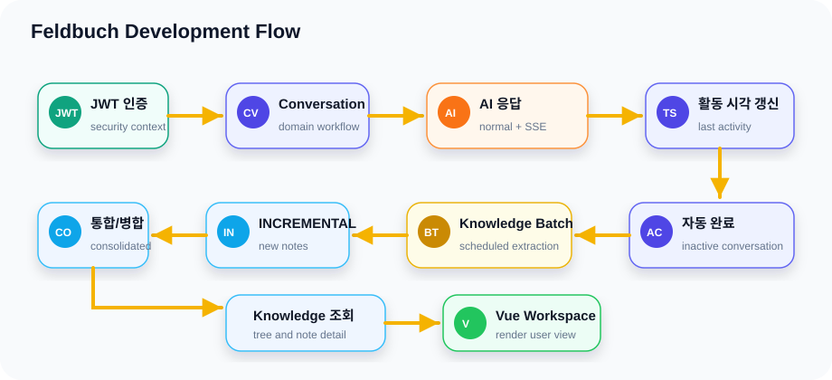
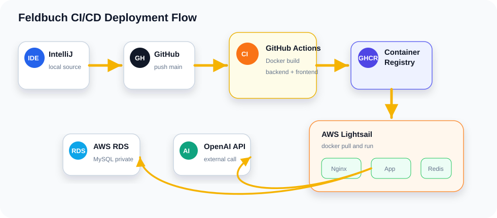
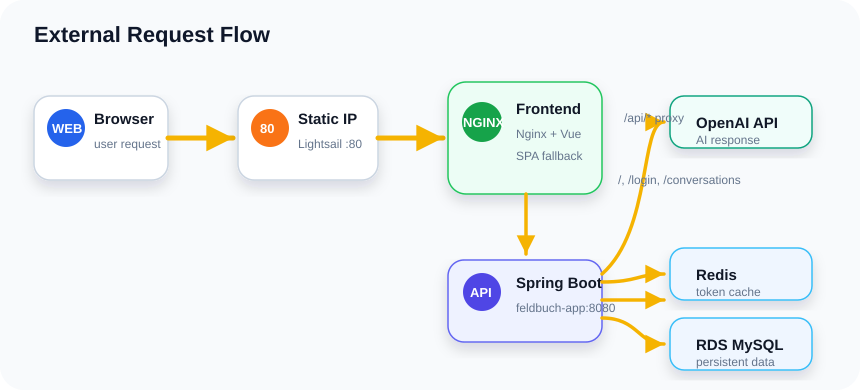
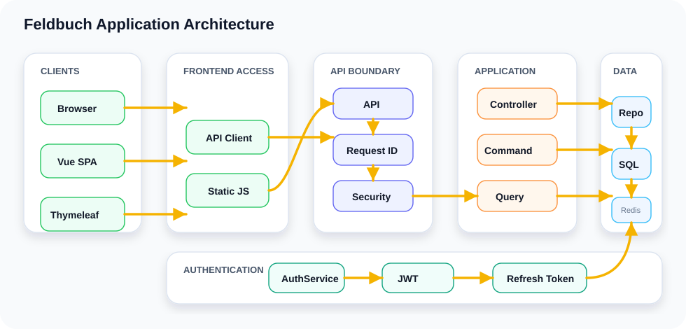
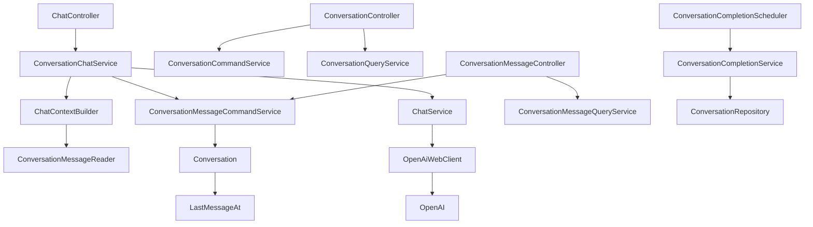
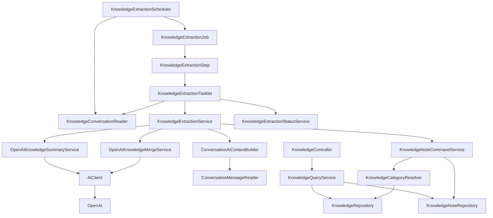
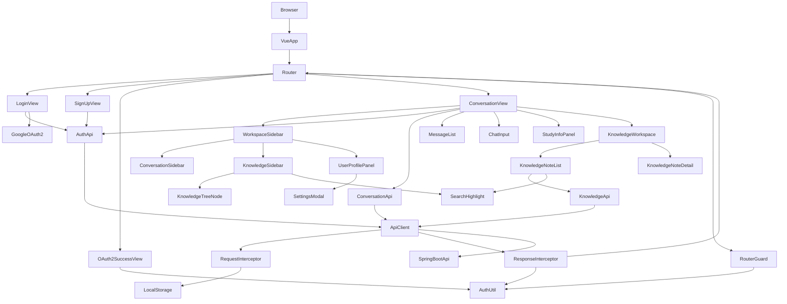
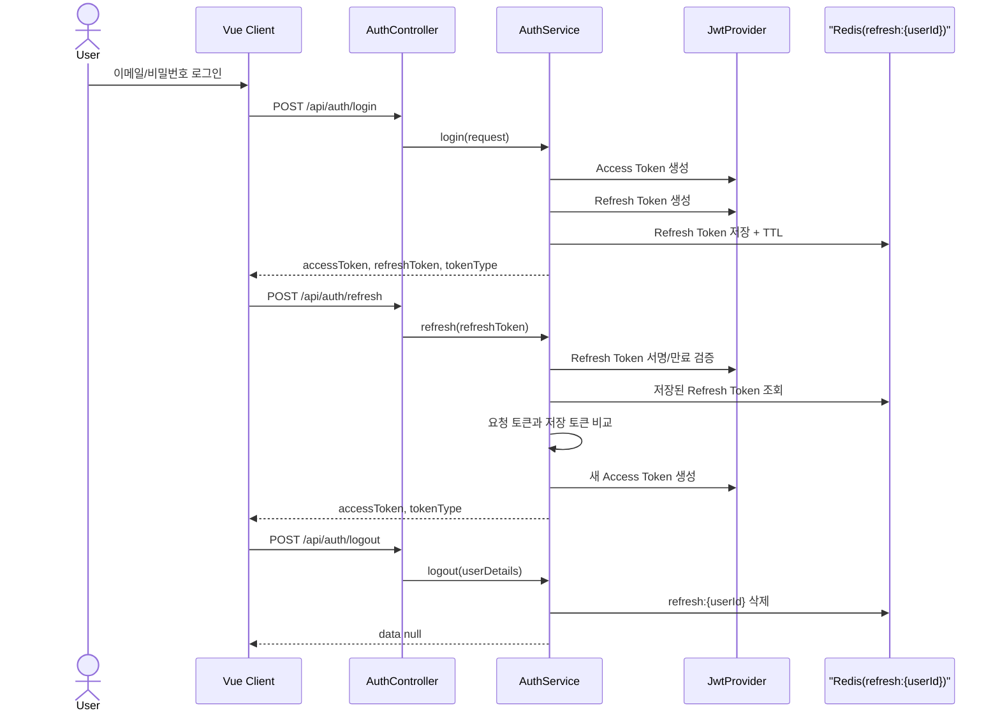

# FELDBUCH DEVELOPMENT DOCUMENTATION

> AI 기반 개발 학습 대화와 KnowledgeNote 추출 흐름을 정리한 현재 개발 문서입니다.

## Project Overview

Feldbuch는 개발자가 AI와 나눈 학습 대화를 저장하고, 완료된 대화를 Batch로 처리해 Knowledge 폴더와 KnowledgeNote로 추출하는 개발 지식 관리 플랫폼입니다.

현재 구현은 Conversation 중심입니다. 대화가 일정 시간 비활성 상태가 되면 자동으로 완료되고, 완료된 대화는 Knowledge 추출 Batch의 대상이 됩니다. 추출 결과는 매 실행마다 생성되는 `INCREMENTAL` 노트와 Conversation 단위로 누적 병합되는 `CONSOLIDATED` 노트로 나뉩니다.

## Current Product Surface

사용자 화면은 `frontend/src/views/LoginView.vue`, `frontend/src/views/SignUpView.vue`, `frontend/src/views/ConversationView.vue`를 중심으로 구성합니다.

- 로그인 화면은 터미널 콘셉트의 `Authenticate` UI로 이메일/비밀번호 로그인, Google OAuth2 로그인 진입 버튼, 인증 진행 로그를 제공합니다.
- 회원가입 화면은 터미널 콘셉트의 `Create Account` UI로 nickname, email, password를 입력받고 가입 성공 후 로그인 화면으로 이동합니다.
- `WorkspaceSidebar`가 왼쪽 고정 영역에서 `대화`와 `지식` 탭을 전환합니다.
- `WorkspaceSidebar` 하단의 `UserProfilePanel`은 현재 사용자 이름, 이메일, Provider/Role, 인증 상태, 세션 시작 시각, 설정/로그아웃 메뉴를 표시합니다.
- `대화` 모드에서는 대화 목록, 채팅 메시지, 입력창, 선택 대화의 학습 정보 패널을 렌더링합니다.
- `지식` 모드에서는 Knowledge 폴더 트리, 선택 폴더의 KnowledgeNote 목록, 선택 노트의 상세 요약과 키워드를 렌더링합니다.
- Knowledge 폴더는 `KnowledgeRootCategory` 대분류와 `KnowledgeCategory` 세부 카테고리 기준으로 생성됩니다.
- Knowledge 폴더와 노트 목록은 검색을 지원하고, 검색어는 `SearchHighlight`로 강조합니다.
- 선택한 사이드바 모드, 대화, Knowledge 폴더, Knowledge 경로, Knowledge 노트는 `localStorage`에 저장해 새로고침 후 복원합니다.
- 대화 메시지 전송은 사용자 메시지와 빈 Assistant 메시지를 낙관적으로 추가한 뒤 SSE 토큰을 누적 표시하고, 완료 후 상세를 재조회합니다.
- 첫 사용자 메시지로 생성되는 대화 제목은 전송 직후 짧게 재조회해 사이드바의 새 대화 제목을 빠르게 갱신합니다.
- 메시지가 저장될 때 Conversation은 ACTIVE 상태와 `lastMessageAt`을 갱신하며, 완료된 대화에 새 메시지가 추가되면 다음 증분 Knowledge 추출을 위해 추출 상태를 다시 `NONE`으로 준비합니다.

## Screens


## Tech Stack

| Category | Stack |
| --- | --- |
| Language | Java 21 |
| Framework | Spring Boot 3.5 |
| Security | Spring Security, JWT, OAuth2 Client |
| Auth Config | Google OAuth2/OIDC client properties |
| Database | MySQL, H2 Test DB |
| ORM / Query | Spring Data JPA, QueryDSL |
| AI | OpenAI REST API, OpenAI SSE Streaming |
| Batch / Infra | Spring Batch, Redis, Docker Compose |
| Frontend | Vue 3, Vite, Vue Router, Axios, Fetch SSE, marked, highlight.js, DOMPurify |
| Deployment | GitHub Actions, GHCR, Docker, Nginx, AWS Lightsail, AWS RDS MySQL |
| Legacy View | Thymeleaf, static CSS/JS |
| Test | JUnit 5, MockMvc, Spring Security Test, Spring Batch Test |

## Development Flow



## Implemented Features

- Spring Security, JWT 로그인, JWT Claims 기반 `userId`, `email`, `role`, `provider` 저장
- Access Token과 Refresh Token 분리 발급
- Redis 기반 Refresh Token 저장, 조회, 삭제
- CustomUserDetails, JWT Filter, JWT AuthenticationEntryPoint 401 처리
- Vite 개발 서버 `http://localhost:5173` CORS 허용
- 회원가입, 이메일/비밀번호 로그인, Google OAuth2 로그인, Access Token 재발급, 서버 로그아웃
- 회원가입 요청 검증: email 필수/이메일 형식, password 8-20자, nickname 2-20자
- 현재 로그인 사용자 조회 API `GET /api/auth/me`
- Refresh Token 기반 Access Token 재발급 API `POST /api/auth/refresh`
- Refresh Token 삭제 기반 로그아웃 API `POST /api/auth/logout`
- Google OIDC 사용자 조회, 기존 이메일 계정 연동, 신규 Google 사용자 자동 생성
- OAuth2 로그인 성공 시 JWT 발급과 `app.frontend-url` 기준 `/oauth2/success` 리다이렉트
- RestClient 기반 OpenAI 일반 요청
- WebClient 기반 OpenAI Chat Completion SSE 스트리밍
- Conversation Entity, Controller, Command/Query Service
- Conversation 제목 수정/삭제 API
- ConversationMessage Entity, Controller, Command/Query Service
- Conversation별 메시지 순서 저장
- Conversation별 마지막 메시지 활동 시각 저장
- Conversation 자동 완료 Scheduler와 Completion Service
- 비활성 ACTIVE Conversation 조회 QueryDSL 쿼리
- 대화 내역을 OpenAI Chat Completion 메시지 컨텍스트로 변환
- Conversation Chat API와 Conversation Chat Stream API
- `StreamResponse` 기반 `TOKEN`, `COMPLETE`, `ERROR` 스트리밍 이벤트 계약
- 첫 사용자 메시지 기반 Conversation 제목 자동 생성
- Conversation Knowledge 추출 상태 필드와 실패 재시도 메타데이터
- Conversation Knowledge 추출 체크포인트 `lastExtractedMessageId`
- Knowledge Entity, KnowledgeNote Entity, KnowledgeNote Keyword ElementCollection
- `KnowledgeRootCategory` 기반 대분류 체계
- `KnowledgeCategory` 기반 세부 카테고리 체계
- KnowledgeNoteType 기반 `INCREMENTAL`, `CONSOLIDATED` 노트 분리
- KnowledgeRepository, KnowledgeNoteRepository
- KnowledgeCategoryResolver
- AiKnowledgeSummaryResponse, AiKnowledgeMergeResponse
- KnowledgeSummaryPrompt, KnowledgeMergePrompt
- AiKnowledgeSummaryService, OpenAiKnowledgeSummaryService
- AiKnowledgeMergeService, OpenAiKnowledgeMergeService
- Knowledge Summary 응답 검증: 필수 텍스트, 최소 300자 요약, Markdown 소제목, 코드 펜스 닫힘, 키워드 3-7개와 중복 여부 확인
- KnowledgeExtractionService, KnowledgeExtractionStatusService
- ConversationAiContextBuilder
- KnowledgeConversationReader
- KnowledgeExtractionBatchConfig, KnowledgeExtractionTasklet
- KnowledgeExtractionScheduler
- BatchAdminController
- 사용자별 Knowledge 루트/자식 조회, 동일 폴더명 중복 확인 쿼리
- QueryDSL 기반 Knowledge 추출 대상 Conversation 조회와 대상 존재 여부 확인 쿼리
- KnowledgeNote의 Knowledge별/Conversation별/사용자별/타입별 조회 쿼리
- Knowledge Tree 조회 API, KnowledgeNote 목록/상세 조회 API, Conversation별 통합 노트 조회 API
- Thymeleaf 기반 로그인/대화 비교 화면
- Vue 3 + Vite SPA: `LoginView`, `SignUpView`, `OAuth2SuccessView`, `ConversationView`
- Vue 컴포넌트: `WorkspaceSidebar`, `SidebarHeader`, `SidebarTabs`, `SidebarSectionLabel`, `ConversationSidebar`, `MessageList`, `ChatInput`, `StudyInfoPanel`, `UserProfilePanel`, `SettingsModal`, `KnowledgeSidebar`, `KnowledgeTreeNode`, `KnowledgeWorkspace`, `KnowledgeNoteList`, `KnowledgeNoteDetail`, `SearchHighlight`
- 로그인 화면의 회원가입 이동 링크와 회원가입 화면의 로그인 복귀 링크
- 새 대화 생성, 대화 제목 인라인 수정, 대화 삭제 UI
- 대화 생성/수정/삭제/메시지 전송 중복 요청 방지 상태
- 메시지 전송 중 AI 응답 작성 로딩 표시
- 첫 메시지 전송 후 생성 제목 재조회와 사이드바 제목 갱신
- 메시지 목록 자동 스크롤
- AI 응답 Markdown 렌더링, highlight.js 코드 문법 강조, DOMPurify sanitize
- 코드 블록 언어 표시와 클립보드 COPY 버튼
- Knowledge 폴더 검색, 노트 검색, 검색 결과 없음 상태 표시
- Knowledge 검색어 하이라이트
- Knowledge breadcrumb 표시
- Knowledge 노트 목록 선택 상태 표시
- Knowledge 노트 상세 화면에서 제목, 설명, 요약, 키워드 표시
- 사이드바 모드, 선택 대화, 선택 Knowledge 폴더, 선택 Knowledge 경로, 선택 Knowledge 노트 localStorage 저장/복원
- Request ID Filter, SLF4J MDC 기반 requestId 저장/해제, `X-Request-Id` 응답 헤더
- Axios 공통 API client와 Request/Response Interceptor
- Vue Router Guard 기반 인증 라우트 보호
- `localStorage` 기반 `accessToken`, `userId` 저장/삭제 유틸리티
- RedisTemplate 구성과 RedisService 유틸리티
- 주요 도메인/서비스/컨트롤러 통합 테스트와 Knowledge 추출 Batch 테스트

## Runtime Configuration

- 기본 활성 프로필: `local`
- 공통 설정 파일: `src/main/resources/application.yml`
- 로컬 설정 파일: `src/main/resources/application-local.yml`
- 운영 설정 파일: `src/main/resources/application-prod.yml`
- OpenAI Base URL: `https://api.openai.com/v1`
- OpenAI 모델 설정 키: `openai.model`
- 현재 기본 모델: `gpt-4.1-nano`
- OpenAI `RestClient` connect timeout: 10초
- OpenAI `RestClient` read timeout: 120초
- OpenAI `WebClient` connect timeout: 10초
- OpenAI `WebClient` response timeout: 120초
- OpenAI connection pool max idle time: 30초
- OpenAI connection pool max life time: 5분
- OpenAI connection pool pending acquire timeout: 10초
- OpenAI connection pool background eviction interval: 30초
- OpenAI 스트리밍 TTFT slow threshold: 10초
- Google OAuth2 client-id 설정 키: `GOOGLE_CLIENT_ID`
- Google OAuth2 client-secret 설정 키: `GOOGLE_CLIENT_SECRET`
- Google OAuth2 scope: `openid`, `profile`, `email`
- JWT Access Token 만료 시간 설정 키: `jwt.access-token-expiration`
- JWT Refresh Token 만료 시간 설정 키: `jwt.refresh-token-expiration`
- Vue 로그인 화면은 JWT 폼 로그인과 Google OAuth2 로그인 진입점을 함께 제공합니다.
- Vue 회원가입 화면은 `/signup`에서 제공하며, 가입 성공 후 `/login`으로 이동합니다.
- Google OAuth2 시작 경로: `/oauth2/authorization/google`
- Google OAuth2 콜백 경로: `/login/oauth2/code/google`
- Google OAuth2 성공 리다이렉트: `{app.frontend-url}/oauth2/success?token={jwt}&userId={id}`
- 로컬 Docker 인프라: MySQL, Redis
- Refresh Token 저장 Redis Key: `refresh:{userId}`
- Refresh Token Redis TTL: `jwt.refresh-token-expiration` 기준
- Spring Batch 기본 자동 실행: `spring.batch.job.enabled=false`
- 운영 Spring Batch 메타 테이블 초기화: `spring.batch.jdbc.initialize-schema=always`
- Knowledge 추출 스케줄러 간격 설정 키: `batch.knowledge-extraction.fixed-delay`
- Knowledge 추출 스케줄러 기본 간격: `12h`
- Knowledge 추출 배치 Job 이름: `knowledgeExtractionJob`
- Knowledge 추출 배치 Step 이름: `knowledgeExtractionStep`
- Conversation 자동 완료 스케줄러 간격 설정 키: `conversation.auto-completion.fixed-delay`
- Conversation 자동 완료 스케줄러 기본 간격: `60000` ms
- Conversation 자동 완료 비활성 시간 설정 키: `conversation.auto-completion.inactivity-timeout`
- Conversation 자동 완료 기본 비활성 시간: `30m`

## Deployment and Operations

현재 배포는 Lightsail에서 직접 빌드하지 않고 GitHub Actions가 Docker 이미지를 빌드한 뒤 GHCR에 push하고, Lightsail에 SSH로 접속해 이미지를 pull한 뒤 컨테이너를 재시작하는 구조입니다. 작은 Lightsail 인스턴스에서 Gradle/JDK/Docker build를 직접 수행하면 CPU 부하로 SSH가 끊길 수 있어, 빌드 서버와 실행 서버 역할을 분리했습니다.

### Deployment Pipeline



### Runtime Request Flow



### GitHub Actions and Images

- CI/CD workflow: `.github/workflows/cicd.yml`
- Manual deploy workflow: `.github/workflows/deploy.yml`
- Backend image: `ghcr.io/keunoh/feldbuch:latest`
- Frontend image: `ghcr.io/keunoh/feldbuch-frontend:latest`
- 각 image는 `latest`와 commit SHA 태그로 GHCR에 push합니다.
- Backend Dockerfile: 루트 `Dockerfile`. `eclipse-temurin:21-jdk` builder에서 `./gradlew clean bootJar -x test` 실행 후 `eclipse-temurin:21-jre` 런타임 이미지로 jar를 복사합니다.
- Frontend Dockerfile: `frontend/Dockerfile`. `node:24-alpine`에서 `npm ci`, `npm run build` 실행 후 `nginx:alpine`에 `dist`와 `nginx.conf`를 복사합니다.
- `cicd.yml`은 `main` push마다 backend/frontend 이미지를 빌드하고, 둘 다 성공하면 Lightsail 배포 job을 실행합니다.
- Lightsail 배포 job은 `LIGHTSAIL_SSH_KEY`, `LIGHTSAIL_HOST`, `LIGHTSAIL_USER` GitHub Secrets를 사용해 서버에 접속합니다.
- backend 배포는 기존 `feldbuch-app` 이미지 ID를 저장한 뒤 새 이미지를 실행하고, `http://127.0.0.1:8080/actuator/health`가 `200`을 반환하는지 최대 40회 확인합니다.
- frontend 배포는 기존 `feldbuch-frontend` 이미지 ID를 저장한 뒤 새 이미지를 실행하고, `http://127.0.0.1:8081/`이 `200`을 반환하는지 확인합니다.
- 새 컨테이너 헬스체크가 실패하면 직전 이미지 ID로 rollback합니다.
- rollback으로 backend 컨테이너를 다시 실행할 때도 `/var/log/feldbuch:/var/log/feldbuch` volume을 마운트해 로그 수집 경로를 유지합니다.
- `deploy.yml`은 `workflow_dispatch` 기반 수동 재배포용 workflow입니다.

### Lightsail Runtime

- Lightsail Ubuntu 인스턴스에 Static IP를 연결했습니다.
- Docker를 설치하고 `docker ps`로 런타임 동작을 확인했습니다.
- 컨테이너는 `feldbuch-network` Docker Network 안에서 실행합니다.
- 실행 컨테이너: `feldbuch-frontend`, `feldbuch-app`, `feldbuch-redis`
- 2026-08-14에 기존 512MB Lightsail에서 새 1GB Lightsail 서버(`feldbuch-1gb`, private IP `172.26.12.135`)로 운영 인스턴스를 이관했습니다.
- Static IP `13.124.140.225`는 새 1GB 서버에 연결했고, `feldbuch.duckdns.org` HTTPS 경로가 새 서버의 Nginx로 들어오도록 복구했습니다.
- 외부 `curl -I --connect-timeout 10 https://feldbuch.duckdns.org` 요청에서 `HTTP/1.1 200 OK`, `Server: nginx/1.24.0 (Ubuntu)`를 확인했습니다.
- `feldbuch-app`은 외부에 직접 공개하지 않고 `127.0.0.1:8080` 바인딩 또는 Docker Network 내부 접근을 기준으로 운영합니다.
- GitHub Actions 자동 배포 시 backend 컨테이너는 `/var/log/feldbuch:/var/log/feldbuch` volume을 마운트해 운영 로그를 host에 남깁니다.
- 외부 HTTP 요청은 `feldbuch-frontend` Nginx가 80 포트에서 받습니다.
- Redis는 Lightsail 내부 Docker 컨테이너로 실행하며 외부 포트를 공개하지 않습니다.
- Spring Boot는 Redis를 `REDIS_HOST=feldbuch-redis`로 접근합니다.

### Nginx Frontend Proxy

`frontend/nginx.conf`는 Vue SPA와 API 프록시를 함께 담당합니다.

- `location /`: Vue Router history mode를 위해 `try_files $uri $uri/ /index.html`로 처리합니다.
- `location /api/`: `proxy_pass http://feldbuch-app:8080`로 Spring Boot에 전달합니다.
- SSE 스트리밍을 위해 `proxy_buffering off`, `proxy_cache off`를 적용합니다.
- 긴 SSE 연결을 위해 `proxy_read_timeout 300s`, `proxy_send_timeout 300s`를 적용합니다.
- 운영 브라우저에서 `localhost`가 사용자 PC를 가리키는 문제를 피하기 위해 공통 API 클라이언트와 SSE 요청은 `/api` 상대경로를 기준으로 동작합니다.

### Vite Local Proxy

로컬 개발 서버는 운영 Nginx 프록시와 같은 상대경로 호출 구조를 유지하기 위해 다음 경로를 Spring Boot 개발 서버로 프록시합니다.

| Path | Target | Purpose |
| --- | --- | --- |
| `/api` | `http://localhost:8080` | REST API와 SSE 요청 |
| `/oauth2/authorization` | `http://localhost:8080` | Google OAuth2 로그인 시작 |
| `/login/oauth2` | `http://localhost:8080` | Google OAuth2 콜백 |

### Production Configuration

운영 설정은 `src/main/resources/application-prod.yml`을 사용합니다. 실제 값은 Git에 올리지 않는 Lightsail의 `.env.prod`에서 주입합니다.

```yaml
spring:
  datasource:
    url: ${DB_URL}
    username: ${DB_USERNAME}
    password: ${DB_PASSWORD}
  data:
    redis:
      host: ${REDIS_HOST}
      port: ${REDIS_PORT:6379}
  batch:
    jdbc:
      initialize-schema: always

jwt:
  secret: ${JWT_SECRET}

openai:
  api-key: ${OPENAI_API_KEY}

server:
  servlet:
    session:
      persistent: false
  forward-headers-strategy: framework

management:
  endpoints:
    web:
      exposure:
        include: health
  endpoint:
    health:
      show-details: never

logging:
  file:
    name: /var/log/feldbuch/app.log

app:
  frontend-url: https://feldbuch.duckdns.org
```

### Monitoring and Alerts

2026-08-11 기준으로 AWS CloudWatch 기반 운영 모니터링을 구성하고 실제 알림 수신까지 검증했습니다.

| Area | Configuration | Verified |
| --- | --- | --- |
| Backend log collection | CloudWatch Agent가 `/var/log/feldbuch/app.log`를 `/feldbuch/backend` 로그 그룹으로 전송 | Done |
| Backend ERROR metric | CloudWatch Metric Filter가 `ERROR` 로그를 `Feldbuch/Application` namespace의 `BackendErrorCount`로 집계 | Done |
| Backend ERROR alarm | `feldbuch-backend-error`, 300초 period에서 `BackendErrorCount >= 1`이면 ALARM | Done |
| Notification | SNS topic `feldbuch-alerts`를 통해 이메일 알림 전송 | Done |
| Memory alarm | Lightsail 메모리 80% 기준 경보 | Done |
| Swap alarm | Lightsail Swap 60% 기준 경보 | Done |

검증 흐름은 다음과 같습니다.

```text
Spring Boot ERROR log
    -> /var/log/feldbuch/app.log
    -> CloudWatch Agent
    -> /feldbuch/backend
    -> ERROR Metric Filter
    -> BackendErrorCount
    -> feldbuch-backend-error
    -> SNS feldbuch-alerts
    -> Email notification
```

실제 테스트에서는 `ERROR Feldbuch CloudWatch alarm test` 로그가 `BackendErrorCount = 1.0`으로 집계되었고, `feldbuch-backend-error`가 `OK -> ALARM`으로 전환되며 이메일 알림이 수신되었습니다. 알림 조건은 300초 동안 1개 datapoint가 threshold `1.0` 이상일 때입니다.

### OpenAI Runtime Verification

- Lightsail의 `feldbuch-app` 컨테이너 내부에서 OpenAI Chat Completion SSE 요청을 직접 실행해 `200 OK`, `text/event-stream`, `[DONE]`까지 정상 수신되는 것을 확인했습니다.
- 애플리케이션에서도 짧은 프롬프트인 `HTTP에 대해 간단하게 설명해줘` 요청에 대해 OpenAI 스트리밍 응답이 정상 반환되는 것을 확인했습니다.
- OpenAI 일반 요청용 `RestClient`는 10초 connect timeout과 120초 read timeout을 적용해 외부 API 연결 지연 시 무기한 대기를 피합니다.
- OpenAI 스트리밍용 `WebClient`는 Reactor Netty `HttpClient`에 connect timeout 10초, response timeout 120초를 적용합니다.
- OpenAI 스트리밍 `WebClient`는 전용 `ConnectionProvider`를 사용하고, idle connection은 30초, connection life time은 5분으로 제한하며 30초 간격으로 idle connection을 정리합니다.
- `OpenAiChatService`는 stream 시작 시각을 `NanoTimeProvider`로 기록하고 첫 토큰 수신 시 TTFT를 로그로 남깁니다. TTFT가 10초 이상이면 `[OPENAI_TTFT_SLOW]` 경고 로그를 남겨 운영 지연 분석에 사용합니다.
- stream 구독 시점도 `Stream subscribed` 로그로 기록해 controller 반환 이후 실제 upstream 구독까지의 지연을 구분합니다.
- 이전에 관찰한 `reactor.netty.http.client.PrematureCloseException: Connection prematurely closed BEFORE response`는 API Key, DNS, outbound network 자체보다는 긴 스트리밍 연결과 작은 Lightsail 인스턴스의 메모리/swap 압박이 겹쳤을 가능성이 큽니다.
- 긴 답변 테스트 시에는 `watch -n 1 'free -h; echo; docker stats --no-stream'`로 JVM, Docker, swap 상태를 함께 확인합니다.
- 다음 운영 보강 대상은 backend 프로세스가 조용히 죽는 상황을 잡는 가용성/헬스체크 경보입니다.

### RDS MySQL

- MySQL은 Lightsail 컨테이너가 아니라 AWS RDS로 분리했습니다.
- RDS Database: `feldbuch`
- RDS Master User: `feldbuch_admin`
- RDS Port: `3306`
- Public access: `No`
- Lightsail과 Default VPC는 VPC Peering으로 연결했습니다.
- RDS Security Group은 최초 `0.0.0.0/0`에서 Lightsail 인스턴스 IP 단위 접근으로 제한했습니다.
- 1GB 서버 이관 후 RDS Security Group은 새 서버 private IP `172.26.12.135`에서 3306 접근을 허용하도록 갱신했습니다.
- Lightsail에서 `nc -vz <RDS_ENDPOINT> 3306`로 연결 성공을 확인했습니다.

### Lightsail 1GB Migration Verification

2026-08-14 운영 장애 분석 결과, 기존 512MB 서버의 메모리 압박과 과도한 swap 사용이 OpenAI 스트리밍 지연의 주요 원인으로 판단되어 1GB Lightsail 서버로 이관했습니다.

| Item | Result |
| --- | --- |
| New server | `feldbuch-1gb`, private IP `172.26.12.135` |
| Static IP | `13.124.140.225`를 새 서버에 연결 |
| HTTPS check | `https://feldbuch.duckdns.org` `200 OK` |
| RDS access | RDS Security Group에 새 서버 private IP 허용 |
| Final stream test | `Stream subscribed=1ms`, `TTFT=1376ms`, `Stream completed=2369ms` |
| Warning logs | `OPENAI_TTFT_SLOW`, `Thread starvation`, `Stream failed` 미발생 |

기존 512MB 서버에서는 Java swap 사용, `Thread starvation`, 13초 이상 또는 30초 이상 TTFT가 관찰되었습니다. 1GB 서버 전환 후 실제 도메인 경로에서 TTFT가 약 1.38초로 안정화되어, 512MB 환경의 메모리/swap 압박이 지연의 주요 원인이었을 가능성이 큽니다. 단, 1GB도 최소 운영 사양에 가까우므로 swap과 CloudWatch 경보는 계속 관찰합니다.

### Current Deployment State

| Area | State |
| --- | --- |
| GitHub Actions backend image build | Done |
| GitHub Actions frontend image build | Done |
| GHCR backend/frontend image push | Done |
| Lightsail Static IP and Docker runtime | Done |
| Vue + Nginx frontend container | Done |
| Spring Boot backend container | Done |
| Redis container | Done |
| AWS RDS MySQL | Done |
| Lightsail VPC Peering to RDS VPC | Done |
| RDS Security Group restriction | Done |
| External HTTP access | Done |
| Domain and HTTPS | Done |
| Lightsail 512MB to 1GB migration | Done |
| OpenAI stream TTFT verification on 1GB server | Done |
| Frontend to backend API proxy | Done |
| Nginx SSE proxy timeout extension | Done |
| GitHub Actions to Lightsail CD restart | Done |
| Backend deployment health check | Done |
| Frontend deployment health check | Done |
| Deployment rollback by previous image ID | Done |
| CloudWatch backend log collection | Done |
| Backend ERROR metric and alarm | Done |
| SNS email notification | Done |
| Memory and Swap alarms | Done |
| OpenAI TTFT logging | Done |
| Backend availability alarm | Pending |

## Architecture

### System Overview


Spring Boot는 인증, REST API, AI 호출, Batch 처리를 담당합니다. Vue SPA는 독립 프론트엔드로 개발하며, Thymeleaf 화면은 전환 과정의 비교용 구현으로 남겨둡니다.



### AI and Conversation


```mermaid
flowchart TD
    ChatController --> ConversationChatService
    ConversationChatService --> ConversationMessageCommandService
    ConversationChatService --> ChatContextBuilder
    ConversationChatService --> ChatService
    ChatContextBuilder --> ConversationMessageReader
    ChatService --> OpenAiWebClient
    OpenAiWebClient --> OpenAI

    ConversationController --> ConversationCommandService
    ConversationController --> ConversationQueryService
    ConversationMessageController --> ConversationMessageCommandService
    ConversationMessageController --> ConversationMessageQueryService
    ConversationCompletionScheduler --> ConversationCompletionService
    ConversationCompletionService --> ConversationRepository
    ConversationMessageCommandService --> Conversation
    Conversation --> LastMessageAt
```

### Knowledge and Batch



```mermaid
flowchart TD
    KnowledgeController --> KnowledgeQueryService
    KnowledgeQueryService --> KnowledgeRepository
    KnowledgeQueryService --> KnowledgeNoteRepository

    KnowledgeExtractionScheduler --> KnowledgeConversationReader
    KnowledgeExtractionScheduler --> KnowledgeExtractionJob
    KnowledgeExtractionJob --> KnowledgeExtractionStep
    KnowledgeExtractionStep --> KnowledgeExtractionTasklet
    KnowledgeExtractionTasklet --> KnowledgeConversationReader
    KnowledgeExtractionTasklet --> KnowledgeExtractionService
    KnowledgeExtractionTasklet --> KnowledgeExtractionStatusService
    KnowledgeExtractionService --> ConversationAiContextBuilder
    ConversationAiContextBuilder --> ConversationMessageReader
    KnowledgeExtractionService --> OpenAiKnowledgeSummaryService
    KnowledgeExtractionService --> OpenAiKnowledgeMergeService
    KnowledgeExtractionService --> KnowledgeNoteCommandService
    KnowledgeNoteCommandService --> KnowledgeCategoryResolver
    KnowledgeCategoryResolver --> KnowledgeRepository
    KnowledgeNoteCommandService --> KnowledgeNoteRepository
    OpenAiKnowledgeSummaryService --> AiClient
    OpenAiKnowledgeMergeService --> AiClient
    AiClient --> OpenAI
```

## Client Architecture



```mermaid
flowchart TD
    Browser --> VueApp
    VueApp --> Router
    Router --> LoginView
    Router --> SignUpView
    Router --> OAuth2SuccessView
    Router --> ConversationView
    Router --> RouterGuard
    RouterGuard --> AuthUtil

    LoginView --> AuthApi
    LoginView --> GoogleOAuth2
    SignUpView --> AuthApi
    OAuth2SuccessView --> AuthUtil
    ConversationView --> WorkspaceSidebar
    ConversationView --> AuthApi
    WorkspaceSidebar --> ConversationSidebar
    WorkspaceSidebar --> KnowledgeSidebar
    WorkspaceSidebar --> UserProfilePanel
    UserProfilePanel --> SettingsModal
    KnowledgeSidebar --> KnowledgeTreeNode

    ConversationView --> ConversationApi
    ConversationView --> MessageList
    ConversationView --> ChatInput
    ConversationView --> StudyInfoPanel
    ConversationView --> KnowledgeWorkspace
    KnowledgeWorkspace --> KnowledgeNoteList
    KnowledgeWorkspace --> KnowledgeNoteDetail
    KnowledgeNoteList --> KnowledgeApi
    KnowledgeNoteList --> SearchHighlight
    KnowledgeSidebar --> SearchHighlight

    AuthApi --> ApiClient
    ConversationApi --> ApiClient
    KnowledgeApi --> ApiClient
    ApiClient --> RequestInterceptor
    ApiClient --> ResponseInterceptor
    RequestInterceptor --> LocalStorage
    ResponseInterceptor --> AuthUtil
    ResponseInterceptor --> Router
    ApiClient --> SpringBootApi
```

## API Communication

공통 규칙:

- 요청 본문은 JSON을 사용합니다.
- 일반 응답은 `ApiResponse<T>` 형식으로 통일하고 실제 데이터는 `data` 필드에 담습니다.
- 회원가입은 `POST /api/users/signup`으로 수행하며, `email`, `password`, `nickname`을 전송합니다.
- 회원가입 성공 시 `SignupResponse(id, email, nickname)`를 받고 Vue는 `/login`으로 이동합니다.
- 로그인 성공 시 서버는 `accessToken`, `refreshToken`, `tokenType`을 반환합니다.
- 서버는 로그인 시 발급한 Refresh Token을 Redis에 `refresh:{userId}` 키로 저장하고, `jwt.refresh-token-expiration`과 같은 TTL을 적용합니다.
- Access Token 만료 시 클라이언트는 인증 헤더 없이 `POST /api/auth/refresh`로 Refresh Token을 전송해 새 Access Token을 발급받습니다.
- 로그아웃 시 클라이언트는 `POST /api/auth/logout`을 호출하고, 서버는 Redis의 Refresh Token을 삭제합니다.
- Google OAuth2 성공 시 서버가 JWT와 사용자 ID를 Vue 성공 화면으로 전달하고, `OAuth2SuccessView`가 이를 `localStorage`에 저장합니다.
- `GET /api/auth/me`는 로그인 사용자 프로필 패널의 `email`, `nickname`, `role`, `provider` 값을 제공합니다.
- Axios Request Interceptor가 `Authorization: Bearer <accessToken>` 헤더를 자동으로 추가합니다.
- Axios Response Interceptor가 `401 Unauthorized`를 감지하면 `logout()`으로 클라이언트 토큰을 제거하고 `/login`으로 이동합니다.
- Fetch 기반 SSE 스트리밍 함수는 `Authorization` 헤더를 직접 추가합니다.
- 백엔드는 `RequestIdFilter`로 모든 요청에 UUID 기반 `requestId`를 부여하고, MDC와 `X-Request-Id` 응답 헤더에 기록합니다.

주요 API:

| Method | Path | Purpose |
| --- | --- | --- |
| `POST` | `/api/auth/login` | 로그인 |
| `GET` | `/api/auth/me` | 현재 로그인 사용자 조회 |
| `POST` | `/api/auth/refresh` | Refresh Token 기반 Access Token 재발급 |
| `POST` | `/api/auth/logout` | 현재 사용자 Refresh Token 삭제 기반 로그아웃 |
| `GET` | `/oauth2/authorization/google` | Google OAuth2 로그인 시작 |
| `GET` | `/login/oauth2/code/google` | Google OAuth2 인증 콜백 |
| `POST` | `/api/users/signup` | 회원가입. email, password, nickname 입력 |
| `GET` | `/api/users/me` | 내 정보 조회 |
| `GET` | `/api/conversations` | 대화 목록 조회 |
| `POST` | `/api/conversations` | 새 대화 생성 |
| `GET` | `/api/conversations/{conversationId}` | 대화 상세와 메시지 조회 |
| `PATCH` | `/api/conversations/{conversationId}` | 대화 제목 수정 |
| `DELETE` | `/api/conversations/{conversationId}` | 대화 삭제 |
| `POST` | `/api/conversations/{conversationId}/messages` | 대화 메시지 생성 |
| `GET` | `/api/conversations/{conversationId}/messages` | 대화 메시지 목록 조회 |
| `POST` | `/api/conversations/{conversationId}/chat` | 일반 대화형 AI 요청 |
| `POST` | `/api/conversations/{conversationId}/chat/stream` | SSE 대화형 AI 요청 |
| `GET` | `/api/knowledge/tree` | Knowledge 폴더 트리 조회 |
| `GET` | `/api/knowledge/{knowledgeId}/notes` | Knowledge 폴더별 노트 목록 조회 |
| `GET` | `/api/knowledge/notes/{noteId}` | Knowledge 노트 상세 조회 |
| `GET` | `/api/knowledge/conversations/{conversationId}/consolidated-note` | Conversation별 통합 Knowledge 노트 조회 |

### Refresh Token Flow


```mermaid
sequenceDiagram
    actor User
    participant Client as Vue Client
    participant AuthController
    participant AuthService
    participant JwtProvider
    participant Redis as "Redis(refresh:{userId})"

    User->>Client: 이메일/비밀번호 로그인
    Client->>AuthController: POST /api/auth/login
    AuthController->>AuthService: login(request)
    AuthService->>JwtProvider: Access Token 생성
    AuthService->>JwtProvider: Refresh Token 생성
    AuthService->>Redis: Refresh Token 저장 + TTL
    AuthService-->>Client: accessToken, refreshToken, tokenType

    Client->>AuthController: POST /api/auth/refresh
    AuthController->>AuthService: refresh(refreshToken)
    AuthService->>JwtProvider: Refresh Token 서명/만료 검증
    AuthService->>Redis: 저장된 Refresh Token 조회
    AuthService->>AuthService: 요청 토큰과 저장 토큰 비교
    AuthService->>JwtProvider: 새 Access Token 생성
    AuthService-->>Client: accessToken, tokenType

    Client->>AuthController: POST /api/auth/logout
    AuthController->>AuthService: logout(userDetails)
    AuthService->>Redis: refresh:{userId} 삭제
    AuthService-->>Client: data null
```

SSE 이벤트 계약:

```text
StreamResponse
  type: TOKEN | COMPLETE | ERROR
  content: TOKEN일 때 새 토큰 조각, ERROR일 때 오류 메시지
```

## Database Model


### Domain Table Schema

Batch 메타 테이블은 제외하고, 서비스 도메인에서 직접 관리하는 테이블만 정리합니다. 컬럼 순서는 `id -> FK -> 핵심 비즈니스 컬럼 -> 상태값 -> 정렬/순서 -> 통계/캐시/메타 정보 -> created_at -> updated_at` 기준을 따릅니다.

#### users

| 순서 | 분류 | 컬럼 | 타입 | Null | 설명 |
| --- | --- | --- | --- | --- | --- |
| 1 | PK | `id` | `BIGINT` | N | 사용자 식별자 |
| 2 | 핵심 비즈니스 컬럼 | `email` | `VARCHAR(100)` | N | 로그인 이메일. `uk_user_email` 유니크 제약 |
| 3 | 핵심 비즈니스 컬럼 | `password` | `VARCHAR(255)` | N | 암호화된 비밀번호 |
| 4 | 핵심 비즈니스 컬럼 | `nickname` | `VARCHAR(30)` | N | 화면 표시용 사용자 이름 |
| 5 | 상태 | `role` | `VARCHAR(20)` | N | 사용자 권한. `USER` 기본값 |
| 6 | 생성 시각 | `created_at` | `DATETIME` | Y | 생성 시각. JPA Auditing으로 기록 |
| 7 | 수정 시각 | `updated_at` | `DATETIME` | Y | 마지막 수정 시각. JPA Auditing으로 기록 |

#### user_identities

| 순서 | 분류 | 컬럼 | 타입 | Null | 설명 |
| --- | --- | --- | --- | --- | --- |
| 1 | PK | `id` | `BIGINT` | N | 외부 인증 계정 식별자 |
| 2 | FK | `user_id` | `BIGINT` | N | `users.id` 참조. `fk_user_identity_user` |
| 3 | 상태 | `provider` | `VARCHAR(20)` | N | 인증 Provider. 현재 `GOOGLE` |
| 4 | 핵심 비즈니스 컬럼 | `provider_subject` | `VARCHAR(255)` | N | OAuth Provider 사용자 고유 식별자. Google OIDC `sub` |
| 5 | 핵심 비즈니스 컬럼 | `provider_email` | `VARCHAR(100)` | Y | Provider에서 받은 이메일 |
| 6 | 생성 시각 | `created_at` | `DATETIME` | Y | 생성 시각. JPA Auditing으로 기록 |
| 7 | 수정 시각 | `updated_at` | `DATETIME` | Y | 마지막 수정 시각. JPA Auditing으로 기록 |

제약/인덱스:

- `uk_user_identity_provider_subject`: `provider`, `provider_subject`
- `idx_user_identity_user`: `user_id`
- `idx_user_identity_provider_email`: `provider`, `provider_email`

#### conversations

| 순서 | 분류 | 컬럼 | 타입 | Null | 설명 |
| --- | --- | --- | --- | --- | --- |
| 1 | PK | `id` | `BIGINT` | N | 대화 식별자 |
| 2 | FK | `user_id` | `BIGINT` | N | `users.id` 참조 |
| 3 | 핵심 비즈니스 컬럼 | `title` | `VARCHAR(100)` | N | 대화 제목. 기본값은 `새 대화` |
| 4 | 상태 | `status` | `VARCHAR(255)` | N | 대화 상태. `ACTIVE`, `COMPLETED` |
| 5 | 상태 | `knowledge_extract_status` | `VARCHAR(20)` | N | Knowledge 추출 상태. `NONE`, `PROCESSING`, `COMPLETED`, `FAILED` |
| 6 | 통계/캐시/메타 정보 | `last_message_at` | `DATETIME` | Y | 마지막 메시지 저장 시각. 자동 완료 기준 |
| 7 | 통계/캐시/메타 정보 | `last_extracted_message_id` | `BIGINT` | Y | 마지막 Knowledge 추출 완료 메시지 ID |
| 8 | 통계/캐시/메타 정보 | `knowledge_extract_retry_count` | `INT` | N | Knowledge 추출 실패 재시도 횟수 |
| 9 | 통계/캐시/메타 정보 | `knowledge_extract_error_message` | `VARCHAR(1000)` | Y | 마지막 Knowledge 추출 실패 메시지 |
| 10 | 통계/캐시/메타 정보 | `knowledge_extract_failed_at` | `DATETIME` | Y | 마지막 Knowledge 추출 실패 시각 |
| 11 | 생성 시각 | `created_at` | `DATETIME` | Y | 생성 시각. JPA Auditing으로 기록 |
| 12 | 수정 시각 | `updated_at` | `DATETIME` | Y | 마지막 수정 시각. JPA Auditing으로 기록 |

#### conversation_messages

| 순서 | 분류 | 컬럼 | 타입 | Null | 설명 |
| --- | --- | --- | --- | --- | --- |
| 1 | PK | `id` | `BIGINT` | N | 대화 메시지 식별자 |
| 2 | FK | `conversation_id` | `BIGINT` | N | `conversations.id` 참조 |
| 3 | 핵심 비즈니스 컬럼 | `content` | `LONGTEXT` | N | 사용자 또는 Assistant 메시지 본문 |
| 4 | 상태 | `role` | `VARCHAR(20)` | N | 메시지 역할. `USER`, `ASSISTANT` |
| 5 | 정렬/순서 | `sequence` | `INT` | N | 대화 안에서의 메시지 순서 |
| 6 | 생성 시각 | `created_at` | `DATETIME` | Y | 생성 시각. JPA Auditing으로 기록 |
| 7 | 수정 시각 | `updated_at` | `DATETIME` | Y | 마지막 수정 시각. JPA Auditing으로 기록 |

#### knowledge

| 순서 | 분류 | 컬럼 | 타입 | Null | 설명 |
| --- | --- | --- | --- | --- | --- |
| 1 | PK | `id` | `BIGINT` | N | Knowledge 폴더 식별자 |
| 2 | FK | `user_id` | `BIGINT` | N | `users.id` 참조. `fk_knowledge_user` |
| 3 | FK | `parent_id` | `BIGINT` | Y | 상위 `knowledge.id` 참조. 루트 폴더는 `NULL` |
| 4 | 핵심 비즈니스 컬럼 | `name` | `VARCHAR(100)` | N | 화면에 표시할 Knowledge 폴더 이름 |
| 5 | 생성 시각 | `created_at` | `DATETIME` | Y | 생성 시각. JPA Auditing으로 기록 |
| 6 | 수정 시각 | `updated_at` | `DATETIME` | Y | 마지막 수정 시각. JPA Auditing으로 기록 |

인덱스:

- `idx_knowledge_user_parent`: `user_id`, `parent_id`
- `idx_knowledge_parent`: `parent_id`

#### knowledge_notes

| 순서 | 분류 | 컬럼 | 타입 | Null | 설명 |
| --- | --- | --- | --- | --- | --- |
| 1 | PK | `id` | `BIGINT` | N | KnowledgeNote 식별자 |
| 2 | FK | `user_id` | `BIGINT` | N | `users.id` 참조. `fk_knowledge_note_user` |
| 3 | FK | `conversation_id` | `BIGINT` | N | 원본 `conversations.id` 참조. `fk_knowledge_note_conversation` |
| 4 | FK | `knowledge_id` | `BIGINT` | N | 저장 위치 `knowledge.id` 참조. `fk_knowledge_note_knowledge` |
| 5 | 핵심 비즈니스 컬럼 | `title` | `VARCHAR(200)` | N | AI가 생성한 학습 노트 제목 |
| 6 | 핵심 비즈니스 컬럼 | `description` | `LONGTEXT` | N | AI가 생성한 한 줄 설명 |
| 7 | 핵심 비즈니스 컬럼 | `summary` | `LONGTEXT` | N | 대화에서 추출한 학습 요약 |
| 8 | 상태 | `note_type` | `VARCHAR(20)` | N | 노트 유형. `INCREMENTAL`, `CONSOLIDATED` |
| 9 | 생성 시각 | `created_at` | `DATETIME` | Y | 생성 시각. JPA Auditing으로 기록 |
| 10 | 수정 시각 | `updated_at` | `DATETIME` | Y | 마지막 수정 시각. JPA Auditing으로 기록 |

인덱스:

- `idx_knowledge_note_user`: `user_id`
- `idx_knowledge_note_knowledge`: `knowledge_id`
- `idx_knowledge_note_conversation`: `conversation_id`
- `idx_knowledge_note_conversation_type`: `conversation_id`, `note_type`

#### knowledge_note_keywords

`KnowledgeNote.keywords`의 `@ElementCollection` 테이블이며, 별도 PK 컬럼은 두지 않습니다.

| 순서 | 분류 | 컬럼 | 타입 | Null | 설명 |
| --- | --- | --- | --- | --- | --- |
| 1 | FK | `knowledge_note_id` | `BIGINT` | N | `knowledge_notes.id` 참조. `fk_knowledge_note_keyword_note` |
| 2 | 핵심 비즈니스 컬럼 | `keyword` | `VARCHAR(100)` | N | AI가 추출한 검색/복습용 키워드 |

현재 영속 모델은 `users`, `user_identities`, `conversations`, `conversation_messages`, `knowledge`, `knowledge_notes`, `knowledge_note_keywords`를 중심으로 구성합니다.

- `users`: 대화와 Knowledge의 소유자
- `user_identities`: Google OIDC 등 외부 인증 Provider 계정 식별자
- `conversations`: AI 학습 대화 세션, 마지막 메시지 활동 시각, Knowledge 추출 상태와 체크포인트
- `conversation_messages`: 대화별 USER/ASSISTANT 메시지
- `knowledge`: 사용자별 지식 폴더 트리. 최상위 폴더는 `KnowledgeRootCategory`, 하위 폴더는 `KnowledgeCategory` displayName 기반
- `knowledge_notes`: 대화에서 AI가 추출한 학습 노트. `INCREMENTAL`은 추출 범위별 노트, `CONSOLIDATED`는 Conversation 누적 통합 노트
- `knowledge_note_keywords`: KnowledgeNote 키워드 ElementCollection

## Knowledge Extraction Batch

Knowledge 추출 배치는 완료된 대화를 AI 학습 노트로 증류하기 위한 Spring Batch 작업입니다. Conversation은 메시지가 저장될 때 `lastMessageAt`을 갱신하고 ACTIVE 상태가 되며, 자동 완료 스케줄러가 일정 시간 비활성인 ACTIVE 대화를 COMPLETED로 전환합니다. COMPLETED 대화만 Knowledge 추출 대상이 됩니다.

- Job 이름: `knowledgeExtractionJob`
- Step 이름: `knowledgeExtractionStep`
- 실행 방식: Tasklet 기반 단일 Step
- 실행 시점: `KnowledgeExtractionScheduler`가 `batch.knowledge-extraction.fixed-delay` 기준으로 대상 존재 여부를 확인한 뒤 Job 실행
- 수동 실행: `POST /api/admin/batch/knowledge-extraction`로 스케줄 실행 시각을 기다리지 않고 즉시 `KnowledgeExtractionScheduler.run()` 호출
- 수동 실행 API는 공개 경로가 아니므로 JWT 인증이 필요하며, 운영 확인과 장애 대응용 임시 관리 API입니다.
- 기본 스케줄 간격: 12시간
- Scheduler Job Parameter: `requestedAt=System.currentTimeMillis()`로 매 실행을 고유 Job 인스턴스로 구분
- 반복 방식: 한 번 실행할 때 조회된 대상 Conversation 목록을 순회 처리
- 대상 조건: `status = COMPLETED`이고 `knowledgeExtractStatus = NONE` 또는 재시도 가능한 `FAILED`
- 재시도 조건: `knowledgeExtractStatus = FAILED`, `knowledgeExtractRetryCount < 3`, `knowledgeExtractFailedAt <= now - 1 minute`
- 제외 조건: ACTIVE 대화, 이미 `COMPLETED`로 추출된 대화, 실패 횟수 3회 이상, 실패 후 1분 대기 시간이 지나지 않은 대화
- 처리 순서: `updatedAt ASC`
- 대상 존재 확인: `existsKnowledgeExtractionTarget()`으로 스케줄러가 불필요한 Job 실행을 건너뜀
- 성공 처리: `PROCESSING -> COMPLETED`, `lastExtractedMessageId` 갱신, 오류 메시지와 실패 시각 초기화
- 실패 처리: `FAILED`로 변경, 재시도 횟수 증가, 실패 메시지와 실패 시각 저장
- 추출 본문 처리는 `REQUIRES_NEW` 트랜잭션으로 분리해 개별 Conversation 추출 실패가 전체 배치 트랜잭션 rollback으로 번지는 것을 막음
- 증분 추출: 완료된 대화에 새 메시지가 추가되면 상태를 `NONE`으로 되돌리고 `lastExtractedMessageId` 이후 메시지만 AI 컨텍스트로 구성
- 노트 생성: 새 메시지 범위는 항상 `INCREMENTAL` KnowledgeNote로 저장
- 통합 노트: 같은 Conversation의 `CONSOLIDATED` KnowledgeNote가 없으면 최초 생성하고, 있으면 기존 통합 노트와 신규 증분 노트를 AI로 병합해 갱신
- 폴더 결정: AI 요약/병합 응답의 `KnowledgeCategory`를 `KnowledgeCategoryResolver`가 실제 Knowledge 폴더로 변환

## Knowledge Classification and Merge

Knowledge 분류와 병합은 추출 품질과 폴더 중복 방지를 위한 서버 내부 정책입니다.

- 최상위 분류: `KnowledgeRootCategory` enum으로 고정
- 세부 분류: `KnowledgeCategory` enum으로 고정
- AI 응답: `category`, `title`, `description`, `summary`, `keywords`를 JSON으로 반환
- 폴더 구조: `KnowledgeRootCategory.name()` 루트 아래 `KnowledgeCategory.displayName` 하위 폴더를 생성/조회
- 병합 응답: `AiKnowledgeMergeResponse`가 `category`, `title`, `description`, `summary`, `keywords`를 반환
- 병합 결과의 category가 바뀌면 통합 KnowledgeNote를 해당 Knowledge 폴더로 이동

## Conversation Auto Completion

비활성 대화 자동 완료는 사용자가 명시적으로 대화를 닫지 않아도 Knowledge 추출 대상이 자연스럽게 만들어지도록 하는 스케줄링 흐름입니다.

- Scheduler: `ConversationCompletionScheduler`
- Service: `ConversationCompletionService`
- Repository query: `findInactiveActiveConversations(cutoff)`
- 기본 실행 간격: `conversation.auto-completion.fixed-delay=60000`
- 기본 비활성 시간: `conversation.auto-completion.inactivity-timeout=30m`
- 대상 조건: `status = ACTIVE`, `lastMessageAt IS NOT NULL`, `lastMessageAt <= cutoff`
- 제외 조건: 최근 메시지가 있는 ACTIVE 대화, 이미 COMPLETED인 대화, 메시지가 아직 없는 대화
- 정렬 기준: `lastMessageAt ASC`
- 유효성: 비활성 시간은 null, 0, 음수일 수 없음

## Project Structure

```text
src/main/java/io.github.kaltz.feldbuch
├── ai
│   ├── client          # OpenAI REST/SSE 클라이언트
│   ├── dto             # Knowledge AI 응답 DTO
│   ├── mapper          # 요청/응답/메시지 변환
│   ├── model           # 채팅/제목 생성 모델
│   ├── prompt          # Knowledge/Title 프롬프트
│   └── service         # 채팅, Knowledge 요약/병합 서비스
├── auth
├── batch            # Batch 설정, 스케줄러, Tasklet, 관리용 수동 실행 API
├── common
├── config
├── conversation
├── knowledge
│   ├── context         # Conversation 메시지 기반 추출 컨텍스트
│   └── service         # Knowledge 카테고리 결정, 추출, 노트 저장
├── redis
└── user

src/main/resources
├── templates           # Thymeleaf 비교용 화면
└── static              # Thymeleaf 화면용 CSS/JS

frontend/src
├── api
├── assets
├── components
│   ├── background
│   ├── chat
│   ├── common
│   ├── knowledge
│   ├── settings
│   └── sidebar
├── constants
├── router
├── utils
└── views
```

## Design Points

- CQRS 기반 Command/Query 책임 분리
- Reader Pattern으로 조회 전용 도메인 접근 책임 분리
- Mapper Pattern으로 DTO/도메인/OpenAI 메시지 변환 분리
- OpenAI 일반 요청과 SSE 스트리밍 요청 계층 분리
- Conversation 메시지 영속화 후 AI 컨텍스트 구성
- 메시지 저장 시 `lastMessageAt` 갱신과 완료 대화 재활성화
- 비활성 ACTIVE 대화 자동 완료 후 Knowledge 추출 대상으로 연결
- `lastExtractedMessageId` 기반 증분 Knowledge 추출
- 낙관적 사용자 메시지와 스트리밍 Assistant 메시지 렌더링
- 회원가입 성공 후 로그인 화면으로 이동해 인증 흐름을 단순하게 유지
- Access Token과 Refresh Token 수명을 분리해 짧은 인증 토큰과 긴 세션 유지 토큰을 구분
- Refresh Token은 Redis에 서버 측 상태로 저장해 재발급 검증과 로그아웃 무효화를 처리
- OAuth2 성공 화면에서 JWT 저장 후 대화 워크스페이스로 이동
- 현재 사용자 조회 결과를 사이드바 사용자 프로필과 설정 모달에 반영
- Markdown 렌더링과 sanitize 책임을 `markdownRenderer.js`로 분리
- Knowledge 폴더 트리 자기 참조 모델링
- 고정 `KnowledgeCategory` 기반 폴더 구조로 AI의 임의 폴더 생성 방지
- 추출 범위별 `INCREMENTAL` 노트와 Conversation 단위 `CONSOLIDATED` 노트를 분리
- 기존 통합 노트와 신규 증분 노트를 AI로 병합해 누적 요약 유지
- Knowledge 워크스페이스를 목록 패널과 상세 패널로 분리
- 폴더/노트 검색어 하이라이트를 공통 컴포넌트로 분리
- 사용자의 마지막 작업 위치를 localStorage로 복원
- Batch 대상 조회와 재시도 조건을 QueryDSL로 관리
- Scheduler에서 대상 존재 여부를 먼저 확인해 불필요한 Batch 실행 방지
- 운영 확인용 `POST /api/admin/batch/knowledge-extraction` 관리 API로 Knowledge 추출 배치 수동 실행 지원
- Knowledge 추출 처리 트랜잭션을 `REQUIRES_NEW`로 분리해 실패 Conversation이 전체 Batch 결과를 rollback하지 않도록 조정
- Knowledge 추출 상태 변경은 별도 트랜잭션으로 반영
- Request ID 기반 요청 추적
- Thymeleaf 화면은 비교용으로 유지하고 Vue SPA를 주 사용자 화면으로 전환

## Roadmap

- backend 애플리케이션 가용성/헬스체크 경보 추가
- 기존 512MB Lightsail 서버 보존 기간 이후 삭제와 스냅샷/중복 비용 정리
- Knowledge 노트 원본 Conversation 이동 링크
- Vue 화면 상태 관리 구조 정리
- Vue 삭제 확인 UX 개선
- Postman Knowledge 요청 파일 보강
- AI 태그 생성, 코드 리뷰, 학습 퀴즈 생성, 학습 로드맵 추천
- 테스트 커버리지 확장

## 삭제 로그

- Note 도메인 패키지, CRUD/Search API, PageResponse 기반 목록 문서 제거
- 노트 요약용 AI Job 계층, Summary Prompt/Service/Batch 문서 제거
- `AiController`, `AiFacade`, `AiJobController`, Summary Handler 계층 문서 제거
- `LocalKnowledgeExtractionJobRunner` 문서 제거
- `KnowledgePathResolver`, AI 폴더 선택 구조 문서 제거
- ERD와 아키텍처에서 `notes`, `ai_job`, Summary Batch 구성 제거
